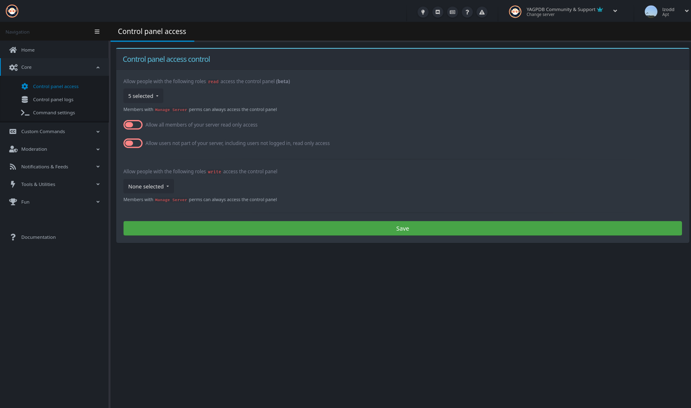

+++
title = 'Control Panel Access'
weight = 210
+++

Select who can view or edit your control panel.

<!--more-->

This page is relatively simple, yet very powerful. An overview of the settings follows.

### Read Access

#### Allow people with the following roles

The very top option is to allow people with certain roles read access to the control panel. Simply open the drop-down
select menu and select the roles you wish to grant read access.

#### Allow all members read access

This switch is fairly straight forward, when enabled any and all members of your server are granted read access. For
reference, this is enabled on the support server, but it may be a good idea to keep it disabled.

#### Allow users not part of your server read access

Taking the above one step further, this toggle lets any and all users, even not logged in ones, to view your control
panel. In general, it is a very good idea to have this disabled, unless you have good reasons not to. For the record,
this option is enabled on the support server's control panel.

### Write Access

Quite simple, but moderately dangerous. Anyone with these roles can edit anything on your control panel, so do handle
this with care. To make things easier to configure, members with **Manage Server** permissions can always edit the
control panel.
