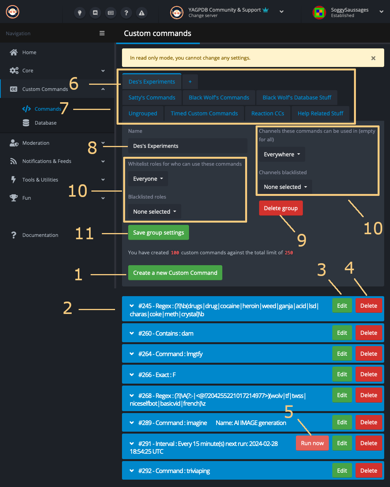
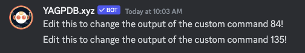
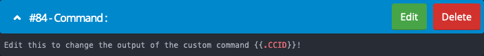
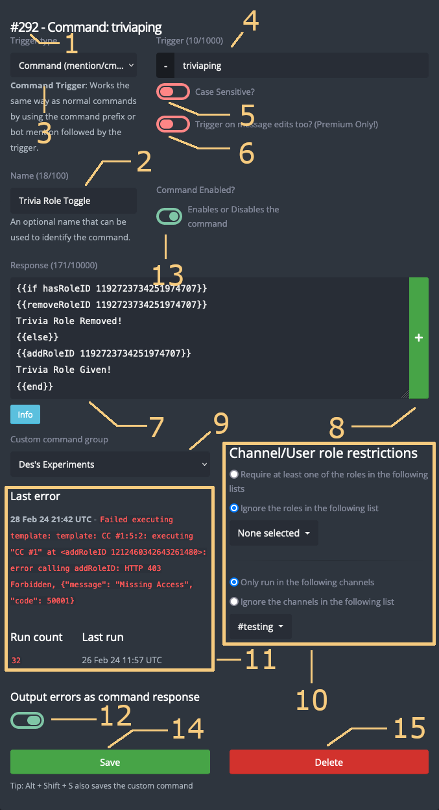

+++
title = 'Commands'
weight = 310
+++

The commands page displays all custom commands and allows you to add, delete, or edit custom commands and custom command
groups.

<!--more-->



<center>

**1** Create Custom Command **2** List of Commands in Selected Group **3** Edit this Custom Command **4** Delete this
Custom Command **5** Run this Command Now **6** Selected Group **7** Group Tabs **8** Name of Selected Group **9**
Delete Selected Group **10** Channel and Role Restrictions **11** Save group settings

</center>

## Creating a Custom Command

Clicking the Create Custom Command (**1**) creates a new command within the selected group (**6**) and redirects you to
a page to edit it.

A new custom command has the default response:

```yag
Edit this to change the output of the custom command {{.CCID}}!
```

Each custom command is assigned a unique incrementing ID, which cannot be modified after creation.





If the bot is sending messages such as this in your server, you are likely accidentally triggering CCs with the default
response. Check the commands page to find any CCs with empty responses.





## Command List

The commands page lists the commands (**2**) in the selected group (**6**). They are ordered by [ID](#id-and-name) and
display their name (if set), [trigger type](#trigger-types), and trigger text (if applicable). You can expand the
command by clicking on it, which displays the full command response.

### Delete a Command

Deleting a custom command (**4**) will **permanently** delete the command after confirmation. This cannot be undone.

### Run Now

The Run now button (**5**) appears on [interval trigger](#hourlyminute-interval) commands. When clicked, it executes the
command immediately as long as the command isn't disabled and a channel is selected.

Running an interval command using this button reschedules all subsequent runs based off the current time.

## Command Groups

Command groups allow you to organize your custom commands and apply role and channel restrictions to multiple commands.

The group tabs at the top of the page (**7**) allow you to switch to any of your created groups. The **+** button allows
you to create a new group.

### Editing a Group

Selecting a group allows you to edit it. Changes must be saved (**11**) to take effect.

- **Name** (**8**): Name your custom command group (100 characters max).
- **Delete group** (**9**): Permanently delete the group after confirmation.
- **Role/Channel restrictions** (**10**): Restrict commands within the group based on roles or channels executed in.
- **Save group settings** (**11**): Update the group with the new values.

#### Role/Channel Restrictions

Using role/channel restrictions, it is possible to set conditions on which users can trigger a custom command.

Specifically, whitelisted roles or channels are required to run the command, whereas blacklisted roles or channels
cannot use the command at all.



YAGPDB was raised well and honors a "no" when told "no". In other words, blacklists take precedence over whitelists.

This is a relatively common trip-hazard, so take great care when you set up both whitelists and blacklists.





Role restrictions are unrelated to member permissions. Having `Administrator` permissions will not override these
restrictions.



## Editing a Custom Command

Editing a custom command (**3**) opens a separate page for configuration.



<center>

**1** ID **2** Name **3** Trigger Type **4** Trigger Text **5** Case Sensitivity Toggle **6** Message Edits Trigger
Toggle **7** Response **8** Add Response **9** Custom Command Group **10** Channel and Role Restrictions
**11** Execution Statistics **12** Error Output Toggle **13** Enable Command Toggle **14** Save Command **15**
Delete command button

</center>

### ID and Name

Custom commands are identified by either their ID or their name.

When a custom command is created, it is assigned a numeric **ID** (**1**) starting at `1`. The number increases with
each custom command created on your server. It is not based on the _current_ number of custom commands, but the total
commands that have ever been created on the server. IDs cannot be changed by the user.

The ID uniquely identifies a custom command, and is therefore used in a variety of contexts where one needs to supply a
specific custom command. For instance, the `execCC` custom command function targets a specific CC ID, and some built-in
commands like `customcommands` accept a CC ID as an argument.

Within a command response, the ID may be retrieved using the `{{ .CCID }}` template.



Deleting a custom command does not allow its ID to be reassigned. If you delete a CC, its ID is lost forever.



A Custom Command's **name** (**2**), conversely, is defined by the user. It is an optional argument that can be used to
identify the command in the control panel and with the `CustomCommands` command. Max 100 characters.

### Triggers

A trigger (**3**) defines conditions under which the command will be executed. Depending on the type of trigger, you may
also need to specify additional configuration. For example, most trigger types require a **Trigger** (**4**) field
defining the text the command should match against new messages. Max 1000 characters.

#### Trigger types

##### Command

Messages **starting with the prefix** for your server (- by default) _OR_ by mentioning the bot followed by the trigger
text (**4**) will trigger the command.

###### Example

Trigger: `say`

Matches:

> -say
>
> -say hello
>
> @YAGPDB.xyz say hello

Doesn't match:

> say hello
>
> -sayl hello

##### Starts With

Messages **starting with** the trigger text (**4**) will trigger the command.

##### Contains

Messages **containing** the trigger text (**4**) will trigger the command.

##### Regex

Messages matching the trigger text (**4**) as a **[regex pattern](/docs/reference/regex)** will trigger the command.

##### Exact Match

Messages which **exactly** match the trigger text (**4**) will trigger the command.

##### Reaction

Reactions to a message will trigger the command.

Can specify **Added Only**, **Removed Only**, or **Both** to restrict which types of Reactions will trigger the command.



You cannot specify which emojis the command will trigger on. If you'd like to limit which emojis run the code, you will
need to write that code yourself in the response.

Example:

```yag
  {{ if eq .Reaction.Emoji.APIName "😀" "⭐️" }}
    This is an allowed reaction!
  {{ else if eq .Reaction.Emoji.APIName "🦆" }}
    This is not an allowed reaction.
  {{ end }}
  {{/* Emojis other than 😀, ⭐️, and 🦆 do not produce any response. */}}
```



##### Hourly/Minute Interval

These triggers will run the command at a regular interval of time -- for instance, every 2 hours -- in the selected
channel.

When using an interval trigger, the custom command does not receive any user or member context. Thus, `{{ .User.ID }}`
and similar templates will result in no value and member-dependent functions such as `addRoleID` will fail.


<center>

**1** Interval **2** Channel **3** Excluding hours/weekdays

</center>

Interval (**1**) sets how often the command will run in **hours** or **minutes**.

Channel (**2**) specifies a channel to run the command in. The response, if any, will be sent to this channel.

Excluding hours and/or weekdays (**3**) prevents the command from triggering during those hours or weekdays. **This uses
UTC time**, not your local timezone.

When editing an interval command, a **Run Now** button appears at the bottom of the page. It executes the command as
long as the command is not disabled and a channel is selected. Running an interval command using this button reschedules
all subsequent runs based off the current time.



You must specify a channel to run interval commands in even if the command doesn't output a message.



##### Component

[In-depth Interactions Guide](/docs/reference/custom-interactions)

The component trigger is used to trigger custom commands via buttons or select menus.

The trigger is matched using [RegEx](/docs/reference/regex).

##### Modal

[In-depth Interactions Guide](/docs/reference/custom-interactions)

The modal trigger is used to trigger custom commands via submitting a modal.

The trigger is matched using [RegEx](/docs/reference/regex).

#### Case Sensitivity

Any commands which allow you to specify trigger text (command, regex, exact match, and so on) have a **Case
sensitivity** toggle (**5**) which is off by default. A case-sensitive trigger `yagPDB` will trigger on "yagPDB" but not
"yagpdb" or "YAGPDB".

#### Edit Message Trigger

This feature is [premium only](/docs/welcome/premium).

Commands which trigger on messages have a **Trigger on message edits** toggle (**6**) which is off by default. If a
message is edited and matches the trigger text, it will trigger the command.

The edited message toggle is an _additional_ trigger to the normal message trigger. If you'd like to _only_ trigger on
message edits, you will need to use a conditional branch on `{{ .IsMessageEdit }}` in the custom command response.

### Response

The response (**7**) defines the message the bot will send once the command is triggered.

Optionally define multiple responses which the bot will randomly select from when the command is run. Add a response
with the plus button on the right of the response (**8**).

The response supports the custom template script, allowing for more complex functionality such as assigning roles,
getting data from users, sending messages to other channels, and more. Visit the Templates reference page to learn more.





It is recommended to save local copies of your custom commands. There is no way to recover deleted or overwritten CCs.
Use an editor like **Vim**, **VS Code**, or **Notepad++** for the best coding experience.



### Custom Command Group

Dropdown selection (**9**) to change which command group the command is in. Select `None` to ungroup the command.

### Channel and Role Restrictions

Group restrictions operate identically to [command-specific restrictions](#rolechannel-restrictions).

#### CC Groups

A user executing a command must obey both the overarching group's restrictions and the command restrictions.
Command-specific whitelists will _not_ override the group restrictions.

### Execution Statistics

The execution statistics (**11**) show details about the custom command's executions. It is updated after each command
run.

#### Last Error

The most recent error which occurred running the command, UTC timestamped. The error display is not cleared when the
command runs successfully.

#### Run Count

A count of how many times the command executed the response. This counter increases even if the command errors, or does
not send a response. It also increases if the command is run via `execCC`.

The run count will not increase if the user who ran the command did not pass the restrictions.



If your command fails to run, check the run count. If the run count increases when you attempt to run the command, the
issue is with your code. Otherwise, the issue may be with YAGPDB's permissions in your server, or improperly configured
role/channel restrictions in the command and/or command group.



#### Last Run

A UTC timestamp of the last time the command executed the response.

#### Next Scheduled Run

Only shown on Interval type commands. A UTC timestamp of the next time the command is scheduled to run.

### Output errors as command response

This toggle (**12**) determines whether errors during command execution are sent in the command response after the
command fails. Does not affect logging of Last Error to the statistics.

### Command Enabled

This toggle (**13**) enables the command. A disabled command will never run (not even with `execCC`) or count against
the trigger limit.

### Saving Your Command

Saving (**14**) the command updates it with the new values if there are no errors.

<kbd>Alt</kbd> + <kbd>Shift</kbd> + <kbd>S</kbd> also saves the custom command.

A custom command **will not save** if there is an error in your input. Examples of errors which prevent you from saving:

- There is a syntax error in the response
- You have reached the maximum CC limit
- You are attempting to save an empty response

If you save a command with an interval trigger which has never been run, it will run immediately upon saving.



It is recommended to code your custom command using a local editor on your device. You will not be able to save your
code on the dashboard if there are syntax errors in your code. Use an editor like **Vim**, **VS Code**, or **Notepad++**
for the best coding experience.





Custom commands do not autosave.



### Delete Current Command

Deleting the custom command (**15**) will **permanently** delete the command after confirmation. This cannot be undone.
