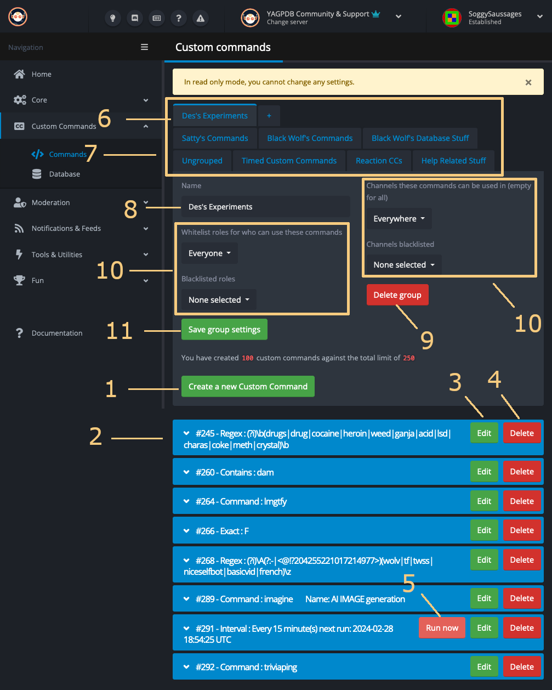
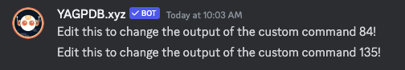
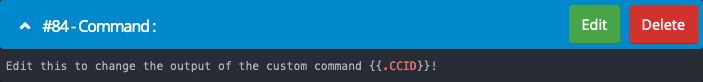
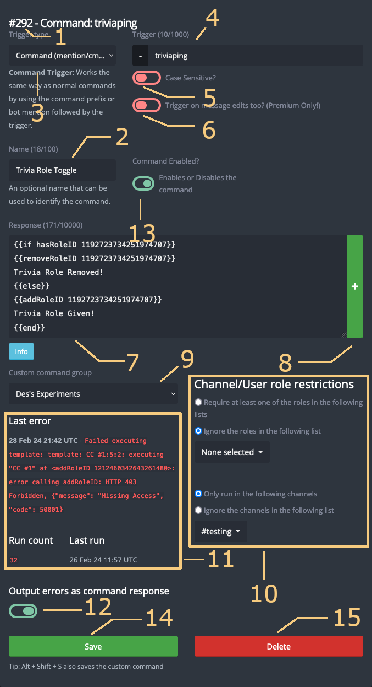

+++
title = "Commands"
weight = 310
description = "Custom command settings and editor."
+++

The commands page displays all custom commands and allows you to add, delete, or edit custom commands and custom command groups.



<center>

**1** Create Custom Command.
**2** List of Commands in Selected Group.
**3** Edit this Custom Command.
**4** Delete this Custom Command.
**5** Run this Command Now.
**6** Selected Group.
**7** Group Tabs.
**8** Name of Selected Group.
**9** Delete Selected Group.
**10** Channel and Role Restrictions.
**11** Save group settings.

</center>

## Creating a Custom Command

Clicking the Create Custom Command (**1**) creates a new command within the selected group (**6**) and redirects you to a page to edit it.

A new custom command has the default response:

```yag
Edit this to change the output of the custom command {{.CCID}}!
```

Each custom command is assigned a unique incrementing ID, which cannot be modified after creation.





If the bot is sending messages such as this in your server, you are likely accidentally triggering CCs with the default response.
Check the commands page to find any CCs with empty responses.





## Command List

The commands page lists the commands (**2**) in the selected group (**6**).
They are ordered by [ID](#id-and-name) and display their name (if set), [trigger type](#trigger-types), and trigger text (if applicable).
You can expand the command by clicking on it, which displays the full command response.

### Delete a Command

Deleting a custom command (**4**) will **permanently** delete the command after confirmation.
This cannot be undone.

### Run Now

The Run now button (**5**) appears on [interval trigger](#hourlyminute-interval) commands.
When clicked, it executes the command immediately as long as the command isn't disabled and a channel is selected.

Running an interval command using this button reschedules all subsequent runs based off the current time.

## Command Groups

Command groups allow you to organize your custom commands and apply role and channel restrictions to multiple commands.

The group tabs at the top of the page (**7**) allow you to switch to any of your created groups.
The **+** button allows you to create a new group.

### Editing a Group

Selecting a group allows you to edit it.
Changes must be saved (**11**) to take effect.

- **Name** (**8**): Name your custom command group (100 characters max).
- **Delete group** (**9**): Permanently delete the group after confirmation.
- **Role/Channel restrictions** (**10**): Restrict commands within the group based on roles or channels executed in.
- **Save group settings** (**11**): Update the group with the new values.

#### Role/Channel Restrictions

Using role/channel restrictions, it is possible to set conditions on which users can trigger a custom command.

Specifically, allowed roles or channels are required to run the command, whereas denied roles or channels cannot use the command at all.
These role restrictions are unrelated to member permissions.
Having `Administrator` permissions will not override these restrictions.



YAGPDB was raised well and honors a "no" when told "no".
In other words, a denylist takes precedence over an allowlist.



## Editing a Custom Command

Editing a custom command (**3**) opens a separate page for configuration.



<center>

**1** ID
**2** Name
**3** Trigger Type
**4** Trigger Text
**5** Case Sensitivity Toggle
**6** Message Edits Trigger Toggle
**7** Response
**8** Add Response
**9** Custom Command Group
**10** Channel and Role Restrictions
**11** Execution Statistics
**12** Error Output Toggle
**13** Enable Command Toggle
**14** Save Command
**15** Delete command button

</center>

### ID and Name

Custom commands are identified by either their ID or their name.

When a custom command is created, it is assigned a numeric **ID** (**1**) starting at `1`.
The number increases with each custom command created on your server.
It is not based on the _current_ number of custom commands, but the total commands that have ever been created on the server.
IDs cannot be changed by the user.

The ID uniquely identifies a custom command, and is therefore used in a variety of contexts where one needs to supply a specific custom command.
For instance, the `execCC` custom command function targets a specific CC ID, and some built-in commands like `/customcommands list` accept a CC ID as an argument.

Within a command response, the ID may be retrieved using the `{{ .CCID }}` template.



Deleting a custom command does not allow its ID to be reassigned.
If you delete a CC, its ID is lost forever.



A Custom Command's **name** (**2**), conversely, is defined by the user.
It is an optional argument that can be used to identify the command in the control panel and with the `/customcommands list` command.
Max 100 characters.

### Triggers

A trigger (**3**) defines conditions under which the command will be executed.
Depending on the type of trigger, you may also need to specify additional configuration.
For example, most trigger types require a **Trigger** (**4**) field defining the text the command should match against new messages.
Max 1000 characters.

#### Trigger types

##### Command

Messages **starting with the prefix** for your server (- by default) _OR_ by mentioning the bot followed by the trigger text (**4**) will trigger the command.

###### Example

Trigger: `say`

Matches:

> -say
>
> -say hello
>
> @YAGPDB.xyz say hello

Doesn't match:

> say hello
>
> -sayl hello

##### Starts With

Messages **starting with** the trigger text (**4**) will trigger the command.

##### Contains

Messages **containing** the trigger text (**4**) will trigger the command.

##### Regex

Messages matching the trigger text (**4**) as a **[regex pattern](/docs/reference/regex)** will trigger the command.

##### Exact Match

Messages which **exactly** match the trigger text (**4**) will trigger the command.

##### Reaction

Reactions to a message will trigger the command.

Can specify **Added Only**, **Removed Only**, or **Both** to restrict which types of Reactions will trigger the command.



You cannot specify which emojis the command will trigger on.
If you'd like to limit which emojis run the code, you will need to write that code yourself in the response.

Example:

```yag
  {{ if eq .Reaction.Emoji.APIName "😀" "⭐️" }}
    This is an allowed reaction!
  {{ else if eq .Reaction.Emoji.APIName "🦆" }}
    This is not an allowed reaction.
  {{ end }}
  {{/* Emojis other than 😀, ⭐️, and 🦆 do not produce any response. */}}
```



##### Hourly/Minute Interval

These triggers will run the command at a regular interval of time -- for instance, every 2 hours -- in the selected channel.

When using a time-based trigger, the custom command does not receive any user or member context.
Thus, `{{ .User.ID }}` and similar templates will result in no value and member-dependent functions such as `addRoleID` will fail.


<center>

**1** Interval **2** Channel **3** Excluding hours/weekdays

</center>

Interval (**1**) sets how often the command will run in **hours** or **minutes**.



The minimum interval is 5 minutes, and the max is 1 month.
Up to 5 interval triggers may have an interval of 10 minutes or shorter.



Channel (**2**) specifies a channel to run the command in.
The response, if any, will be sent to this channel.

You must specify a channel to run time-based commands in even if the command doesn't output a message.

Excluding hours and/or weekdays (**3**) prevents the command from triggering during those hours or weekdays. **This uses UTC time**, not your local timezone.

When editing an interval command, a **Run Now** button appears at the bottom of the page.
It executes the command as long as the command is not disabled and a channel is selected.
Running an interval command using this button reschedules all subsequent runs based off the current time.

##### Component

[In-depth Interactions Guide](/docs/reference/custom-interactions)

The component trigger is used to trigger custom commands via buttons or select menus.

The trigger is matched using [RegEx](/docs/reference/regex).

##### Modal

[In-depth Interactions Guide](/docs/reference/custom-interactions)

The modal trigger is used to trigger custom commands via submitting a modal.

The trigger is matched using [RegEx](/docs/reference/regex).

##### Crontab

This trigger will run the command periodically using [Cron Syntax](https://en.wikipedia.org/wiki/Cron) to schedule runs.
In contrast to interval triggers, which run a command with a fixed delay but unknown time, cron triggers can be made to execute periodically at fixed times, dates, and/or intervals.
For instance, you could schedule execution for 23:45 every Saturday.

When using a time-based trigger, the custom command does not receive any user or member context.
Thus, `{{ .User.ID }}` and similar templates will result in no value and member-dependent functions such as `addRoleID` will fail.


<center>

**1** Cron Expression **2** Channel **3** Excluding hours/weekdays

</center>

Cron Expression (**1**) defines the expression used to schedule the cron job.
It uses the standard expression format (see below).
It does not support predefined schedules such as `@hourly`.
The cron scheduler uses UTC always.

Read more on [Cron Expressions](#cron-expressions) below.

Channel (**2**) specifies a channel to run the command in.
The response, if any, will be sent to this channel.

Excluding hours and/or weekdays (**3**) prevents the command from triggering during those hours or weekdays. **This uses UTC time**, not your local timezone.

You must specify a channel to run time-based commands in even if the command doesn't output a message.

###### Cron Expressions

A cron expression represents a set of times, using 5 space-separated fields.

| Field name       | Mandatory? | Allowed values  | Allowed special characters |
| --------------   | ---------- | --------------  | -------------------------- |
| Minutes          | Yes        | 0-59            | * / , -                    |
| Hours            | Yes        | 0-23            | * / , -                    |
| Day of month     | Yes        | 1-31            | * / , - ?                  |
| Month            | Yes        | 1-12 or JAN-DEC | * / , -                    |
| Day of week (DOW)| Yes        | 0-6 or SUN-SAT  | * / , - ?                  |

To read more about the supported format of cron expressions, visit [Robfig's Cron package documentation - Expression Format](https://pkg.go.dev/github.com/robfig/cron/v3#hdr-CRON_Expression_Format).



To help build and debug cron expressions, we recommend using [Cronitor's Crontab Guru](https://crontab.guru/) or a similar site.
Note that predefined schedules such as `@hourly`, and the use of `7` in the DOW field may parse correctly on Corntab Guru, but are not supported with YAGPDB.



###### Special Characters

- Asterisk ( * )

The asterisk indicates that the cron expression will match for all values of the field; e.g., using an asterisk in the 5th field (month) would indicate every month.

- Slash ( / )

Slashes are used to describe increments of ranges.
For example 3-59/15 in the 1st field (minutes) would indicate the 3rd minute of the hour and every 15 minutes thereafter.
The form "*\/..." is equivalent to the form "first-last/...", that is, an increment over the largest possible range of the field.
The form "N/..." is accepted as meaning "N-MAX/...", that is, starting at N, use the increment until the end of that specific range.
It does not wrap around.

- Comma ( , )

Commas are used to separate items of a list.
For example, using "MON,WED,FRI" in the 5th field (day of week) would mean Mondays, Wednesdays and Fridays.

- Hyphen ( - )

Hyphens are used to define ranges.
For example, 9-17 would indicate every hour between 9am and 5pm inclusive.

- Question mark ( ? )

Question mark may be used instead of '*' for leaving either day-of-month or day-of-week blank.

Quick Examples:

```txt
45 23 * * 6
Run once a week, on Saturday at 23:45.

0 * * * *
Run once an hour, beginning of hour.

0 0 * * *
Run once a day, midnight.

0 0 * * 0
Run once a week, midnight between Sat/Sun.

0 0 1 * *
Run once a month, midnight, first of month.

0 0 1 1 *
Run once a year, midnight, Jan. 1st.
```



Your cron expression must schedule jobs with greater than a 10 minute interval between executions.



##### Role Changes

This trigger type executes when a role is added to or removed from a member.

**Special properties in this trigger type:**

- `.TargetMember`: The member whose roles were changed.
- `.TargetUser`: The user whose roles were changed.
- `.Author`: The user who performed the role change.
- `.Role`: The role object that was added or removed.
- `.RoleAdded`: A boolean indicating if the role was added (`true`) or removed (`false`).

**Restrictions and limitations:**

- **Targets**: Will not trigger if the target is a bot.
- **Cooldown**: There is a cooldown for specific user-role combinations.
    - Free servers: 5 minutes.
    - Premium servers: 1 minute.
- **Trigger Limits**:
    - Free servers: Maximum 1 Role Change trigger.
    - Premium servers: Maximum 5 Role Change triggers.
- **Role Restrictions**: Role Restrictions on the custom command apply specifically to the role being modified, not the member receiving/assigning it.

- **Context Limitations**: Similar to interval triggers, `.Message`, `.Member`, and `.User` are not available in this trigger type. Use `.TargetMember`, `.TargetUser`, and `.Author` instead. Any functions that rely on these properties will not work in this trigger type. For example `hasRole` won't work, to check if the `.TargetMember` has a role use `targetHasRole` instead. 

- **Execution**: Cannot be triggered via `execCC` or `scheduleUniqueCC`.

##### Slash Command

This trigger type registers a native Discord [slash command](https://support.discord.com/hc/en-us/articles/26501837786775-Slash-Commands-FAQ) with your server.
The command executes when a member runs `/your-command` in Discord, and any arguments the member supplies are made available to the response.

Because slash commands are an [interaction](/docs/reference/custom-interactions), the command's response is sent as the reply to the interaction.
You may make the reply ephemeral using the [Defer mode](#defer-mode) below or the [`ephemeralResponse`](/docs/reference/templates/functions#interactions) function, and you can send followups, modals, components, and so on just like other interaction triggers.

###### Command Trigger

For this trigger type, the **Trigger** (**4**) field is the slash command name (the `/name` members type in Discord).

- Maximum 32 characters.
- Lowercase letters, numbers, dashes (`-`) and underscores (`_`) only.
- It cannot match the name of a built-in YAGPDB slash command.

###### Description

A slash command requires a **Description** (1–100 characters), shown to members in Discord's command picker.

###### Options

Slash commands may define up to **25 options** (arguments). Each option has a:

- **Name**: 1–32 lowercase characters (letters, numbers, dashes, underscores). Must be unique within the command.
- **Type**: see the table below.
- **Description**: 1–100 characters.
- **Required** toggle: required options are always asked for before optional ones.

| Type          | Description                                                                                  |
| ------------- | -------------------------------------------------------------------------------------------- |
| Text          | A free-text string.                                                                          |
| Text menu     | A string with a fixed set of **choices** the member picks from.                              |
| Integer       | A whole number.                                                                              |
| Integer menu  | An integer with a fixed set of **choices**.                                                  |
| Number        | A decimal number.                                                                            |
| Number menu   | A number with a fixed set of **choices**.                                                    |
| True/False    | A boolean.                                                                                   |
| User          | A member of the server.                                                                      |
| Channel       | A channel in the server.                                                                     |
| Role          | A role in the server.                                                                        |
| Mentionable   | A mentionable, i.e. either a user or a role.                                                 |

Depending on the chosen type, an option exposes extra constraints:

- **Menu types** (`Text menu`, `Integer menu`, `Number menu`): a **Choices** field, one choice per line (max 25 choices, each max 100 characters). For integer and number menus, every line must be a valid number. Menu options cannot also use the min/max constraints below.
- **Text**: optional **Min length** and **Max length** (0–6000).
- **Integer / Number**: optional **Min value** and **Max value**.
- **Channel**: optional **Allowed channel types** to restrict which kinds of channels can be selected (Text, Voice, Category, Announcement, Stage, Forum, Public Thread, Private Thread, Announcement Thread). Leave empty to allow any.

###### Accessing options in the response

Option values are exposed to the response in two ways, plus the command name:

| Field             | Description                                                                                                                            |
| ----------------- | -------------------------------------------------------------------------------------------------------------------------------------- |
| `.Options`        | An `SDict` keyed by option name, holding the value the member supplied for each option. Optional options the member omits are absent.  |
| `.Args`           | An ordered slice of the supplied values, with the **command name at index 0** followed by the provided option values.                  |
| `.CmdArgs`        | The same ordered values as `.Args` but **without** the command name (i.e. `.Args` from index 1 onward).                                |
| `.CommandName` / `.Cmd` | The slash command name that was run.                                                                                             |
| `.SubCommand`     | The invoked [subcommand](#subcommands) name, or an empty string if the command does not use subcommands.                               |
| `.IsSlashCommand` | `true` when the command was triggered by a slash command.                                                                              |
| `.Interaction`    | The triggering [interaction](/docs/reference/custom-interactions#parsing-an-interaction) object.                                       |
| `.InteractionData`| The raw application command interaction data from Discord.                                                                             |

Snowflake-typed options are resolved to full objects: a `User` (or chosen-user `Mentionable`) option yields a user object, a `Channel` option a channel object, and a `Role` (or chosen-role `Mentionable`) option a role object.

```yag
{{ $name := .Options.name }}
{{ $target := .Options.target }}
Hello {{ $target.Mention }}, {{ .User.Username }} says: {{ $name }}
```



A slash command interaction has no source message, so YAGPDB synthesizes a minimal one.
`.User`, `.Member`, and member-dependent functions such as `addRoleID` work as usual, but message-specific data inside `.Message` such as `.Message.Content` is not available because no Message Exists in the trigger context.



###### Subcommands

Instead of attaching options directly to the command, you can enable the **Use subcommands** toggle to split the command into named subcommands, invoked as `/your-command subcommand`.
This is useful for commands that bundle several related actions, such as `/role add` and `/role remove`.

When subcommands are enabled:

- The command has **no top-level options** — Discord does not allow a command to have both subcommands and top-level options. Options are defined per subcommand instead.
- Each subcommand has its own **Name** (1–32 lowercase characters: letters, numbers, dashes and underscores, unique within the command), **Description** (1–100 characters), and up to **25 options** configured exactly like the top-level options described above.
- At least one subcommand (with a name and description) is required, otherwise the command will not save.

The invoked subcommand name is exposed to the response as `.SubCommand`, and that subcommand's option values are available through `.Options`, `.Args`, and `.CmdArgs` just like a command without subcommands.

```yag
{{ if eq .SubCommand "add" }}
  {{ addRoleID .Options.role }}
  Added {{ (getRole .Options.role).Name }}.
{{ else if eq .SubCommand "remove" }}
  {{ removeRoleID .Options.role }}
  Removed {{ (getRole .Options.role).Name }}.
{{ end }}
```



You can have at most **3** subcommands *per slash command* on free servers, raised to **10** on [premium](/docs/welcome/premium) servers.



###### Defer mode

Slash commands use the same [Defer mode](/docs/reference/custom-interactions#responding-to-an-interaction) options as other interaction triggers, except for **Update Message Response**, which is not available (there is no prior message to update).



Servers may have at most **3 enabled** slash command custom commands, raised to **10** on [premium](/docs/welcome/premium) servers.
Only enabled commands are registered with Discord and count against this limit.
If premium is removed and you are over the limit, only the lowest-ID commands remain registered.



##### User Context Menu

This trigger type registers a native Discord **user [context menu command](https://support.discord.com/hc/en-us/articles/26501837786775-Slash-Commands-FAQ)** --- an entry in the **Apps** submenu that appears when you right-click (or long-press) a user.
The command executes against the selected user.

Like slash commands, context menu commands are [interactions](/docs/reference/custom-interactions), so the response is sent as the reply to the interaction, and you can use [Defer mode](#defer-mode), ephemeral responses, followups, components, and so on.

###### Command name

For this trigger type, the **Trigger** (**4**) field is the command name shown in the Apps menu.

- 1–32 characters.
- Letters, numbers, **spaces**, dashes (`-`) and underscores (`_`). Unlike slash commands, the name may contain spaces and uppercase letters, and its capitalization is preserved.
- The name must be unique among context menu commands of the same type in your server.

Context menu commands have **no description and no options**.

###### Accessing the target in the response

| Field                   | Description                                                                                     |
| ----------------------- | ----------------------------------------------------------------------------------------------- |
| `.CommandType`          | `"user"` for this trigger type.                                                                 |
| `.TargetUser`           | The user that was right-clicked.                                                                |
| `.TargetMember`         | The member object for the right-clicked user.                                                   |
| `.Author`               | The user who invoked the command.                                                               |
| `.CommandName` / `.Cmd` | The command name that was run.                                                                  |
| `.IsContextMenuCommand` | `true` when the command was triggered by a context menu command.                                |
| `.Interaction`          | The triggering [interaction](/docs/reference/custom-interactions#parsing-an-interaction) object.|
| `.InteractionData`      | The raw application command interaction data from Discord.                                      |

```yag
{{ .Author.Mention }} gave a cookie to {{ .TargetUser.Mention }} 🍪
```



Similar to the [Role Change](#role-changes) trigger, `.Member` and `.User` are **not** available in context menu commands, and there is no source `.Message`.
The person who invoked the command is exposed as `.Author`, and the right-clicked user is `.TargetUser` / `.TargetMember`.

Any function that relies on `.Member` or `.User` will not work --- for example, use `targetHasRole` instead of `hasRole`.
`sendDM` is also disabled, so a context menu command cannot be used to DM an arbitrary target.



##### Message Context Menu

This trigger type registers a native Discord **message [context menu command](https://support.discord.com/hc/en-us/articles/26501837786775-Slash-Commands-FAQ)** --- an entry in the **Apps** submenu that appears when you right-click (or long-press) a message.
The command executes against the selected message.

It behaves identically to the [User Context Menu](#user-context-menu) trigger --- same naming rules, no description or options, and the same interaction-based response --- except for what is exposed to the response:

| Field                   | Description                                                                                     |
| ----------------------- | ----------------------------------------------------------------------------------------------- |
| `.CommandType`          | `"message"` for this trigger type.                                                              |
| `.Message`              | The message that was right-clicked.                                                             |
| `.TargetUser`           | The author of the right-clicked message.                                                        |
| `.TargetMember`         | The member object for the message author.                                                       |
| `.Author`               | The user who invoked the command.                                                               |
| `.CommandName` / `.Cmd` | The command name that was run.                                                                  |
| `.IsContextMenuCommand` | `true` when the command was triggered by a context menu command.                                |
| `.Interaction`          | The triggering [interaction](/docs/reference/custom-interactions#parsing-an-interaction) object.|
| `.InteractionData`      | The raw application command interaction data from Discord.                                      |

Unlike the user context menu, the message type does have a `.Message` --- it is the full right-clicked message (with its content, author, and so on). `.TargetUser` / `.TargetMember` refer to that message's author, and `.Author` is the member who invoked the command.

The same member-context restrictions as the [user context menu](#user-context-menu) apply: `.Member` and `.User` are not available, and `sendDM` is disabled.

```yag
{{ .Author.Mention }} pinned this message from {{ .TargetUser.Mention }}:
> {{ .Message.Content }}
```



You may have at most **1 enabled** context menu command **of each type** (one user, one message), raised to **5 of each type** on [premium](/docs/welcome/premium) servers.
Only enabled commands are registered with Discord and count against this limit.

The **Update Message Response** defer mode is not available for context menu commands.



#### Case Sensitivity

Any commands which allow you to specify trigger text (command, regex, exact match, and so on) have a **Case sensitivity** toggle (**5**) which is off by default.
A case-sensitive trigger `yagPDB` will trigger on "yagPDB" but not "yagpdb" or "YAGPDB".

#### Edit Message Trigger

This feature is [premium only](/docs/welcome/premium).

Commands which trigger on messages have a **Trigger on message edits** toggle (**6**) which is off by default.
If a message is edited and matches the trigger text, it will trigger the command.

The edited message toggle is an _additional_ trigger to the normal message trigger.
If you'd like to _only_ trigger on message edits, you will need to use a conditional branch on `{{ .IsMessageEdit }}` in the custom command response.

### Response

The response (**7**) defines the message the bot will send once the command is triggered.

Optionally define multiple responses which the bot will randomly select from when the command is run.
Add a response with the plus button on the right of the response (**8**).

The response supports the custom template script, allowing for more complex functionality such as assigning roles, getting data from users, sending messages to other channels, and more.
Visit the Templates reference page to learn more.



### Custom Command Group

Dropdown selection (**9**) to change which command group the command is in.
Select `None` to ungroup the command.

### Channel and Role Restrictions

Group restrictions operate identically to [command-specific restrictions](#rolechannel-restrictions).

#### CC Groups

A user executing a command must obey both the overarching group's restrictions and the command restrictions.
Command-specific allowlists will _not_ override the group restrictions.

### Execution Statistics

The execution statistics (**11**) show details about the custom command's executions.
It is updated after each command run.

#### Last Error

The most recent error which occurred running the command, UTC timestamped.
The error display is not cleared when the command runs successfully.

#### Run Count

A count of how many times the command executed the response.
This counter increases even if the command errors, or does not send a response.
It also increases if the command is run via `execCC`.

The run count will not increase if the user who ran the command did not pass the restrictions.



If your command fails to run, check the run count.
If the run count increases when you attempt to run the command, the issue is with your code.
Otherwise, the issue may be with YAGPDB's permissions in your server, or improperly configured role/channel restrictions in the command and/or command group.



#### Last Run

A UTC timestamp of the last time the command executed the response.

#### Next Scheduled Run

Only shown on Interval type commands.
A UTC timestamp of the next time the command is scheduled to run.

### Output errors as command response

This toggle (**12**) determines whether errors during command execution are sent in the command response after the command fails.
Does not affect logging of Last Error to the statistics.

### Command Enabled

This toggle (**13**) enables the command.
A disabled command will never run (not even with `execCC`) or count against the trigger limit.

### Saving Your Command

Saving (**14**) the command updates it with the new values if there are no errors.

<kbd>Alt</kbd> + <kbd>Shift</kbd> + <kbd>S</kbd> also saves the custom command.

A custom command **will not save** if there is an error in your input.
Examples of errors which prevent you from saving:

- There is a syntax error in the response
- You have reached the maximum CC limit
- You are attempting to save an empty response

If you save a command with an interval trigger which has never been run, it will run immediately upon saving.



It is recommended to code your custom command using a local editor on your device.
You will not be able to save your code on the dashboard if there are syntax errors in your code.
Use an editor like **Vim**, **VS Code**, or **Notepad++** for the best coding experience.





Custom commands do not autosave.



### Delete Current Command

Deleting the custom command (**15**) will **permanently** delete the command after confirmation.
This cannot be undone.
