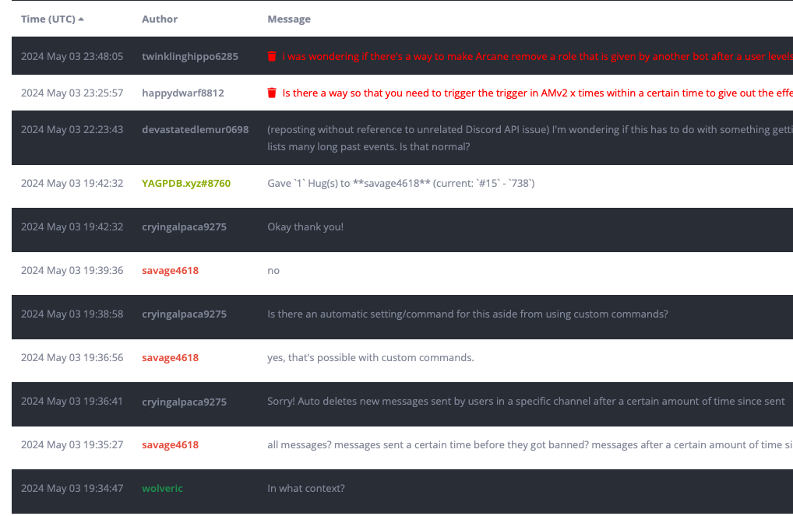

+++
title = 'Logging'
weight = 440
+++

Capture a moment in time with message logging of the last messages in a channel when the log is created, including a
limited number of deleted messages.

<!--more-->



YAGPDB IS NOT A LOGGING BOT.



Message logs capture X amount of messages from a channel, including any deleted messages cached by YAGPDB (the last
1 hour of deleted messages, or last 12 hours with [premium](/docs/welcome/premium), are recorded by YAGPDB).

The log is accessible on YAGPDB's website for later viewing. It saves message timestamps, message author's Username and
User ID, and the message itself. If a message contains an attachment, the attachment URL is logged. If a message
contains an embed, it is serialized and saved in JSON format.



Message logs on the official YAGPDB instance will be automatically deleted after 30 days of their creation.

If you're self-hosting, see [Message Log Purge](#message-log-purge-self-hosting-only) for more information.



## Creating Logs

### Logs Command

By default, any member can run the logs command for any channel in which they have permission to Read Messages, Send
Messages, and Read Message History. Members will be permitted to create logs regardless of their permission to view
them.

[Logs Command Syntax](/docs/core/all-commands#logs)

### Moderation Actions

Select moderation actions will generate message logs when used, and other actions allow you to enable logging if
desired. A link for these logs is included in the mod log if mod log is enabled.

#### Actions Generating Logs

These actions immediately create a log of the last 100 messages in the channel.

- Report
- Timeout
- Mute
- Kick
- Ban

#### Actions Log Generation Optional

These actions require logging to be enabled on their control panel.

- Warn

## Viewing Logs

To view a message log after it has been created, you'll need to visit its link in a browser. YAGPDB cannot send message
logs to a Discord channel; they are only accessible online.

- When a log is created, the link to view it follows the pattern `/public/<server ID>/log/<log count>`. Note that this
  makes it easy to scrape through all the logs created on a server. Assume any member that can view a specific log can
  also view every other log on your server.
- You can view a list of all message logs created on your server on the Logging page of the control panel.
- When the `logs` command is executed, a link to the message log is sent as the response.
- When a moderation action creates a log, a link is included in the mod log entry if enabled.

When viewing a log, YAGPDB colors the usernames of each message author based on their roles at the time of log
_viewing_, similarly to how they would appear on your server.

## Access Control

### Members can view message logs

Selecting this mode on the control panel allows all members of your server to view any message logs created. Users will
need to log in with their Discord account to view the message logs.

#### Roles

You may additionally choose to require roles for members to have in order to view message logs. Members with _one or
more_ of these roles will be permitted to view message logs.

### Everyone can view message logs

Selecting this mode on the control panel allows anyone with a link to a log to view all the logs on your server without
needing to log in.

## Deleted Messages

A log contains any messages cached at the time of log creation. Deleted messages are cached for `1` hour before being
removed. On [premium](/docs/welcome/premium) servers, they are cached for `12` hours.

In a message log, deleted messages are shown to users permitted to view them. If a user is not permitted to view deleted
messages, they will not be able to see deleted messages, or that a message was deleted at all.

## Blacklisting Channels

Under the Logging page on the control panel you may blacklist channels for log creation. Using the logs command in a
blacklisted channel will return an error message. Moderation actions will also not generate or attach logs in
blacklisted channels.

## Deleting Logs

Users with write access to the control panel may delete individual logs or delete all logs on the server using the
control panel.

## Message Log Purge [Self-hosting only]

If you are self-hosting your own instance of YAGPDB, you can set `enable_message_log_purge=true` to automatically purge
message logs older than 30 days. This option is enabled on the official instance of YAGPDB hosted by Botlabs but is
disabled by default on a fresh self-host.
