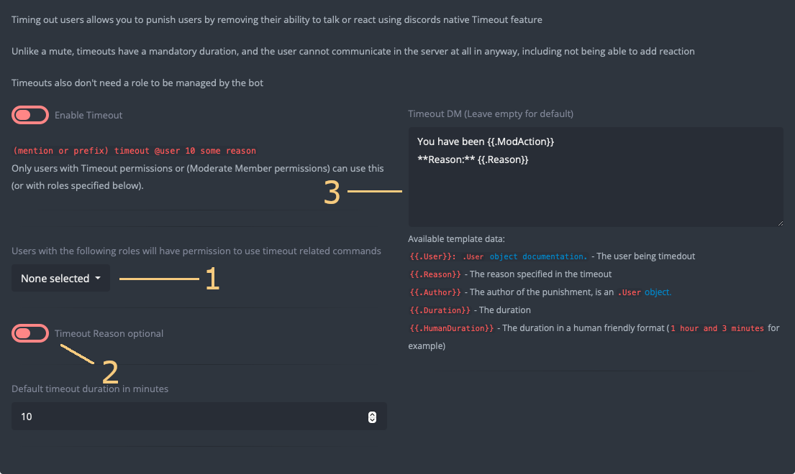

+++
title = "Moderation Tools"
weight = 410
description = "Everything in moderation, including moderation."
+++

Everything in moderation, including moderation.


<center>

**1** Mod Log Channel **2** Report Channel **3** Moderation DM Error Channel **4** Clean Command **5** Report
Command **6** Unban Logging **7** Giverole/Takerole commands **8** Give/Takerole Permitted Roles **9**
Give/Takerole Logging **10** External Ban Logging **11** External Kick Logging **12** External Timeout Logging **13**
Moderation Tabs **14** Bot Permissions Notice

</center>

## Moderation Page

The moderation page allows configuration of common settings.

### Mod Channels

1. **Mod Log** - The mod log is the channel YAGPDB will send log messages to when most moderation commands are used. Log
   entries include username and user ID of both the moderator, and the moderated user. They additionally include the
   reason for relevant commands (defaults to `<no reason provided>` when not provided), and a [log](/docs/moderation/logging)
   of the channel where the command was run.
2. **Report** - The channel for YAGPDB to send report messages to when users use the report command. Similar to the mod
   log, report entries include username and user ID of the user reporting, and the user reported, as well as the reason
   and message log of the channel.
3. **Moderation DM Error** - The channel where YAGPDB will send error messages from executing template script within
   [moderation DMs](#moderation-dms).

### Command Toggles

Certain potentially destructive moderation commands are disabled by default. These commands are:

- The **clean command** (**4**) toggles the [clean command](/docs/core/all-commands#clean).
- The **report command** (**5**) toggles the [report command](/docs/core/all-commands#report).
- **Giverole/Takerole commands** (**7**) toggle the [giverole](/docs/core/all-commands#giverole) and
  [takerole](/docs/core/all-commands#removerole) commands.

### Unban/Unmute Logging

When the `unban`/`unmute` commands are used, YAGPDB will log their usage to the [mod log](#mod-channels) similarly to
the other moderation commands.

When using the `ban` and `mute` commands with a duration, YAGPDB will automatically undo the punishment after the
specified duration. For instance, if you execute `ban @user 1d`, YAGPDB will ban the user, and 1 day later YAGPDB will
execute the `unban` command with reason "Timed ban expired." This action appears in the mod log as YAGPDB being the
moderator.

Toggling Unban Logging (**6**) allows you to enable or disable the logging of Unmute events.

Toggling Give/Takerole Logging (**9**) allows you to enable or disable the logging of Give/Takerole events.

### External Logging

By default, only actions performed through YAGPDB will be recorded in the mod-log. Hence, kicking a user using YAGPDB's
`kick` command will result in a log entry, whereas kicking the user directly through Discord's context menu will not be
recorded. Enabling external logging for different moderation actions (**10**), (**11**), (**12**) allows the bot to use
the server Audit Log to retrieve moderation actions taken by other bots or other users.

YAGPDB must have View Audit Log permissions to use this feature.

## Permissions Notice

The moderation plugin requires additional permissions to function properly. The notice at the top of the screen (**14**)
will inform you of the required permissions for the plugin and alert you if the bot is missing permissions.

## Moderation Tools

Moderation tools are used to prevent members on your server from being abusive. They can be used via command or triggered
by automoderator. Like all inbuilt commands, they may also be triggered within template script using
[exec/execAdmin](/docs/reference/templates/functions#miscellaneous).

Most moderation tools allow you to specify a reason for the mod action. This is included when the action is logged in
the [mod log](#mod-channels) and is also, by default, DM'd to the offending user when using [certain
commands](#moderation-dms). This reason may be retroactively edited using the [Reason Command](/docs/core/all-commands#reason).

Each of the main moderation tools have individual configuration pages, accessible through the tabs (**13**).

### Common Settings



<center>

**1** Permitted Roles **2** Reason Optional Toggle **3** Moderation DM

</center>

There are common configuration options worth mentioning.

#### Permitted Roles

By default, any user with the relevant Discord permission in your server (timeout members for the timeout command, kick
members for the kick command, etc.) are able to run the corresponding moderation command. Selecting permitted roles
(**1**) will allow said roles to run the moderation commands **even if** they do not have required Discord permissions.

Give/Takerole Permitted Roles (**8**) operate in the same way.

#### Reason Optional

By default, Timeout, (Un)Mute, Kick, and Ban tools require the moderator to specify a reason. This forces your staff
(and yourself, no exceptions!) to specify a reason for taking mod action for the mod logs, and also by default to be
DM'd to the offending user.

To remove the requirement and make the reason optional, you may toggle this on (**2**).

#### Moderation DMs

Moderation DMs are template scripts (**3**) which are executed within the offending user's DM. Text output to the response will
be directly sent to the offending user.



Additional template dot context data is available for Moderation Actions:

- `{{.Reason}}`: The reason specified in the timeout.
- `{{.Author}}`: The author of the punishment, is a [user object](/docs/reference/templates/syntax-and-data#user).
- `{{.Duration}}`: The duration of the mod action as a [time.Duration format](/docs/reference/templates/syntax-and-data#time).
- `{{.HumanDuration}}`: The duration in a human friendly format (`1 hour and 3 minutes` for example).
- `{{.WarningID}}`: The ID of the warning (when using the warn command).

Any errors which occur in the template execution will not be logged by default. The offending user will only receive a
DM from your server saying **Failed executing template.** Setting a [Moderation DM Error channel](#mod-channels) allows
for the more detailed errors to be captured.

Moderation actions which send DMs are:

- Timeout
- Mute
- Kick
- Ban
- Warn

### Timeout

Timing a member out employs Discord's timeout feature to prevent users from interacting with your server, temporarily
removing all permissions except to read messages. Owners and admin users with the _Administrator_ permission are exempt.

#### Timeout Default Duration

Similarly to mute and ban, the timeout command has an optional duration. Unlike the mute and ban commands, the timeout
tool requires a duration between 60 seconds and 4 weeks. This is a requirement by Discord. For this reason the timeout
command has a default duration which is applied if the duration argument is omitted when running the command. By
default, this default duration is set to 10 minutes, but can be changed via the timeout tab on the control panel.

[Timeout Command Syntax](/docs/core/all-commands#timeout)

### Mute

Muting a member assigns them the designated "Mute role" as specified in the Mute tab on the control panel. This allows
for you to remove permissions from this role in all or specific channels on your server, effectively removing the user's
ability to send messages on your server when muted. You may optionally specify a duration for the mute, after which the
user will be unmuted.

#### Manage Mute Role

By default, the mute command will only assign the mute role to the user when they are muted. This allows you to fully
customize the permissions granted to or removed from your mute role. Alternatively, enable the "Have the bot manage the
mute role" toggle to allow the bot to automatically alter the permissions of your channels to prevent the muted role
from sending messages.

You may also allow the bot to remove the muted role's "Add Reactions" permission automatically by toggling on "Disallow
Adding Reactions when muted" in the mute tab on the control panel. The bot must be automatically managing the mute role
for this to work.

#### Remove Roles Whilst Muted

You may specify roles for YAGPDB to remove from a user whilst muted and give back after they are unmuted. This will let
the bot log which of the selected roles the member has at the time of the mute, then return them to said member at the
time of unmute.

#### Mute Default Duration

The mute command has an optional duration argument. By default, if no duration is provided, the mute is permanent (or
until manually unmuted). To override this, you may set a default duration with the "Default mute duration" field in the
mute tab on the control panel.

[Mute Command Syntax](/docs/core/all-commands#mute)

[Unmute Command Syntax](/docs/core/all-commands#unmute)



Within a server channel's permission overrides, allowing a permission to a specific role or user supersedes disallowing
a permission to a specific role. This means if you grant Role X the permission to send messages in a channel and
disallow the Muted role the same permission, a user with both Role X _and_ Muted role **will** be allowed to send
messages in the channel.

To solve this issue and allow the mute role to properly remove permissions, select the `/` instead of the checkmark
when configuring other roles' permission overrides.






If you set a duration for the mute, the bot will unmute the user after the specified duration. When this occurs, it
appears as an unmute action taken by YAGPDB in your mod log, regardless of which moderator initially muted the user.



### Kick

Kicking a user immediately removes them from your server. They may still join back if they use a valid invite link or
code.

#### Delete User's Last Messages on Kick

YAGPDB's kick tool optionally allows you to delete the X most recent messages sent by that user within the channel the
kick action takes place in. This can be done by specifying a number of messages to delete with the `-cl` flag when
running the kick command. There is also a "Delete the user's last 100 messages" toggle in the kick tab on the control
panel which enables automatic deletion when the kick tool is used.

[Kick Command Syntax](/docs/core/all-commands#kick)

### Ban

Banning a user uses Discord's native ban feature to remove a user from your server, and prevent that user from joining
your server again with any invite code or link. You may optionally specify a duration for the ban, after which the
user will be unbanned.

#### Delete User's Last Messages on Ban

Discord natively allows you to delete a set amount of the offending user's most recent messages upon banning them. This
is measured by days' worth of messages. This can be done by specifying a number of days' worth of messages to delete
with the `-ddays` flag when running the ban command. There is also a "Default number of days of messages to delete"
field in the ban tab on the control panel which enables automatic deletion when the kick tool is used.

[Ban Command Syntax](/docs/core/all-commands#ban)

[Unban Command Syntax](/docs/core/all-commands#unban)



If you set a duration for the ban, the bot will unban the user after the specified duration. When this occurs, it
appears as an unban action taken by YAGPDB in your mod log, regardless of which moderator initially banned the user.



### Warnings

Warning a user adds an entry to the user's warning log on the server, and optionally appears in the mod log as well.
This can be used to better inform future moderation actions based on the user's past behavior. Additionally, it sends a
DM to the user with the warning reason, which can be used to dissuade a user from continuing harmful actions without
needing to remove their access to your server.

#### Message Logs

You may optionally allow YAGPDB to create a [message log](/docs/moderation/logging) of the last 100 messages from all users
in the channel a warning was issued in. This can help provide context for past warnings and further inform future mod
actions. This is enabled in the warnings tab on the control panel.

#### Warning Mod Log

You may optionally send warnings to the mod log, this is enabled in the warnings tab on the control panel.

#### Managing Warnings

[Warn Command Syntax](/docs/core/all-commands#warn)

[Warnings Command Syntax](/docs/core/all-commands#warnings) - Lists warnings of a user.

[EditWarning Command Syntax](/docs/core/all-commands#editwarning) - Retroactively edits a warning.

[DelWarning Command Syntax](/docs/core/all-commands#delwarning) - Deletes a warning.

[ClearWarnings Command Syntax](/docs/core/all-commands#clearwarnings) - Clears the warnings of a user.

[TopWarnings Command Syntax](/docs/core/all-commands#topwarnings) - Shows ranked list of warnings on the server, allowing you to turn
misbehavior into a fun minigame for your server members.



Some users prescribe an "x warnings => mute/kick/ban" rule for their servers. To have YAGPDB automatically take action
based on warning count, you can take advantage of the template scripting within the warning DM.

Example:

```yag
{{/* Number of warnings at which action is to be taken (eg: for action to take place at 4 warnings set threshold to 4) */}}
{{ $threshold := 4 }}
{{ define "punish_check" }}
  {{ $threshold := toInt .TemplateArgs }}
  {{ $warnCount := len (getWarnings .User) }}
  {{if ge $warns_count $count}}
    {{/* Add required code for action to be taken when warning count exceeds the threshold. */}}
    Add code here
    {{/* Reset warnings for the user. Delete if you do not wish to reset the warnings. */}}
    {{ $silent := execAdmin "clearwarnings" .User }}
  {{ end }}
{{ end }}
{{ if .Channel }}
     {{ $s := sendTemplate .Channel.ID "punish_check" $count }}
{{ else }}
  {{/* no context channel; use an arbitrary one */}}
     {{ $s := sendTemplate (index .Guild.Channels 0).ID "punish_check" $count }}
{{ end }}
```


