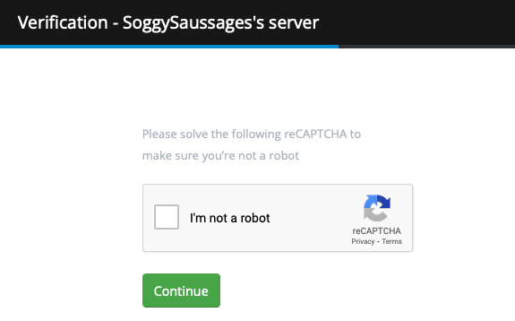
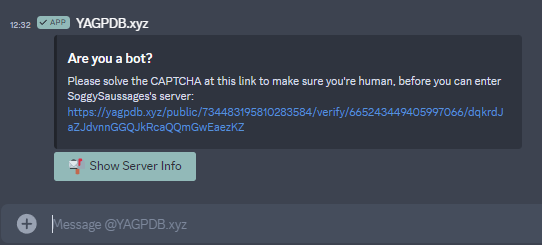

+++
title = 'Verification'
weight = 5
+++

Use Google reCAPTCHA v2 to verify your members before permitting them access to your server.

<!--more-->

The verification plugin assigns a specified role to new members after they successfully complete Google reCAPTCHA v2
verification. This allows you to further verify new members as humans rather than bots before granting them access to
your server.

This is accomplished by sending new members a customizable DM (which employs [template scripting](/docs/reference/templates))
containing a unique link to verify, tied to their User ID. This link takes them to a customizable verification page with
a CAPTCHA challenge. Once completed, the User ID is assigned the verified role.



You must assign a "Verified Role" on the Verification page in the control panel. The plugin will not function if no role
is selected.



## Verify Page

The verification page uses markdown format to render the page. The CAPTCHA challenge and confirmation button are
suffixed below the page content. A success message is displayed upon CAPTCHA completion. You can customize the page
content in the Verification page on the control panel.

## Verification DMs

The verification DM is a template script executed in the new member's DM immediately upon joining. Text output to the
response is sent in the member's DM.

You may optionally send a re-notification message in the member's DMs if they do not verify after X minutes. This
message uses template script as well.

You can customize both messages in the Verification page on the control panel.

[Template Reference](/docs/reference/templates/template-scripting)

Verification scripts provide `.Link` as additional dot context data. This is the unique verification link the user must
visit to verify.



If a user has disabled DMs from server members by default, upon joining your server YAGPDB will fail to send a
verification DM to the user. It is recommended that you inform your new members about this possibility and how to fix it
if they do not receive a DM from YAGPDB.



## Kick After Unverified

You may optionally configure YAGPDB to kick users who haven't verified after X minutes. This is configured in the
Verification page on the control panel.

## Logs

You may optionally configure a channel to send verification logs to. This is done on the Verification page in the
control panel.

Logged events are:

- New user joined, verification DM sent.
- New user verified.
- New user kicked after being unverified for X minutes (as [configured](#kick-after-unverified)).
- New user verified, [alt accounts](#alt-detection) detected.
- New user banned, detected as [alt account](#alt-detection) of banned user.

## Alt Detection



Alt Detection is currently disabled on the official instance of YAGPDB hosted by Botlabs. These features will not
function on the official bot.



By default, upon successful verification YAGPDB will check the user's IP (as captured by the verification page) against
other users who have verified using YAGPDB.

### Alt Banning

When a user is banned for any reason (including bans made outside the bot), YAGPDB will automatically ban any alt
accounts detected for that user.

If a new user verifies who shares an IP with a previously banned user, they will be banned as well.

### Alt Reporting

If a new user who verifies is detected as an alt but none of their associated accounts have been banned, YAGPDB will
send a log to the verification log channel if specified, identifying the new user as an alt and listing other users who
verified at the same IP address.

### Disable Alt Detection Globally

For self hosters, the environment variable to enable this feature is `verification.track_ips`. It is `true` by default.
Disabling IP tracking will also disable alt detection, but the CAPTCHA segment of the verification plugin will be
unaffected.

## Self Hosting YAGPDB

Do not proceed unless you are hosting your own version of the YAGPDB codebase.

### Enabling Verification

Verification requires the `google.recaptcha_secret` and `google.recaptcha_site_key` env variables to be configured and
valid. To get a reCAPTCHA secret and site key, [register a site on
reCAPTCHA](https://www.google.com/recaptcha/admin/create) and copy the generated secret and key.
