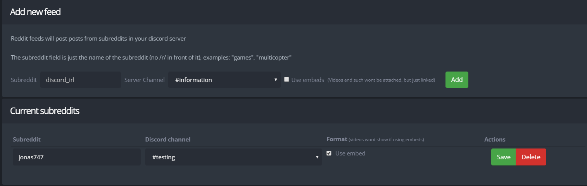

+++
title = "Reddit"
weight = 520
description = "Stalk Reddit without actually using Reddit."
+++

Get notifications from your favorite subreddits directly in your Discord server.

<!--more-->

## Reddit Feed

To get notifications from a subreddit, simply enter the name of the subreddit in the subreddit field without the `r/` in front (for example, to add a feed for the `r/jonas747`, you would put "jonas747" as the subreddit name).
Then, specify which channel you would like the bot to post the feed in.

You can toggle whether to post using embeds or without using them.
With embeds, the feed will look nicer but videos and such will not be attached but just linked.
