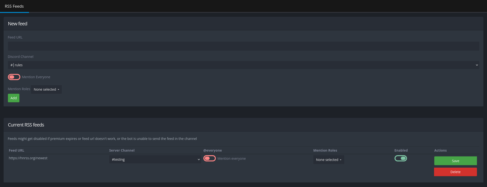

+++
title = "RSS"
description = "Stay updated with RSS"
weight = 550
+++

Receive notifications from your favorite RSS feeds directly in your Discord server.



The bot requires at least the "Read Messages" and "Send Messages" permissions in the channel you want to post the feed in.



## Adding an RSS Feed

To add a new feed simply copy the RSS feed URL and paste it into the "Feed URL" field under "New Feed", then select a channel to post it to.
Optionally select a role to mention when a new post is made, or `@everyone`.
Then, click "Add" to add the feed to your server.

Due to the polling nature of RSS, new posts may take up to 5 minutes to appear in your server.

## Managing RSS Feeds

All your added RSS feeds are listed under "Current RSS Feeds".
From here you can disable, enable or delete existing feeds, as well as edit them to change the channel or the role to mention.



You cannot have more than 2 active RSS feeds at a time (10 with [Premium](/docs/welcome/premium)).
If you have that many feeds active, you cannot add more until you disable or delete at least one of those.


