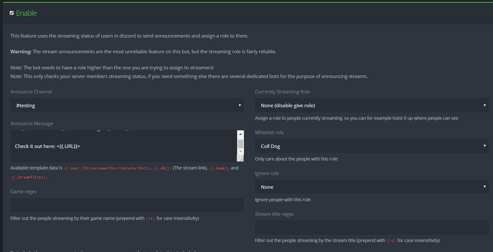

+++
title = 'Streaming'
weight = 4
+++

Let everyone know that someone is currently streaming.

<!--more-->

### Streaming Feed



There are currently some issues with the streaming announcement, and it may not always give the announcement. It will
however, always assign the streamer role.





The streaming role will be **automatically removed** from a member that is not streaming if it is given manually, so be
careful! If YAGPDB is removing member's roles without apparent reason, this may well be the cause.



Steaming notification is triggered based on your Discord streaming status (When you go purple, AKA streaming). You can
either have announcements, be assigned the streaming role or both.

### **Announce Channel**

Choose the Channel that you want to bot to post the announcement in.

### Announcement Message

Write the message that you want the announcement to say. The streaming announcements accept most templates, but have
some additional special ones:

- `{{ .URL }}` outputs the URL of the stream.
- `{{ .Game }}` outputs the current game.
- `{{ .StreamTitle }}` outputs the stream title.
- `{{ .User.Username }}` outputs the Discord username of the person who is streaming.

### Game Regex

Use regex to filter out games to post announcements and assign roles for specific games.

### Currently Streaming Role

Assign this role to the people streaming.

### Whitelist role

Only assign a role and make announcement for the people with this role.

### Ignore role

Do not assign a role and make an announcement for people with this role.

### Stream Title Regex

Use regex to filter out streams based on the title of their stream.
