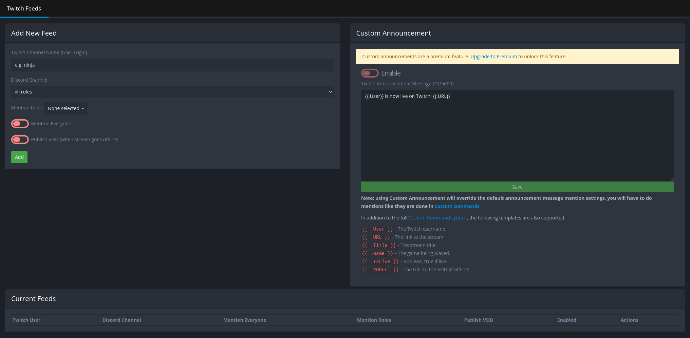

+++
title = "Twitch"
description = "Receive notifications from Twitch"
weight = 560
+++

Receive notifications about your favorite Twitch streamers.
Note that this is different from the Streaming notification, which notifies when someone in your server starts streaming.



The bot requires at least the "Read Messages" and "Send Messages" permissions in the channel you want to post the feed in.





## Adding a Twitch Feed

To add a new feed enter the Twitch channel name (not the full URL) into the "Channel Name" field under "Add New Feed", then select a channel to post it to.
Optionally select a role to mention when a new stream goes live, or `@everyone`.
If you like, you can also tell the bot to additionally publish the VOD when the stream ends.
Then, click "Add" to add the feed to your server.

## Managing Twitch Feeds

All your added Twitch feeds are listed under "Current Feeds".
From here you can disable, enable or delete existing feeds, as well as edit them to change the channel, role to mention, or whether to post VODs.



You cannot have more than 3 active Twitch feeds at a time (15 with [Premium](/docs/welcome/premium)).
You won't be able to add more until you disable or delete at least one of those.



## Custom Announcement Message

The custom announcement message is a premium feature.
As with other custom messages, custom command syntax is fully supported.
The default announcement message is:

```yag
{{ .User }} is now live on Twitch! {{ .URL }}
```

### Additional Context Data

- `{{ .User }}` - The Twitch username of the streamer.
- `{{ .URL }}` - The URL of the stream
- `{{ .Title }}` - The title of the stream
- `{{ .Game }}` - The game/category of the stream
- `{{ .IsLive }}` - Whether the stream is currently live (always true for live announcements, false for VOD announcements)
- `{{ .VODUrl }}` - The URL of the VOD (only available for VOD announcements)
