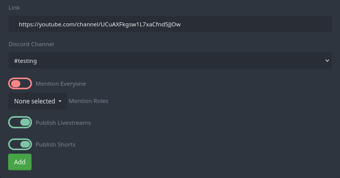
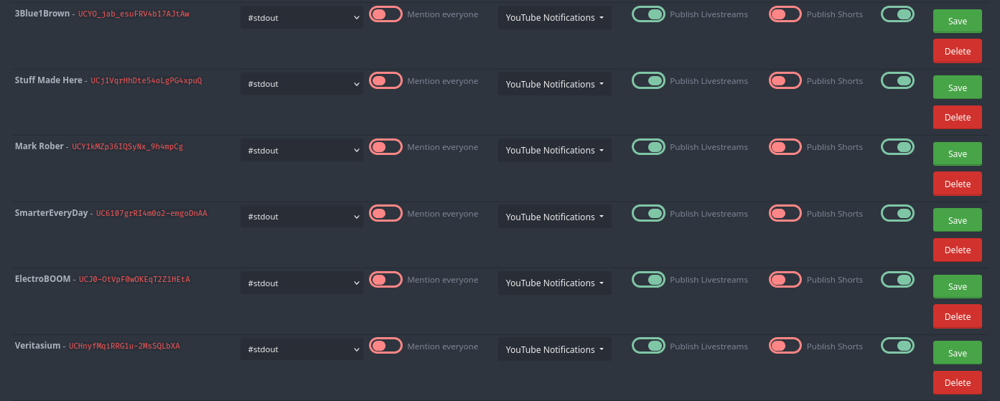

+++
title = "YouTube"
weight = 530
description = "Subscribe to your favorite YouTubers without polluting your own feed."
+++

Get notifications from your favorite YouTubers directly in your Discord server.



The bot requires at least the "Read Messages" and "Send Messages" permissions in the channel you want to post the feed in.



## Adding a YouTube Feed

To add a new feed simply copy the channel URL from YouTube and paste it into the "Link" field under "Add New Feed" (you may need to scroll down a bit), then select a channel to post it to.
For a visual reference, please see the image below.

<center>



</center>

If you are unable to obtain a direct channel URL, similar to <https://youtube.com/channel/UCuAXFkgsw1L7xaCfnd5JJOw>, we also support the following URLs:

- Video links (<https://youtube.com/watch?v=dQw4w9WgXcQ>)
- Shorts links (<https://youtube.com/shorts/pBZ_2pX_8mg>)
- Share links (<https://youtu.be/dQw4w9WgXcQ>)
- Live links (<https://youtube.com/live/jfKfPfyJRdk>)
- Playlist links (<https://youtube.com/playlist?list=PLEamUZtdyTMxwDNQ97Y7im8EwqRyht12R>)

Less reliable, but also supported are

- usernames (<https://youtube.com/user/MontyPython>)
- custom links (<https://youtube.com/c/Taskmaster>)
- handles (<https://youtube.com/@TomScottGo>)

as we use the first result of a YouTube search to determine the channel via these URLs.
If you find yourself having trouble adding a feed using these kinds of URLs, please try to use one of the links listed above before asking for help in the [support server](/discord).



You cannot have more than 10 active YouTube feeds at a time (250 with [Premium](/docs/welcome/premium)).
If you have that many feeds active, you cannot add more until you disable at least one of those.
Disabled excess feeds will be deleted once you add a new one.



## Configuring a YouTube Feed

During setup of a feed there are four more options you can configure, namely:

- mention `@everyone` in the announcement message
- mention a specific role
- also publish livestreams
- also publish shorts



The bot needs mention `@everyone` or "mention this role" permissions if you wish to mention everyone or a specific role of your choosing.



You need not configure any of these ahead of time, you can always [edit the feed](#editing-a-youtube-feed) later.

## Editing a YouTube Feed

To edit a feed, scroll down further until you reach the "Current subscribed channels" section.
There you will find a list of all the feeds you have added.



Going from left to right of the editable options, you can change the following:

- The Discord channel to post to
- Mention `@everyone` in the announcement message
- Mention a specific role
- Also publish livestreams
- Also publish shorts
- Disable the feed until you enable it again

Once you have made your changes, click the "Save" button on the far right to save your changes.
If you instead wish to delete the feed, click the "Delete" button just below the "Save" button.
None of these options need to be equal across all your feeds, you can have different settings for each feed.

You can only save changes to a feed one at a time, so if there are multiple feeds you wish to edit, you have to do so separately, saving after each feed you edited.

## Custom Announcement

If you take a look at the top-right of the configuration page, you'll see a field for custom command templates for usage in the announcement message provided for YouTube feeds.
The default response is the following code:

```yag
{{.ChannelName}} published a new video! {{.URL}}
```

You can customize this message to your liking, but bear in mind that using a custom announcement message will override the default announcement's mention settings *for all channels*, therefore you will have to implement this logic by yourself.
Refer to the [mentions functions](https://help.yagpdb.xyz/docs/reference/templates/functions/#mentions) for more information.



Using a custom announcement message will override the default announcement's mention settings for all channels.
Really.



### Additional Context Data

In addition to the standard context data available to all custom commands, we provide the following additional context data:

- `{{ .ChannelID }}`: ID of the YouTube Channel.
- `{{ .ChannelName }}`: Name of the YouTube Channel.
- `{{ .IsLiveStream }}`: True, if the notification is for a livestream else False.
- `{{ .IsUpcoming }}`: True, if the notification is for a scheduled release else False.
- `{{ .VideoID }}`: ID of the video.
- `{{ .VideoTitle }}`: Title of the video.
- `{{ .VideoThumbnail }}`: Thumbnail image URL of the video.
- `{{ .VideoDescription }}`: Description of the video.
- `{{ .VideoDurationSeconds }}`: Duration of video in seconds.
- `{{ .Video }}`: Data of the video as available in the [YouTube API][video-yt-api].
- `{{ .URL }}`: Video URL.

[video-yt-api]: https://pkg.go.dev/google.golang.org/api/youtube/v3#Video
