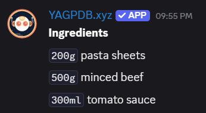
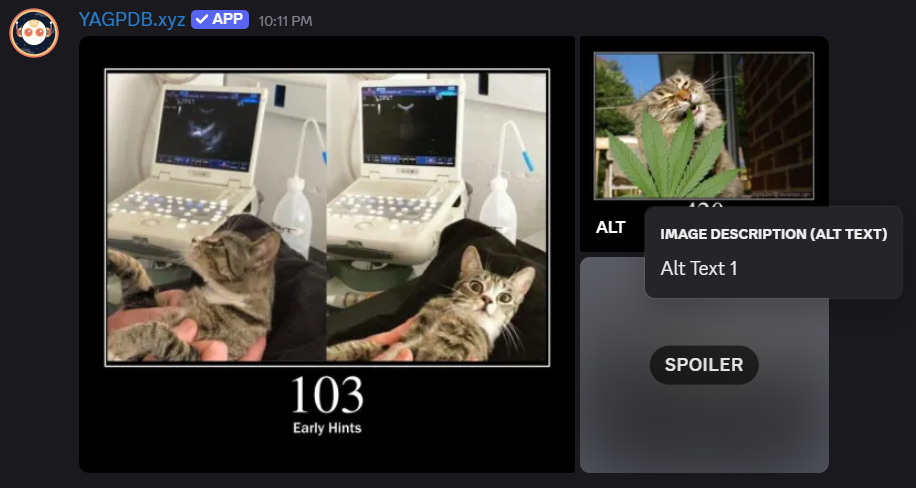
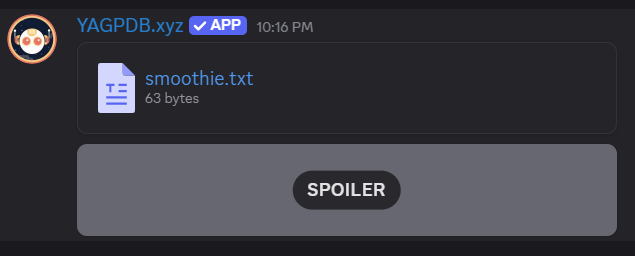
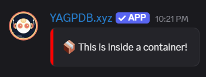
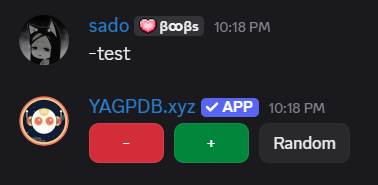
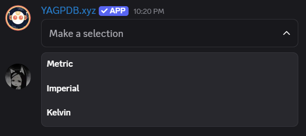
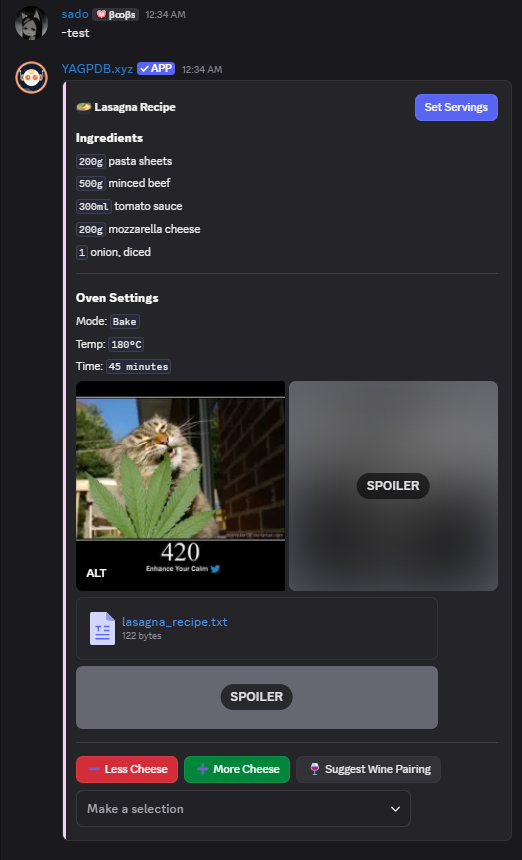

+++
title = "Components V2"
weight = 1020
description = "Be fancier, use components!"
+++

## componentBuilder

`componentBuilder` is a helper for building Discord’s new Components V2 (sections, buttons, menus, galleries).
It provides a simple template-based way to assemble complex message layouts without needing to write raw JSON.
You describe components with key–value pairs and `componentBuilder` handles conversion and validation for you.

This makes it easier to:

- Create rich messages with text, images, and files.
- Add interactive components like buttons and select menus.
- Group and style components with containers.
- Control delivery with meta options like ephemeral replies.

### Text

Displays plain text content, supporting markdown. Can be a string or a slice of strings.

```yag
{{ $text := componentBuilder
    "text" "Component Builder v2 test!"
}}

{{/* or */}}

{{ $text := componentBuilder
    "text" (cslice
        "### Ingredients"
        "`200g` pasta sheets"
        "`500g` minced beef"
        "`300ml` tomato sauce"
    )
}}
```



### Section

A layout block that shows text with one optional accessory: a button **or** a thumbnail.

`text`: A string, or slice of strings.

`button`: [Button](/docs/reference/templates/functions#cbutton) (optional)

`thumbnail`: sdict with keys media, description, spoiler (optional)

###### Example

For brevity, this example shows both a button and a thumbnail within a single section, but only one of those accessories
can be used per section.

```yag
{{ $section := componentBuilder
    "section" (sdict
        "text" "🍲 **Lasagna Recipe**"
        "thumbnail" (sdict
            "media" "https://http.cat/103"
            "description" "Alt text"
            "spoiler" false
        )
        "button" (cbutton (sdict "label" "Set Servings" "custom_id" "set-servings" "style" "primary"))
    )
}}
```


### Gallery

Displays one or more media items with optional descriptions and spoiler flags.

`media`: string

`description`: string (optional)

`spoiler`: bool (optional)

```yag
{{ $gallery := componentBuilder
    "gallery" (cslice
        (sdict "media" "https://http.cat/103")
        (sdict "media" "https://http.cat/420" "description" "I dont have food pics")
        (sdict "media" "https://http.cat/451" "description" "So have random cats" "spoiler" true)
    )
}}
```



### File

Attaches text files to the message and optionally displays them.

`content`: string (max 100 000 chars)

`name`: string (filename, .txt appended automatically)

```yag
{{ $file := componentBuilder
    "file" (cslice
        (sdict
            "content" "Step 1: Boil pasta\nStep 2: Cook beef\nStep 3: Layer & bake"
            "name" "lasagna_recipe"
        )
        (sdict
            "content" "Tips:\n- Use fresh herbs\n- Let it rest 10 min before serving"
            "name" "lasagna_tips"
            "spoiler" true
        )
    )
}}
```



### Separator

Adds spacing between components.

`true`: large separator

`false` or `nil`: small separator

```yag
{{ $separator := componentBuilder "separator" true }}
```

### Container

Groups multiple components with optional styling.

`components`: ComponentBuilder or list of entries

`color`: hex accent color (optional)

`spoiler`: hides content until revealed (optional)

```yag
{{ $container := componentBuilder
    "container" (sdict
        "color" 0xF5CDF6
        "spoiler" false
        "components" (componentBuilder
            "text" "🍲 **Lasagna Recipe**"
            "buttons" (cslice
                (cbutton (sdict "label" "Start" "custom_id" "start" "style" "primary"))
                (cbutton (sdict "label" "Cancel" "custom_id" "cancel" "style" "danger"))
            )
        )
    )
}}
```



### Buttons

Interactive buttons users can click. Can be single or multiple. see [cbutton](/docs/reference/templates/functions#cbutton).

- Maximum 25 buttons total (5 rows \* 5 buttons)

- Link buttons don’t need a `custom_id`

```yag
{{ $buttons := componentBuilder
    "buttons" (cslice
        (cbutton "label" "-" "custom_id" "decrease" "style" "danger")
        (cbutton "label" "+" "custom_id" "increase" "style" "success")
        (cbutton "label" "Random" "custom_id" "random" "style" "secondary")
    )
}}
```



### Menus

Select menus for user options. see [cmenu](/docs/reference/templates/functions#cmenu).

- Maximum 5 menus per message

- Each menu occupies its own row

```yag
{{ $menu := componentBuilder
    "menus" (cmenu
        "custom_id" "unit-select"
        "options" (cslice
            (sdict "label" "Metric" "value" "metric")
            (sdict "label" "Imperial" "value" "imperial")
            (sdict "label" "Kelvin" "value" "kelvin")
        )
    )
}}
```



### Interactive Components

Mix of buttons and menus, auto-distributed. see [cbutton](/docs/reference/templates/functions#cbutton) and
[cmenu](/docs/reference/templates/functions#cmenu), respectively.

Accepts:

- Single component

- Slice of components

- Slice of slices (to define rows)

```yag
{{ $interactive := componentBuilder
    "interactive_components" (cslice
        (cbutton "label" "Approve" "custom_id" "approve" "style" "success")
        (cbutton "label" "Reject" "custom_id" "reject" "style" "danger")
        (cmenu
            "custom_id" "priority-select"
            "options" (cslice
                (sdict "label" "High" "value" "high")
                (sdict "label" "Medium" "value" "medium")
                (sdict "label" "Low" "value" "low")
            )
        )
    )
}}
```

### Meta keys

- `allowed_mentions`: control pings (users, roles, everyone)

- `reply`: message ID to reply to (only available in interactions)

- `silent`: suppress notifications

- `ephemeral`: message visible only to interaction user

###### Example

This example combines text, sections, gallery, files, buttons, menus, and container styling into a single, cohesive layout.

```yag
{{ $section := sdict
    "text" "🍲 **Lasagna Recipe**"
    "button" (cbutton "label" "Set Servings" "custom_id" "set-servings" "style" "primary")
}}

{{ $pasta := cslice "### Ingredients" "`200g` pasta sheets" "`500g` minced beef" "`300ml` tomato sauce" "`200g` mozzarella cheese" "`1` onion, diced" }}

{{ $oven := cslice "### Oven Settings" "Mode: `Bake`" "Temp: `180°C`" "Time: `45 minutes`" }}

{{ $gallery := cslice
    (sdict "media" "https://http.cat/420" "description" "Step 1: Prep ingredients")
    (sdict "media" "https://http.cat/451" "description" "Step 2: Into the oven!" "spoiler" true)
}}

{{ $file := cslice
    (sdict
        "content" "Step 1: Boil pasta\nStep 2: Cook beef with onion\nStep 3: Layer pasta, beef, sauce, cheese\nStep 4: Bake at 180°C for 45 min"
        "name" "lasagna_recipe"
    )
    (sdict
        "content" "Tips:\n- Use fresh herbs for better flavor\n- Let it rest 10 min before serving"
        "name" "lasagna_tips"
        "spoiler" true
    )
}}

{{ $buttons := cslice
    (cbutton "label" "➖ Less Cheese" "custom_id" "less-cheese" "style" "danger")
    (cbutton "label" "➕ More Cheese" "custom_id" "more-cheese" "style" "success")
    (cbutton "label" "🍷 Suggest Wine Pairing" "custom_id" "wine" "style" "secondary")
}}

{{ $menus := cmenu
    "custom_id" "sauce-select"
    "options" (cslice
        (sdict "label" "Classic Tomato" "value" "tomato")
        (sdict "label" "White Sauce" "value" "bechamel")
        (sdict "label" "Spicy Arrabbiata" "value" "arrabbiata")
    )
}}

{{ $comp := componentBuilder
    "silent" true
    "container" (sdict
        "color" 0xF5CDF6
        "components" (componentBuilder
            "section" $section
            "text" $pasta
            "separator" true
            "text" $oven
            "gallery" $gallery
            "file" $file
            "separator" true
            "buttons" $buttons
            "menus" $menus
        )
    )
}}

{{ sendMessage nil $comp }}
```



## Component Builder Helper Functions

The helper function provides methods to construct, manipulate, and get Discord V2 message components programmatically.

These methods allow you to build complex layouts incrementally and retrieve them in a format that Discord understands.

### componentBuilder.Add

Adds a single component entry to the builder under the given key.

```yag
{{ $cb.Add <key> <value> }}
```

Parameters:

- `key` – The top-level key for the component (e.g., "text", "section", "buttons").
- `value` – The component data (string, sdict, Button, SelectMenu, etc.).

###### Example

```yag
{{ $builder := componentBuilder }}
{{ $section := sdict
    "text" "🍲 **Lasagna Recipe**"
    "button" (cbutton "label" "Set Servings" "custom_id" "set-servings" "style" "primary")
}}
{{ $builder.Add "section" $section }}
```

### componentBuilder.AddSlice

Adds multiple components under one key.

```yag
{{ $cb.AddSlice <key> <values...> }}
```

Parameters:

- `key` – The top-level key for the component (e.g., "text", "section", "buttons").
- `values` – The component data (string, sdict, Button, SelectMenu, etc.).

###### Example

```yag
{{ $builder := componentBuilder }}
{{ $pasta := cslice
    "### Ingredients"
    "`200g` pasta sheets"
    "`500g` minced beef"
    "`300ml` tomato sauce"
    "`200g` mozzarella cheese"
    "`1` onion, diced"
}}
{{ $builder.AddSlice "text" $pasta }}
```

### componentBuilder.Merge

Combine another builder into the current one.

```yag
{{ $cb.Merge <componentBuilder> }}
```

Parameters:

- `other` – The builder to merge.

###### Example

```yag
{{ $builder1 := componentBuilder }}
{{ $builder2 := componentBuilder }}
{{ $oven := cslice
    "### Oven Settings"
    "Mode: `Bake`"
    "Temp: `180°C`"
    "Time: `45 minutes`"
}}
{{ $section := sdict
    "text" "🍲 **Lasagna Recipe**"
    "button" (cbutton "label" "Set Servings" "custom_id" "set-servings" "style" "primary")
}}
{{ $builder1.Add "section" $section }}
{{ $builder2.AddSlice "text" $oven }}
{{ $builder1.Merge $builder2 }}
```

### componentBuilder.Get

Retrieve components stored under a key.

```yag
{{ $components := $cb.Get <key> }}
```

Parameters:

- `key` – The top-level key for the component (e.g., "text", "section", "buttons").

###### Example

```yag
{{ $textComponents := $builder1.Get "text" }}
```

`$textComponents` now contains the ingredient and oven text slices.

---

Here's an example of how to use the helper function to create a complex layout:

###### Example (with helper function)

```yag
{{ $section := sdict
    "text" "🍲 **Lasagna Recipe**"
    "button" (cbutton "label" "Set Servings" "custom_id" "set-servings" "style" "primary")
}}
{{ $pasta := cslice
    "### Ingredients"
    "`200g` pasta sheets"
    "`500g` minced beef"
    "`300ml` tomato sauce"
    "`200g` mozzarella cheese"
    "`1` onion, diced"
}}
{{ $oven := cslice
    "### Oven Settings"
    "Mode: `Bake`"
    "Temp: `180°C`"
    "Time: `45 minutes`"
}}
{{ $gallery := cslice
    (sdict "media" "https://http.cat/420" "description" "Step 1: Prep ingredients")
    (sdict "media" "https://http.cat/451" "description" "Step 2: Into the oven!" "spoiler" true)
}}
{{ $file := cslice
    (sdict
        "content" "Step 1: Boil pasta\nStep 2: Cook beef with onion\nStep 3: Layer pasta, beef, sauce, cheese\nStep 4: Bake at 180°C for 45 min"
        "name" "lasagna_recipe"
    )
    (sdict
        "content" "Tips:\n- Use fresh herbs for better flavor\n- Let it rest 10 min before serving"
        "name" "lasagna_tips"
        "spoiler" true
    )
}}
{{ $buttons := cslice
    (cbutton "label" "➖ Less Cheese" "custom_id" "less-cheese" "style" "danger")
    (cbutton "label" "➕ More Cheese" "custom_id" "more-cheese" "style" "success")
    (cbutton "label" "🍷 Suggest Wine Pairing" "custom_id" "wine" "style" "secondary")
}}
{{ $menus := cmenu
    "custom_id" "sauce-select"
    "options" (cslice
        (sdict "label" "Classic Tomato" "value" "tomato")
        (sdict "label" "White Sauce" "value" "bechamel")
        (sdict "label" "Spicy Arrabbiata" "value" "arrabbiata")
    )
}}

{{ $builder := componentBuilder }}

{{ $builder.Add "section" $section }}

{{ $builder.AddSlice "text" $pasta }}

{{ $builder.Add "separator" true }}

{{ $builder.AddSlice "text" $oven }}

{{ $builder.Add "separator" true }}

{{ $builder.Add "gallery" $gallery }}
{{ $builder.Add "file" $file }}

{{ $builder.Add "separator" true }}

{{ $builder.Add "buttons" $buttons }}
{{ $builder.Add "menus" $menus }}

{{ $container := componentBuilder }}

{{ $container.Add "container" (sdict
    "color" 0xF5CDF6
    "components" $builder
  )
}}

{{ sendMessage nil $container }}
```
