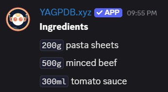
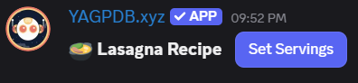
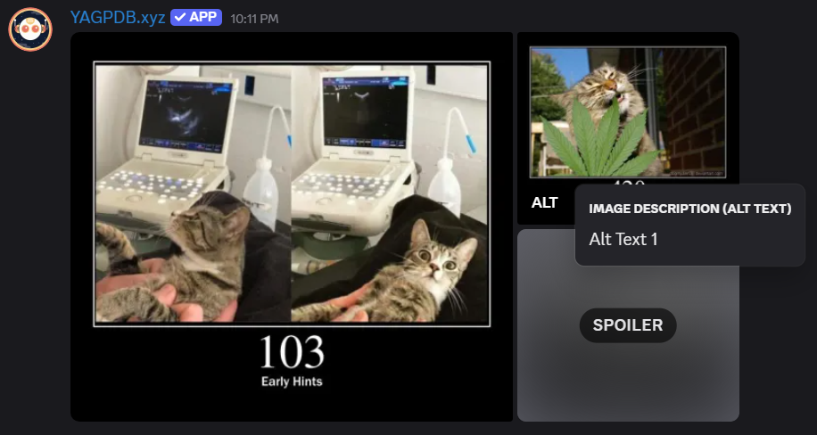
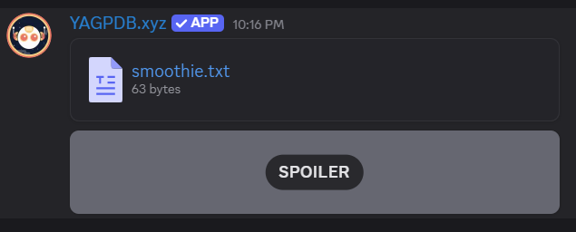
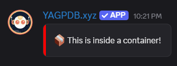
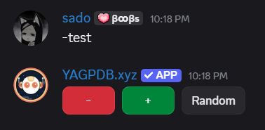
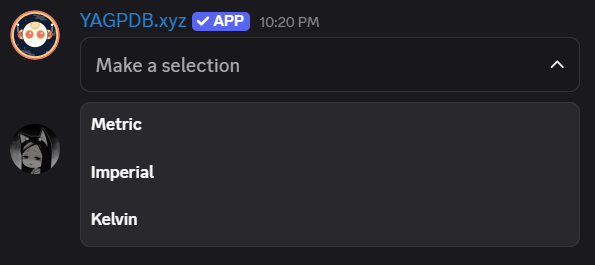
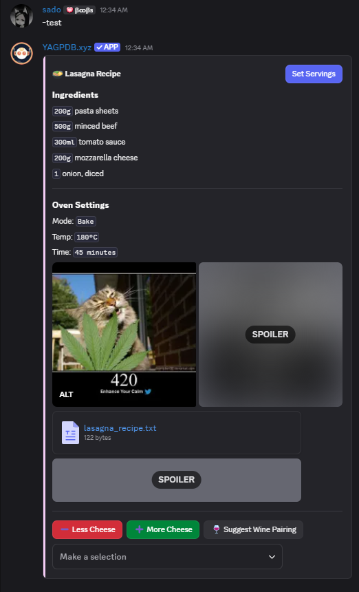

+++
title = "Components V2"
weight = 920
description = "Be fancier, use components!"
+++

## componentBuilder
`componentBuilder` is a helper for building Discord’s new Components V2 (sections, buttons, menus, galleries, etc.) in YAGPDB custom commands.

It provides a simple template-based way to assemble complex message layouts without needing to write raw JSON. Instead, you describe components with key–value pairs (sdict, strings, arrays), and `componentBuilder` handles conversion and validation for you.

This makes it easier to:

- Create rich messages with text, images, and files.
- Add interactive components like buttons and select menus.
- Group and style components with containers.
- Control delivery with meta options like ephemeral replies.

### Text

Displays plain text content, supporting markdown. Can be a string or a slice of strings.

`text`: string | []string

Example:
```go
{{$text := componentBuilder (sdict
    "text" "Component Builder v2 test!"
)}}
{{/* or */}}
{{$text := componentBuilder (sdict
    "text" (cslice
        "### Ingredients"
        "`200g` pasta sheets"
        "`500g` minced beef"
        "`300ml` tomato sauce"
    )
)}}
{{sendMessage nil $text}}
```


### Section

A layout block that shows text with one optional accessory: a button OR a thumbnail.

`text`: string | []string

`button`: Button (optional)

`thumbnail`: sdict with keys media, description, spoiler (optional)
```go
{{$section := componentBuilder (sdict
    "section" (sdict
        "text" "🍲 **Lasagna Recipe**"
        "thumbnail" (sdict
            "media" "https://http.cat/103"
            "description" "Alt text"
            "spoiler" false
        )
        "button" (cbutton (sdict "label" "Set Servings" "custom_id" "set-servings" "style" "primary"))
    )
)}}
```

The above example shows `button` and `thumbnail` in `section`, however you can use only one of them, not both at same time.



### Gallery

Displays one or more media items with optional descriptions and spoiler flags.

`media`: string

`description`: string (optional)

`spoiler`: bool (optional)
```go
{{$gallery := componentBuilder (sdict
    "gallery" (cslice
        (sdict "media" "https://http.cat/103")
        (sdict "media" "https://http.cat/420" "description" "I dont have food pics")
        (sdict "media" "https://http.cat/451" "description" "So have random cats" "spoiler" true)
    )
)}}
```


### File

Attaches text files to the message and optionally displays them.

`content`: string (≤ 100,000 chars)

`name`: string (filename, .txt appended automatically)
```go
{{$file := componentBuilder (sdict
    "file" (cslice
        (sdict
            "content" "Step 1: Boil pasta\nStep 2: Cook beef\nStep 3: Layer & bake"
            "name" "lasagna_recipe"
        )
        (sdict
            "content" "Tips:\n- Use fresh herbs\n- Let it rest 10 min before serving"
            "name" "lasagna_tips"
            "spoiler" true
        )
    )
)}}
```


### Separator

Adds spacing between components.

`true`: large separator

`false` or `nil`: small separator
```go
{{$separator := componentBuilder (sdict "separator" true)}}
```

### Container

Groups multiple components with optional styling.

`components`: ComponentBuilder or list of entries

`color`: hex accent color (optional)

`spoiler`: hides content until revealed (optional)

```go
{{$container := sdict
    "color" 0xF5CDF6
    "spoiler" false
    "components" (componentBuilder (sdict
        "text" "🍲 **Lasagna Recipe**"
            "buttons" (cslice
                (cbutton (sdict "label" "Start" "custom_id" "start" "style" "primary"))
                (cbutton (sdict "label" "Cancel" "custom_id" "cancel" "style" "danger"))
            )
        ))
    }}
{{$component := componentBuilder (sdict
    "container" $container
)}}
```


### Buttons

Interactive buttons users can click. Can be single or multiple. see [cbutton](../reference/templates/functions.md#cbutton).

- Maximum 25 buttons total (5 rows × 5 buttons)

- Link buttons don’t need a `custom_id`
```go
{{$buttons := componentBuilder (sdict
"buttons" (cslice
    (cbutton (sdict "label" "-" "custom_id" "decrease" "style" "danger"))
    (cbutton (sdict "label" "+" "custom_id" "increase" "style" "success"))
    (cbutton (sdict "label" "Random" "custom_id" "random" "style" "secondary"))
)
)}}
```


### Menus

Select menus for user options. see [cmenu](../reference/templates/functions.md#cmenu).

- Maximum 5 menus per message

- Each menu occupies its own row
```go
{{$menu := componentBuilder (sdict
"menus" (cmenu (sdict
    "custom_id" "unit-select"
    "options" (cslice
    (sdict "label" "Metric" "value" "metric")
    (sdict "label" "Imperial" "value" "imperial")
    (sdict "label" "Kelvin" "value" "kelvin")
    )
)))
}}
```


### Interactive Components

Mix of buttons and menus, auto-distributed. see [cbutton](../reference/templates/functions.md#cbutton)/[cmenu](../reference/templates/functions.md#cmenu).

Accepts:

- Single component

- Slice of components

- Slice of slices (to define rows)
```go
{{$interactive := componentBuilder (sdict "interactive_components" (cslice
    (cbutton (sdict "label" "Approve" "custom_id" "approve" "style" "success"))
    (cbutton (sdict "label" "Reject" "custom_id" "reject" "style" "danger"))
    (cmenu (sdict
        "custom_id" "priority-select"
        "options" (cslice
            (sdict "label" "High" "value" "high")
            (sdict "label" "Medium" "value" "medium")
            (sdict "label" "Low" "value" "low")
        )
    ))
))}}
```

### Meta keys

- `allowed_mentions`: control pings (users, roles, everyone)

- `reply`: message ID to reply to (only available in interactions)

- `silent`: suppress notifications

- `ephemeral`: message visible only to interaction user

### Example
This example combines text, sections, gallery, files, buttons, menus, and container styling into a single, cohesive layout.
```go
{{$section := sdict
  "text" "🍲 **Lasagna Recipe**"
  "button" (cbutton (sdict "label" "Set Servings" "custom_id" "set-servings" "style" "primary"))
}}
{{$pasta := cslice
  "### Ingredients"
  "`200g` pasta sheets"
  "`500g` minced beef"
  "`300ml` tomato sauce"
  "`200g` mozzarella cheese"
  "`1` onion, diced"
}}
{{$oven := cslice
  "### Oven Settings"
  "Mode: `Bake`"
  "Temp: `180°C`"
  "Time: `45 minutes`"
}}
{{$gallery := cslice
  (sdict "media" "https://http.cat/420" "description" "Step 1: Prep ingredients")
  (sdict "media" "https://http.cat/451" "description" "Step 2: Into the oven!" "spoiler" true)
}}
{{$file := cslice
  (sdict
   "content" "Step 1: Boil pasta\nStep 2: Cook beef with onion\nStep 3: Layer pasta, beef, sauce, cheese\nStep 4: Bake at 180°C for 45 min"
   "name" "lasagna_recipe"
  )
  (sdict
   "content" "Tips:\n- Use fresh herbs for better flavor\n- Let it rest 10 min before serving"
   "name" "lasagna_tips"
   "spoiler" true
  )
}}
{{$buttons := cslice
  (cbutton (sdict "label" "➖ Less Cheese" "custom_id" "less-cheese" "style" "danger"))
  (cbutton (sdict "label" "➕ More Cheese" "custom_id" "more-cheese" "style" "success"))
  (cbutton (sdict "label" "🍷 Suggest Wine Pairing" "custom_id" "wine" "style" "secondary"))
}}
{{$menus := cmenu (sdict
  "custom_id" "sauce-select"
  "options" (cslice
             (sdict "label" "Classic Tomato" "value" "tomato")
             (sdict "label" "White Sauce" "value" "bechamel")
             (sdict "label" "Spicy Arrabbiata" "value" "arrabbiata")
            )
)}}
{{$comp := componentBuilder (sdict
  "silent" true
  "container" (sdict
    "color" 0xF5CDF6
    "components" (componentBuilder
      "section" $section
      "text" $pasta
      "separator" true
      "text" $oven
      "gallery" $gallery
      "file" $file
      "separator" true
      "buttons" $buttons
      "menus" $menus
    )
  )
)}}
{{sendMessage nil $comp}}
```


## Component Builder Helper Functions

The `componentBuilder` helper function provides methods to construct, manipulate, and get Discord V2 message components programmatically. These methods allow you to build complex layouts incrementally and retrieve them in a format that Discord understands.

### componentBuilder.Add
Adds a single component entry to the builder under the given key.
- Parameters:
    - `key` – The top-level key for the component (e.g., "text", "section", "buttons").
    - `value` – The component data (string, sdict, Button, SelectMenu, etc.).

- Example:
```go
{{$builder := componentBuilder}}
{{$section := sdict
    "text" "🍲 **Lasagna Recipe**"
    "button" (cbutton (sdict "label" "Set Servings" "custom_id" "set-servings" "style" "primary"))
}}
{{$builder.Add "section" $section}}
```

### componentBuilder.AddSlice
Adds multiple components under one key.

- Parameters:
    - `key` – The top-level key for the component (e.g., "text", "section", "buttons").
    - `values` – The component data (string, sdict, Button, SelectMenu, etc.).

- Example:
```go
{{$builder := componentBuilder}}
{{$pasta := cslice
    "### Ingredients"
    "`200g` pasta sheets"
    "`500g` minced beef"
    "`300ml` tomato sauce"
    "`200g` mozzarella cheese"
    "`1` onion, diced"
}}
{{$builder.AddSlice "text" $pasta}}
```

### componentBuilder.Merge
Combine another builder into the current one.

- Parameters:
    - `other` – The builder to merge.

- Example:
```go
{{$builder1 := componentBuilder}}
{{$builder2 := componentBuilder}}
{{$oven := cslice
    "### Oven Settings"
    "Mode: `Bake`"
    "Temp: `180°C`"
    "Time: `45 minutes`"
}}
{{$section := sdict
    "text" "🍲 **Lasagna Recipe**"
    "button" (cbutton (sdict "label" "Set Servings" "custom_id" "set-servings" "style" "primary"))
}}
{{$builder1.Add "section" $section}}
{{$builder2.AddSlice "text" $oven}}
{{$builder1.Merge $builder2}}
```

### componentBuilder.Get
Retrieve components stored under a key.

- Parameters:
    - `key` – The top-level key for the component (e.g., "text", "section", "buttons").

- Example:
```go
{{$textComponents := $builder1.Get "text"}}
```
`$textComponents` now contains the ingredient and oven text slices.

### Example (With helper functions)
```go
{{$section := sdict
  "text" "🍲 **Lasagna Recipe**"
  "button" (cbutton (sdict "label" "Set Servings" "custom_id" "set-servings" "style" "primary"))
}}
{{$pasta := cslice
  "### Ingredients"
  "`200g` pasta sheets"
  "`500g` minced beef"
  "`300ml` tomato sauce"
  "`200g` mozzarella cheese"
  "`1` onion, diced"
}}
{{$oven := cslice
  "### Oven Settings"
  "Mode: `Bake`"
  "Temp: `180°C`"
  "Time: `45 minutes`"
}}
{{$gallery := cslice
  (sdict "media" "https://http.cat/420" "description" "Step 1: Prep ingredients")
  (sdict "media" "https://http.cat/451" "description" "Step 2: Into the oven!" "spoiler" true)
}}
{{$file := cslice
  (sdict
   "content" "Step 1: Boil pasta\nStep 2: Cook beef with onion\nStep 3: Layer pasta, beef, sauce, cheese\nStep 4: Bake at 180°C for 45 min"
   "name" "lasagna_recipe"
  )
  (sdict
   "content" "Tips:\n- Use fresh herbs for better flavor\n- Let it rest 10 min before serving"
   "name" "lasagna_tips"
   "spoiler" true
  )
}}
{{$buttons := cslice
  (cbutton (sdict "label" "➖ Less Cheese" "custom_id" "less-cheese" "style" "danger"))
  (cbutton (sdict "label" "➕ More Cheese" "custom_id" "more-cheese" "style" "success"))
  (cbutton (sdict "label" "🍷 Suggest Wine Pairing" "custom_id" "wine" "style" "secondary"))
}}
{{$menus := cmenu (sdict
  "custom_id" "sauce-select"
  "options" (cslice
             (sdict "label" "Classic Tomato" "value" "tomato")
             (sdict "label" "White Sauce" "value" "bechamel")
             (sdict "label" "Spicy Arrabbiata" "value" "arrabbiata")
            )
)}}

{{$builder := componentBuilder}}

{{$builder.Add "section" $section}}

{{$builder.AddSlice "text" $pasta}}

{{$builder.Add "separator" true}}

{{$builder.AddSlice "text" $oven}}

{{$builder.Add "separator" true}}

{{$builder.Add "gallery" $gallery}}
{{$builder.Add "file" $file}}

{{$builder.Add "separator" true}}

{{$builder.Add "buttons" $buttons}}
{{$builder.Add "menus" $menus}}

{{$container := componentBuilder}}
{{$container.Add "container" (sdict
    "color" 0xF5CDF6
    "components" $builder
)}}

{{sendMessage nil $container}}
```