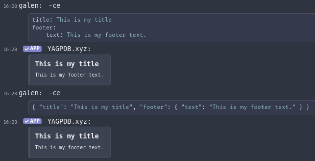

+++
title = "Custom Embeds"
weight = 940
description = "Be fancy, use embeds!"
+++

A guide to creating custom embeds in various contexts across YAGPDB.

<!--more-->



Embeds have limits, summarized in [Discord channel
documentation](https://discord.com/developers/docs/resources/channel#embed-object-embed-limits).





Custom Embeds with the `customembed` command don't work in custom commands. If you want to know how you can use embeds
in custom commands, scroll down to [Embeds in Custom Commands](#embeds-in-custom-commands).



## The `customembed` command

One method of sending an embed with YAGPDB is using the command `customembed` (or for short, `ce`).

### Create embeds by hand

YAGPDB accepts embeds in JSON or YAML following the rules of Discord's [Embed Object] structure.

[Embed Object]: https://discord.com/developers/docs/resources/message#embed-object



#### Using YAML

```yaml
title: This is my title
footer:
	text: This is my footer text.
```

YAML input is formatted as a list of names with associated values for each part of the embed. In this example I start
with a name (title) and the associated value (This is my title) after a semicolon. On a new line, we have another name
(footer), this time with another list of name-value pairs as the value. An indent indicates that the name-value pair
(text: This is ...) is part of the value of the footer.

##### The syntax of YAML

[YAML] has an intuitive, lenient syntax. Most parts of the embed are simple name-value pairs (or nested name-value
maps like in the footer shown above). New lines separate each pair, unless the next line is indented to indicate that
that line is the value. Strings (text) can be included as-is without quotes, unless the text contains special characters
like `:`, in which case single quotes (`'`) or double quotes (`"`) may be used. Double quotes allow backslash-escapes to
add newlines, double quotes, and more.

[YAML]: https://en.wikipedia.org/wiki/YAML#Syntax

#### Using JSON

```javascript
{ "title": "This is my title", "footer": { "text": "This is my footer text." } }
```

As shown in the example above, I start my object (the embed) with a curly brace. Like YAML, we then have a name (title)
and the value for that name (This is my title). We separate each name-value pair with a comma. Then we have something
similar, but with another object as the value. Within that object we have a name-value pair with the same format as the
title, this time for the footer text. In the end we close the objects (footer and embed) with more curly braces.

##### The syntax of JSON

[JSON]'s syntax is also quite simple. Objects start with an opening curly brace (`{`) and end with a closing curly brace
(`}`). Between these, you can add names and their associated values. Each name-value pair is separated by a comma (`,`).
Around strings (text) you wrap two quotation marks (`""`), but nothing around integers (whole numbers) or booleans
(`true` or `false` values). You can play around with this a bit.

Some special characters need to be prefixed with a backslash in strings to indicate that they aren't part of the JSON
syntax:

| Special character   | Escaped input |
| ------------------  | ------------- |
| Quotation mark (")  | \\"           |
| Backslash (\\)      | \\\\          |
| Slash (/)           | \\/           |
| Backspace           | \b            |
| Form feed           | \f            |
| New line            | \n            |
| Carriage return     | \r            |
| Horizontal tab      | \t            |
| [Unicode character] | \uXXXX        |

[JSON]: https://en.wikipedia.org/wiki/JSON#Syntax
[Unicode character]: https://en.wikipedia.org/wiki/List_of_Unicode_characters

### Create embeds with a generator

Creating embeds with a generator can be more difficult if you don't need any difficult features. If you want your embed
to be super shiny, you can use [an embed generator](https://leovoel.github.io/embed-visualizer/). The customembed
command only sends an embed, so you'll need to remove everything around it:

````javascript
{
  "content": "...",
  "embed":
````

and the last curly brace (`}`). After this you can copy and paste it after the `ce` command:


## Embeds in Custom Commands

Embeds in custom commands are a little more involved. To start off, we'll take a look at this example and break it down:

```yag
{{ $embed := cembed "title" "This is my title" "description" "This is my description." }}
{{ sendMessage nil $embed }}
```

First off, I start creating my embed by defining it in a variable called `embed` in the well-known templating curly
braces. This makes it a bit clearer as your embed can get difficult to read. After this I start my embed object with
`cembed` (custom embed) to indicate what the following strings mean. We don't follow the json syntax here and only
define everything one after the other ("`name`" "`value`" et cetera). Now we use the objects for discord embeds from the
[developer page](https://discordapp.com/developers/docs/resources/channel#embed-object) again. So far, so good. In the
end we send our embed with the sendMessage template. `nil` sends it in the same channel, but you could also replace it
with a channel name or ID (or send the embed with sendDM as a direct message).

Next, we'll take a look at this more lavish example:



To make your code readable, especially for large embeds, **indents** may be used, as YAGPDB's templating system allows
this sort of formatting.





```yag
{{ $advice := execAdmin "advice" }}
{{ $topic := execAdmin "topic" }}
{{ $catfact := execAdmin "catfact" }}
{{ $avatar := print "https://cdn.discordapp.com/avatars/" .User.ID "/" .User.Avatar ".png" }}
{{ $botAvatar := .BotUser.AvatarURL "512" }}

{{ $embed := cembed
    "title" (print "Hello there, "  .User.Username "!")
    "url" (.User.AvatarURL "512")
    "description" "This is an embed in a custom command. To see the code behind it, do `-cc embed`."
    "color" 4645612
    "fields" (cslice
        (sdict "name" "Advice" "value" $advice "inline" false)
        (sdict "name" "Topic" "value" $topic "inline" false)
        (sdict "name" "Cat Fact" "value" $catfact "inline" false)
        (sdict "name" "Member Count" "value" (toString .Guild.MemberCount) "inline" true)
        (sdict "name" "Guild ID" "value" (toString .Guild.ID) "inline" true)
    )
    "author"
  (sdict
    "name" "YAGPDB.xyz!"
    "url" "https://yagpdb.xyz/manage"
    "icon_url" (.BotUser.AvatarURL "512")  )
    "thumbnail" (sdict "url" $avatar)
    "image" (sdict "url" $botAvatar)
    "footer"
  (sdict
    "text" "YAGPDB.xyz since"
    "icon_url" $botAvatar)
    "timestamp" .Member.JoinedAt
}}
{{/* this line is here to show raw cembed output */}} {{ $embed }}
{{ sendMessage nil $embed }}
```



In this example, we can ignore lines 1 to 5. I'm just defining some variables there which I am later using in my embed.
One thing to notice is the two ways of getting user's avatar URL for variables `$avatar` and `$botAvatar`. Line 7 starts
with our already known definition of the embed. Then I start with the first object, the title. Notice how I use `print`
to join two strings (text snippets) together.

Next, we have the description. We can use markdown of Discord in here. After that object, I define the color. The color
is given as integer and you can convert a hex color to it using
[BinaryHex Converter](https://www.binaryhexconverter.com/hex-to-decimal-converter), for example.

Up next, I have added some fields. This is a bit more difficult, but doable if you have understood it once. Let's break
it down in this example:

```yag
"fields" (cslice
    (sdict "name" "Title of field 1" "value" "Description of field 1" "inline" false)
    (sdict "name" "Title of field 2" "value" "Description of field 2" "inline" false)
)
```

This would add two fields being displayed under each other. If you set inline to true, they would try to get displayed
next to each other. You can add multiple fields with sdict.

Following the fields I have added the author. Again the author object is nested and can have up to four fields. For
this, we use sdict again. I define the name, the url and the icon url for it. The same applies to the avatar and footer.
In the end I use `.Guild.JoinedAt` as timestamp to display when the first person joined this server and close the
template. After this we just have to send the embed using `SendMessage` or `SendDM`. Here is our result:


### Display an image

You can display an image by simply pasting the link to it in the response, or by doing it fancy this way
(make sure to replace the link with your own image):

Trigger type: command trigger: `imageembed`

```yag
{{ $embed := cembed "image" (sdict "url" "https://i.imgur.com/ttIwOmn.png")  }}
{{ sendMessage nil $embed }}
```

### Using colors

Discord uses color decimal. [SpyColor](https://www.spycolor.com) is a good tool to pick colors, or convert hex to decimal.


## The `simpleembed` command

Simple embeds are easier to use than custom embeds as they do not require any knowledge of json. Their downside is that
they don't support all Discord embed fields from the embed structure, for example fields. You can create a simple embed
with the `simpleembed` command, `se` for short.

Simple embeds work with switches, here is a list of them all:

| Switch      | Description                                 |
| ----------- | ------------------------------------------- |
| -channel    | Optional channel to send in.                |
| -message    | Optional message ID to edit.                |
| -content    | Text content for the message.               |
| -title      | Title field.                                |
| -desc       | Description field.                          |
| -color      | Color field, either in hex or a color name. |
| -url        | URL field for embed.                        |
| -thumbnail  | URL to an image for thumbnail field.        |
| -image      | URL to an image.                            |
| -author     | Author field.                               |
| -authoricon | URL for the icon in 'author' field.         |
| -authorurl  | Url of the 'author' field                   |
| -footer     | Footer field.                               |
| -footericon | URL to an image for footer icon field.      |

The values for simple embeds need to bet placed within quotes:

```yag
-se -title "This is my title" -desc "This is my description" -thumbnail "https://via.placeholder.com/300/"
```

This generates the following embed:


You can play around with this command a bit, it's really easy to use.
