+++
title = "Custom Interactions"
weight = 950
description = "Even better than embeds!"
+++

Buttons, Modals, Select Menus, Ephemeral Messages, and more!

<!--more-->



Use of interactions within YAGPDB is an advanced topic; you will need a thorough understanding of YAGPDB's scripting
language before learning interactions.

We have a [comprehensive learning course](/learn/welcome/introduction) for you to get started.



## The Basics

Interactions within Discord allow server members to use alternative, built-in features to trigger bots to take action
other than messages or reactions. These features include builtin buttons, dropdown selection menus, or submitting a
modal (basically a pop-up form). Within custom commands it is possible to not only create and customize these new
interactive features, but respond to them as well, opening up new possibilities for ephemeral message responses, modals,
and more within YAGPDB custom templating script.

### Interaction Lifetime

An interaction's lifetime starts with the initial _interaction_ with an _interactive element_.

1. A server member clicks on a _button_, uses a _menu_, or submits a _modal_ after filling it out.
2. This interaction is sent to YAGPDB, and becomes available to trigger any custom commands which match it.
3. Within the triggered custom command(s), YAGPDB should then _respond_ once to the interaction, sending a message,
   updating the triggering message, or sending a modal. This may only be done within the CC which was triggered by the
   interaction.
4. _(optional)_ Continue to send followup responses for up to 15 minutes until the interaction token expires.

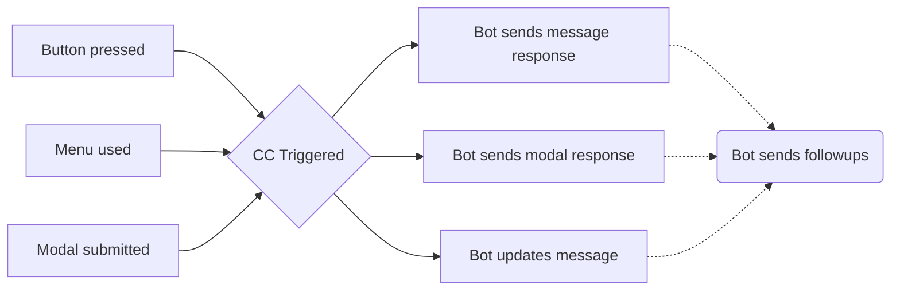

### Definitions

Interaction
: A user engaging with YAGPDB through one of Discord's builtin features: Clicking a button, Making a
selection with a select menu, or Submitting a modal.

Response
: YAGPDB is required to respond promptly after receiving an interaction by either sending a message or modal, or by
updating the message on which the interaction was triggered. If it does not do this, the user triggering the interaction
will see a "This application did not respond" error. The bot cannot respond to an interaction more than once.

Followup
: Since YAGPDB may only _respond_ to an _interaction_ once, it is subsequently required to send an interaction
followup if it still needs to interface with the interaction. These followups can be sent up to 15 minutes after the initial
interaction, and you can send as many as you want. YAGPDB may only send a followup in one of the following ways: Sending
a followup message, editing an initial response or previous followup message, or getting an initial response or previous
followup message.

Interactive Elements
: Elements users can interact with to send _interactions_, i.e. buttons, menus, and modals.

Message Components
: _Interactive Elements_ which can be attached to YAGPDB's Discord messages, i.e. buttons and menus.

Button
: A button appearing in or under a Discord message sent by YAGPDB. You can create and customize these
buttons' appearance and behavior with color, emoji, label text, etc. When a button is clicked, an _interaction_ is sent
to the bot.

Menu
: A dropdown select menu appearing in or under a Discord message sent by YAGPDB. You can create and customize these
menus' appearance and behavior with placeholder text, predefined options with labels, descriptions, and/or emojis,
designate the entire menu as a user or role select menu instead, etc. When a select menu is used, an _interaction_ is sent
to the bot.

Modal
: A pop-up form YAGPDB can send in response to an interaction. It allows users to privately input text which
is sent directly to YAGPDB for use in CC scripting. You can create and customize these modals' appearance and
behavior with a title and fields. YAGPDB can both **receive a submitted modal** (which is an
_interaction_), and **send a modal** for a member to fill out, (which is an interaction _response_).

Ephemeral
: An ephemeral message is sent to a server channel but only appears to a single user. YAGPDB cannot send
these ephemeral messages to users except in response to an _interaction_. Both _response_ messages and _followup_
messages can be ephemeral.

## Creating Interactive Elements

Before you can start triggering Custom Commands with interactive elements, you'll need to have elements to interact
with. _Message Components_ can be created and sent with `complexMessage` and `sendMessage`. _Modals_ need a triggering
_interaction_ to be sent, meaning you'll only be able to show a modal after a user has used a message component.

### Creating Message Components

#### Basics

Let's examine how to make a basic button.

```yag
{{ $button := cbutton "label" "Button" }}
{{ $message := complexMessage "buttons" $button }}
{{ sendMessage nil $message }}
```

Result:

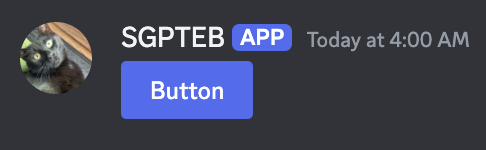

We've successfully made a basic button. Currently this button doesn't do anything when we click it. That's because it
doesn't have an ID that YAGPDB can use to trigger any other custom commands. For our next iteration, we'll add a custom
ID which can trigger a custom command.

##### Custom IDs



Multiple buttons and menus can not have the same custom ID in one message.



```yag
{{ $button := cbutton "label" "Button" "custom_id" "buttons-duck" }}
{{ $message := complexMessage "buttons" $button }}
{{ sendMessage nil $message }}
```

This button will now trigger the following custom command:

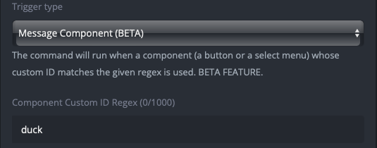

This custom command will trigger on any message component, either button or menu, whose custom ID contains the word
"duck."

##### Menus

Select menus are available in the following types:

- Text - The options available to be selected are defined when creating the select menu. Options have labels, and can
  optionally have emojis and longer-form descriptions.
- User - The options are populated with users on the server by Discord.
- Role - The options are populated with roles on the server by Discord.
- Mentionable - The options are auto-populated with both users and roles on the server by Discord, allowing members to
  select both.
- Channel - The options are populated with channels on the server by Discord. You can limit which channel types appear
  as options when creating the select menu.

###### Text Type

Here is an example of a select menu with three text options defined.

```yag
{{ $menu := cmenu
  "type" "text"
  "placeholder" "Choose a terrible thing"
  "custom_id" "menus-duck"
  "options" (cslice
    (sdict "label" "Two Ducks" "value" "opt-1" "default" true)
    (sdict "label" "A Duck" "value" "duck-option" "emoji" (sdict "name" "🦆"))
    (sdict "label" "Half a Duck" "value" "third-option" "description" "Don't let the smaller amount fool you."))
  "max_values" 3 }}

{{ sendMessage nil (complexMessage "menus" $menu) }}
```

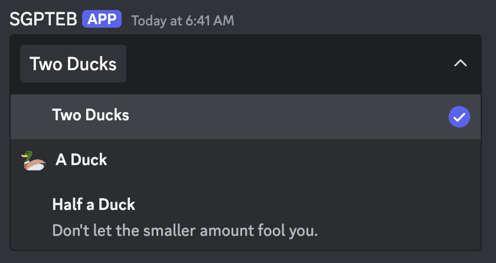

In this menu, our first option (Ducks) is defined as `default`, which is why it is already selected when we look at the
menu on our server. You can define multiple default options, however the amount of default options you define must fall
between your `min_values` and `max_values`.

We have also set the `max_values` to 3, and we haven't set a `min_values` argument. This means the
server member could select anywhere between 1 and 3 of these options.

If the member selected all three options and submitted it (which would send an interaction to YAGPDB), while [parsing
that interaction](#parsing-an-interaction) the `.Values` context data would be `["opt-1" "duck-option" "third-option"]`.
This is because in our code defining the select menu, we defined the `"value"` args of our menu options as `opt-1`,
`duck-option`, and `third-option`. If the member only selected the "Half a Duck" option, `.Values` would be
`["third-option"]`.

###### Other Types

The other menu types are more straightforward. `options` should not be defined for any menu type except `text`.

```yag
{{ $menu := cmenu
  "type" "role"
  "placeholder" "Choose roles who are secretly ducks"
  "custom_id" "menus-duck-roles"
  "max_values" 3 }}

{{ sendMessage nil (complexMessage "menus" $menu) }}
```

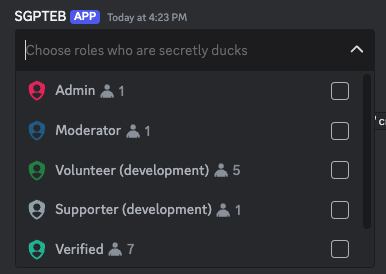

If a member selected roles from this menu, `.Values` would return a slice of strings containing the IDs of selected
options. This behavior is consistent between user type, role type, mentionable type, and channel type. Note that even in
mentionable type select menus where an ID could be either a user or a role, `.Values` is still only a slice of IDs. If
you are parsing options from mentionable type menus, you will need to use your own methods of determining if an ID is a
role or a user.

###### Default Values

Setting default values in these select menus is a more involved process than for text type menus. Instead of setting a
`default` value on each option, you must instead provide a `default_values` argument containing a slice of
[default value structures](https://discord.com/developers/docs/interactions/message-components#select-menu-object-select-default-value-structure).

```yag
{{ $adminRoleID := "1210128415689285642" }}
{{ $soggysaussagesUserID := "329826270898683904" }}

{{ $menu := cmenu
  "type" "mentionable"
  "placeholder" "Choose users or roles who are secretly ducks"
  "custom_id" "menus-duck-mentionables"
  "default_values" ( cslice
  ( sdict "type" "role" "id" $adminRoleID )
  ( sdict "type" "user" "id" $soggysaussagesUserID ))
  "max_values" 3 }}

{{ sendMessage nil (complexMessage "menus" $menu) }}
```

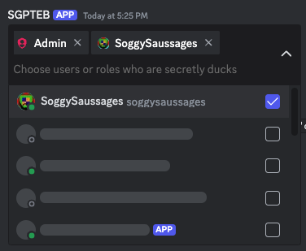



The `default_values` `id`s must be `string`s, not `int64`s. Note how in the above example, `$adminRoleID :=
"1210128415689285642"` defining it as a string, as opposed to `$adminRoleID := 1210128415689285642` which would define
it as an `int64`, which would not work.



###### Channel Type Filtering

A channel type menu optionally allows you to filter which channel types are made available for selection. You can use
the `channel_types` argument which accepts a slice of [channel types](https://discord.com/developers/docs/resources/channel#channel-object-channel-types).

```yag
{{ $issuesChannel := "1210135699135926312" }}
{{ $updatesChannel := "1210135938722693151" }}

{{ $menu := cmenu
  "type" "channel"
  "placeholder" "Choose channels which are secretly duck hideouts"
  "custom_id" "menus-duck-channels"
  "default_values" ( cslice
  ( sdict "type" "channel" "id" $issuesChannel )
  ( sdict "type" "channel" "id" $updatesChannel ))
  "max_values" 3
  "channel_types" (cslice 5 15) }}

{{ sendMessage nil (complexMessage "menus" $menu) }}
```

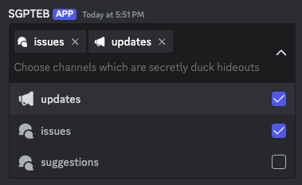

This gives us a select menu which we can only select guild announcement and guild forum channels from.

##### Multiple Components

Now, let's add some more buttons.



Buttons with the "link" style cannot have a Custom ID, and instead require a URL field.

Link style buttons do not trigger _interactions_.



```yag
{{ $button1 := cbutton "label" "Duck One" "custom_id" "buttons-duck-alpha" "style" "success" }}
{{ $button2 := cbutton "emoji" (sdict "name" "🦆") "custom_id" "buttons-duck-beta" "style" "danger" }}
{{ $button3 := cbutton "label" "Duck Three" "emoji" (sdict "name" "🦆") "url" "https://yagpdb.xyz" "style" "link" }}
{{ $message := complexMessage "buttons" (cslice $button1 $button2 $button3) }}
{{ sendMessage nil $message }}
```

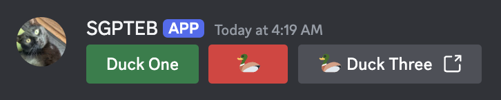

At this stage we have three buttons. Both of the first two buttons will trigger our duck trigger custom command, but the
third button will not trigger any custom command. Link buttons do not create _interactions_.

We can differentiate between the two buttons using `.StrippedID`, which, just like `.StrippedMsg`, returns our Custom ID
without the trigger and everything else before that. In our example, `.StrippedID` will return `-alpha` for the first
button and `-beta` for the second button.

Confirming this behavior will be left as an exercise to the reader (you).

Let's add in a select menu now.

```yag
{{ $button1 := cbutton "label" "Duck One" "custom_id" "buttons-duck-alpha" "style" "success" }}
{{ $button2 := cbutton "emoji" (sdict "name" "🦆") "custom_id" "buttons-duck-beta" "style" "danger" }}
{{ $button3 := cbutton "label" "Duck Three" "emoji" (sdict "name" "🦆") "url" "https://yagpdb.xyz" "style" "link" }}

{{ $menu := cmenu
  "type" "text"
  "placeholder" "Choose a terrible thing"
  "custom_id" "menus-duck-alpha"
  "options" (cslice
    (sdict "label" "Ducks" "value" "opt-1" "default" true)
    (sdict "label" "Duck" "value" "opt-2" "emoji" (sdict "name" "🦆"))
    (sdict "label" "Half a Duck" "value" "opt-3" "description" "Don't let the smaller amount fool you."))
  "max_values" 3 }}

{{ $message := complexMessage "buttons" (cslice $button1 $button2 $button3) "menus" $menu }}
{{ sendMessage nil $message }}
```

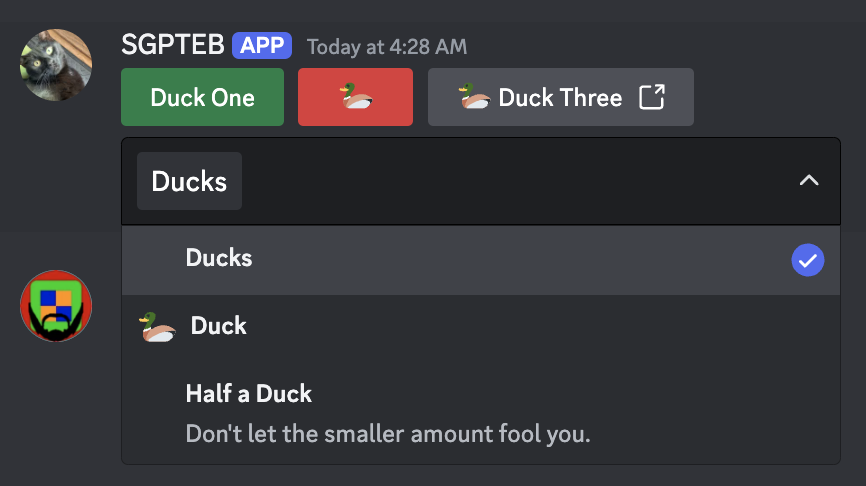

We now have two buttons and a menu which are triggering our duck custom command. We used to branch with `.StrippedID`,
but now since we have two components whose stripped IDs are `-alpha`, we'll need to branch with `.IsMenu` too. If our
custom command was triggered by the use of this select menu, we could also see that `.MenuType` returns `"string"`,
since this menu is a string select type menu.

##### Ordering Message Components

A message can have 5 rows of components.
A row of components can have 5 buttons, **or** 1 menu.

Let's say we want to play tic tac toe. If we just add 9 buttons into the same slice in our complex message, they'll just
fill the first row with 5 buttons and the second row with 4, which isn't what we're looking for. Here's a solution:

```yag
{{ $blankEmoji := sdict "name" "⬜" }}

{{ $row1 := cslice (cbutton "emoji" $blankEmoji "custom_id" "tictactoe-button-1" "style" "secondary") (cbutton "emoji" $blankEmoji "custom_id" "tictactoe-button-2" "style" "secondary") (cbutton "emoji" $blankEmoji "custom_id" "tictactoe-button-3" "style" "secondary") }}
{{ $row2 := cslice (cbutton "emoji" $blankEmoji "custom_id" "tictactoe-button-4" "style" "secondary") (cbutton "emoji" $blankEmoji "custom_id" "tictactoe-button-5" "style" "secondary") (cbutton "emoji" $blankEmoji "custom_id" "tictactoe-button-6" "style" "secondary") }}
{{ $row3 := cslice (cbutton "emoji" $blankEmoji "custom_id" "tictactoe-button-7" "style" "secondary") (cbutton "emoji" $blankEmoji "custom_id" "tictactoe-button-8" "style" "secondary") (cbutton "emoji" $blankEmoji "custom_id" "tictactoe-button-9" "style" "secondary") }}

{{ $menu := cmenu
  "type" "text"
  "placeholder" "Control Panel"
  "custom_id" "tictactoe-menu"
  "options" (cslice
    (sdict "label" "Forfeit" "value" "forfeit")
    (sdict "label" "Toggle Notifications" "value" "notifs"))}}

{{ $message := complexMessage "buttons" $row1 "buttons" $row2 "buttons" $row3 "menus" (cmenu "type" "mentionable") }}
{{ sendMessage nil $message }}
```

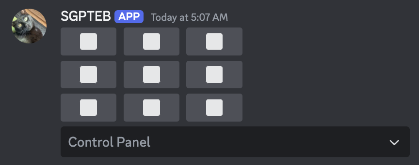

#### Advanced (Variable Row Counts)

When working with multiple components in advanced flows where final number and order of buttons and menus is variable,
the basic structure of building components with `complexMessage` will be inefficient for your needs.

Take the following scenario: You are building a turn-based combat game with a variable number of enemies. For each enemy
you need a button to attack them, and a button to befriend them. You also want each enemy's buttons on a separate row.

If you always had three enemies, this code would look something like this:

```yag
{{ $message := complexMessage
  "content" "Dragon, Ogre, Duck, attack you!"
  "buttons" (cslice
    (cbutton "label" "Attack Dragon" "style" "red" "custom_id" "attack-dragon")
    (cbutton "label" "Befriend Dragon" "style" "green" "custom_id" "befriend-dragon"))
  "buttons" (cslice
    (cbutton "label" "Attack Ogre" "style" "red" "custom_id" "attack-ogre")
    (cbutton "label" "Befriend Ogre" "style" "green" "custom_id" "befriend-ogre"))
  "buttons" (cslice
    (cbutton "label" "Attack Duck" "style" "red" "custom_id" "attack-duck")
    (cbutton "label" "Befriend Duck" "style" "green" "custom_id" "befriend-duck")) }}
{{ sendMessage nil $message }}
```

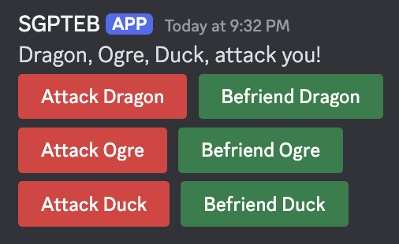

However, we need the number of rows present on the message to be variable. With this method, it is impossible to do this
without building a completely different `complexMessage` for each number of enemies.

##### Quick Solution

A quick solution to this problem is to pass all of our buttons into one `"buttons"` value. Overflowing `"buttons"`,
`"menus"`, or even `"components"` with more components than the row can take (i.e 6+ buttons or 2+ menus) results in the
function automatically distributing the components to new rows.

```yag
{{ $msg1 := complexMessage
  "content" "Message 1"
  "buttons" (cslice (cbutton "label" "Button") (cbutton "label" "Button") (cbutton "label" "Button") (cbutton "label" "Button") (cbutton "label" "Button") (cbutton "label" "Button") (cbutton "label" "Button"))
  "menus" (cslice (cmenu "type" "mentionable") (cmenu "type" "mentionable") (cmenu "type" "mentionable")) }}

{{ $msg2 := complexMessage
  "content" "Message 2"
  "components" (cslice (cbutton "label" "Button") (cmenu "type" "mentionable") (cmenu "type" "mentionable") (cbutton "label" "Button") (cbutton "label" "Button")) }}

{{ sendMessage nil $msg1 }}
{{ sendMessage nil $msg2 }}

```

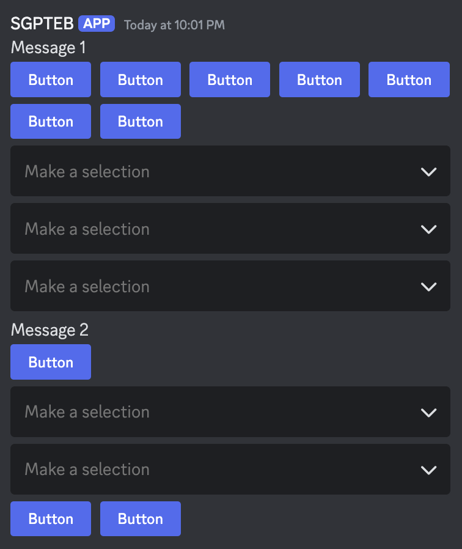

This solution fills up each row with as many components as it can hold and then starts a new one. This is all we need
for most commands, but for our turn-based combat scenario, we only want two or three buttons in each row.

##### Full Solution

To account for a variable amount of rows while maintaining full customization, we will introduce a new field:
`"components"`. Where `"buttons"` and `"menus"` must be a slice of buttons or menus respectively, `"components"`
must be a slice of `rows` of buttons/menus.

A `row` must also be a slice. It either contains 1-5 buttons, _or_ a single select menu.

Below is an example of a `components` structure.

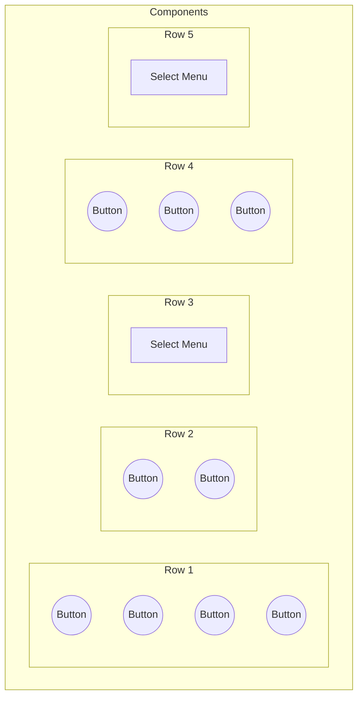

In scripting, this manifests from the following code:

```yag
{{ $row1 := cslice (cbutton "label" "Button") (cbutton "label" "Button") (cbutton "label" "Button") (cbutton "label" "Button") }}
{{ $row2 := cslice (cbutton "label" "Button") (cbutton "label" "Button") }}
{{ $row3 := cslice (cmenu "type" "mentionable") }}
{{ $row4 := cslice (cbutton "label" "Button") (cbutton "label" "Button") (cbutton "label" "Button") }}
{{ $row5 := cslice (cmenu "type" "mentionable") }}

{{ $rows := cslice $row1 $row2 $row3 $row4 $row5 }}

{{ $message := complexMessage "components" $rows }}
{{ sendMessage nil $message }}
```

Which produces this message:

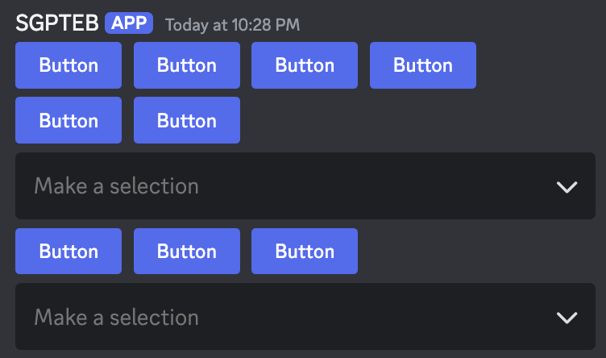

When applying this new skill to our turn-based combat game, the code looks something like this:

```yag
{{ $rows := cslice }}
{{ $enemies := cslice "Dragon" "Ogre" "Duck" }}

{{ range $enemyName := $enemies }}
  {{ $nameButton := cbutton "label" $enemyName "style" "grey" "disabled" true }}
  {{ $attackButton := cbutton "label" "Attack" "style" "red" "custom_id" (print "attack-" (lower $enemyName)) }}
  {{ $befriendButton := cbutton "label" "Befriend" "style" "green" "custom_id" (print "befriend-" (lower $enemyName)) }}

  {{ $currentRow := cslice $nameButton $attackButton $befriendButton }}
  {{ $rows = $rows.Append $currentRow }}
{{ end }}

{{ $promptText := joinStr ", " "Suddenly" $enemies "attack you!" }}
{{ $message := complexMessage "content" $promptText "components" $rows }}
{{ sendMessage nil $message }}
```

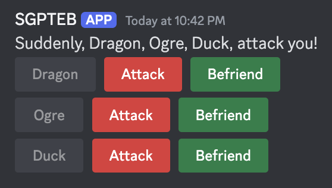

#### Emojis in Message Components

Buttons and Select Menu Options both have an `"emoji"` field, but this field does not accept the regular unicode/name:id
formula like reactions do. Emojis in components follow the [partial emoji
object](https://discord.com/developers/docs/resources/emoji#emoji-object) structure, however only the ID _or_ the Name
fields are required, depending on if you are using a custom emoji or not.

| Field | Description                                                                                          |
| ----- | ---------------------------------------------------------------------------------------------------- |
| ID    | ID of the emoji, only necessary when using Custom Emoji.                                             |
| Name  | Name of the emoji, use the unicode character here. Only necessary when using builtin unicode emojis. |

```yag
{{ $unicodeEmojiButton := cbutton "emoji" (sdict "name" "😀") }}
{{ $customEmojiButton := cbutton "emoji" (sdict "id" "733037741532643428") }}
{{ $animatedEmojiButton := cbutton "emoji" (sdict "id" "786307104247775302") }}

{{ $components := cslice $unicodeEmojiButton $customEmojiButton $animatedEmojiButton }}
{{ sendMessage nil (complexMessage "components" $components)}}
```

#### Message Component Limits

##### General

| Field      | Limits                                   |
| ---------- | ---------------------------------------- |
| Custom ID  | `string`, max 100 characters             |
| Components | Max 5 rows of components in each message |

##### Buttons Limits

| Field      | Limits                       |
| ---------- | ---------------------------- |
| Components | Max 5 buttons in each row    |
| Label      | `string`, max 100 characters |

##### Menus Limits

| Field         | Limits                                                                                                                                                                                                                                                                                                                      |
| ------------- | --------------------------------------------------------------------------------------------------------------------------------------------------------------------------------------------------------------------------------------------------------------------------------------------------------------------------- |
| Components    | Max 1 menu in each row                                                                                                                                                                                                                                                                                                      |
| Options       | Max 25 options in each menu                                                                                                                                                                                                                                                                                                 |
| Placeholder   | `string`, max 150 characters                                                                                                                                                                                                                                                                                                |
| DefaultValues | Count of default values must fall within your defined `min_values` and `max_values` range. Default values are only used for select menu types other than Text. Configuring default values in text select menus is done whilst creating the options themselves. Use the `default` arg to mark the option as a default value. |
| MinValues     | `integer` between 0-25                                                                                                                                                                                                                                                                                                      |
| MaxValues     | `integer` between 1-25                                                                                                                                                                                                                                                                                                      |

###### Text-Type Option Limits

| Field       | Limits                        |
| ----------- | ----------------------------- |
| Label       | `String`, max 100 characters. |
| Value       | `String`, max 100 characters. |
| Description | `String`, max 100 characters. |

### Creating Modals

Modals can be created as either an `sdict` or a `cmodal`. After being created they are subsequently sent with
`sendModal`. Sending a modal is a _response_ to an interaction, meaning it can only be sent once after a user clicks a
button or uses a select menu. You cannot send a modal as a response to a user submitting a modal.

#### Modal structure

| Field     | Description                                                                                                                                                        |
| --------- | ------------------------------------------------------------------------------------------------------------------------------------------------------------------ |
| Title     | The modal's title, appears at the top of the modal while a user is filling it out.                                                                                 |
| Custom ID | The Custom ID is referenced to trigger a custom command when the modal is submitted (which you'll need to do if you care about retrieving what the user inputted). |
| Fields    | A slice of [discordgo.TextInputComponent](https://discord.com/developers/docs/interactions/message-components#text-input-object)s.                                 |

```yag
{{ $modal := sdict
  "title" "My Custom Modal"
  "custom_id" "modals-my_first_modal"
  "fields" (cslice
    (sdict "label" "Name" "placeholder" "Duck" "required" true)
    (sdict "label" "Do you like ducks?" "value" "Heck no")
    (sdict "label" "Duck hate essay" "min_length" 100 "style" 2)) }}
{{ sendModal $modal }}
```

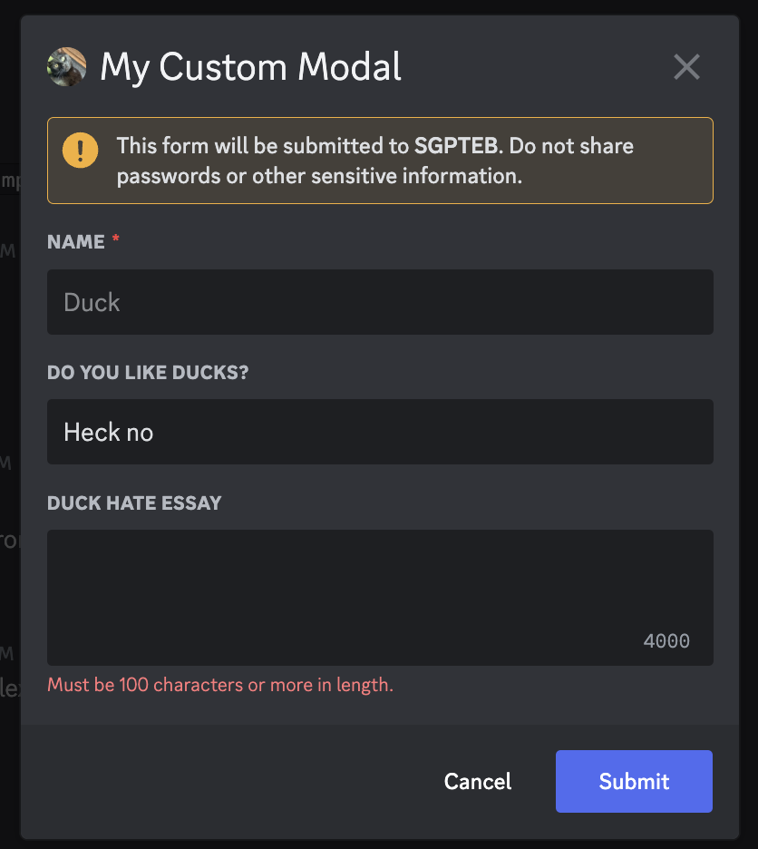

## Parsing an Interaction

Custom Commands with the [Message Component](/docs/custom-commands/commands#component) or [Modal
Submission](/docs/custom-commands/commands#modal) trigger allow you to take action upon the press of a button, use of a
select menu, or completion of a modal form. Interaction triggers provide new context data for templating.

Important interaction context data

| **Field**          | **Description**                                                                                                                                                                                                                                                                 |
| ------------------ | ------------------------------------------------------------------------------------------------------------------------------------------------------------------------------------------------------------------------------------------------------------------------------- |
| .Interaction.Token | The interaction's token. Is unique to each interaction. Required for sending [followup interactions](/docs/reference/templates/functions#interaction-followups).                                                                                                                |
| .CustomID          | The triggering component/modal's Custom ID. Note: This custom ID excludes the `templates-` prefix which is added to all components and modals under the hood.                                                                                                                   |
| .StrippedID        | "Strips" or cuts off the triggering part of the custom ID and prints out everything else after that. Bear in mind, when using regex as trigger, for example `"day"` and input custom ID is `"have-a-nice-day-my-dear-YAG"` output will be `"-my-dear-YAG"` --- rest is cut off. |
| .Values            | List of all options selected with a select menu, OR all values input into a modal in order.                                                                                                                                                                                     |

[Interaction object and context data](/docs/reference/templates/syntax-and-data#interaction)

`.Interaction.Token` must be provided to any [followup](#following-up) functions you decide to use later. If you are
using these in subsequent script executions, it's a good idea to save this to database when the interaction occurs.

`.CustomID` can be used to identify which component or modal triggered the command. `.StrippedID` can be used to quickly
parse out arguments in your custom ID, and use them in your response.

Example: An UNO custom command system where all uno buttons are parsed in the same custom command, a component trigger
with the trigger field `uno-`. This can take individual action for a button with custom ID `uno-join` and one with
`uno-leave`.

```yag
{{ if eq .StrippedID "join" }}
  {{ sendResponse nil "You joined the UNO game!" }}
{{ else if eq .StrippedID "leave" }}
  {{ sendResponse nil "You left the UNO game :(" }}
{{ end }}
```

`.Values` is used to capture values a user selected in a select menu or submitted to a modal. When creating a select
menu and defining the options, the `"value"` field for each option defines which values will show up in this slice if
chosen. A modal's values are simply the values of each field in order.

Example: A user has chosen an option in a select menu whose value is `blue-7`, triggering the following command which will
determine if it is a playable card.

```yag
{{ $selectedOptions := .Values }} {{/* ["blue-7"] */}}
{{ $cardRaw := index $selectedOptions 0 }} {{/* "blue-7" */}}
{{ $cardSplit := split $cardRaw "-" }} {{/* ["blue" "7"] */}}
{{ $playedCard := sdict
  "Color" ( index $cardSplit 0 )
  "Number" ( index $cardSplit 1 )}}

{{ $previousCard := ( dbGet .Channel.ID "uno-last-card" ).Value }}
{{ $validCard := or
  (eq $playedCard.Color $previousCard.Color)
  (eq $playedCard.Number $previousCard.Number) }}

{{ if $validCard }}
  {{ sendResponse nil (print .User " played a " $playedCard.Color $playedCard.Number) }}
  {{ dbSet .Channel.ID "uno-last-card" $playedCard }}
{{ else }}
  {{ sendResponse nil "You can't play that card!" }}
{{ end }}
```

Example 2: A user is setting up a new UNO game with a modal, they've filled out a 'number of decks in play' and a
'minimum number of cards to play' field, triggering the following command which will update those values in database.

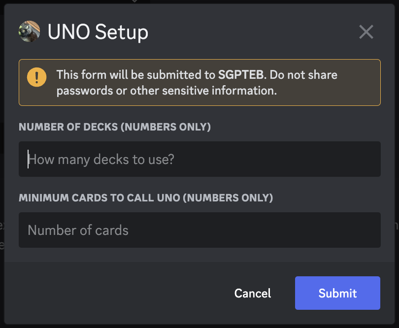

```yag
{{ $numberOfDecks := index .Values 0 }}
{{ $minCardsForUNO := index .Values 1 }}

{{ dbSet .Channel.ID "uno-decks" ( toInt $numberOfDecks ) }}
{{ dbSet .Channel.ID "uno-min_for_uno" ( toInt $minCardsForUNO ) }}
```

## Responding to an Interaction

### Initial Response

While technically not required, responding to an interaction with one of Discord's allotted initial responses is crucial
if you don't want your users to see an error after interacting. An interaction may be responded to only once.

You can only respond to an interaction within the custom command triggered by said interaction, with the exception that
a CC executed with `execCC` by the triggered CC will be able to send initial responses to the triggering interaction as
well.

Possible initial responses:

- Output text in your script response field. This text will be sent as an interaction response.
  - You can even use the `ephemeralResponse` function to turn it _ephemeral_.
- Use the `sendResponse` function to send a response as soon as the function runs.
  - You can also use this to send `embeds` or `complexMessages`.
  - You'll need to send a `complexMessage` and pass it `"ephemeral" true` as an argument to send _ephemeral_ messages.
  - `sendResponse` comes in `NoEscape` and `RetID` variants too.
  - When sending an initial response, `sendResponse` does not need an interaction token, `nil` can be used.
- Use the `sendModal` function to show the user a modal. You cannot respond to a user submitting a modal by sending them
  another modal.
- Use the `updateMessage` function to edit the message the command triggered from. This works the same way as editing a
  message, however because it automatically targets the triggering message, the only argument required is the new
  message.

[Interaction Function documentation](/docs/reference/templates/functions#interactions)

### Following Up

Followups allow you to continue responding to an interaction after the initial response has been made. You can followup
for up to 15 minutes after the user interacts, and you can follow up as many times as you'd like. Followups require the
interaction token of the interaction they should be following up on.

Possible followups:

- Output text in your script response field. This text will be sent as an interaction followup.
  - You can even use the `ephemeralResponse` function to turn it _ephemeral_.
- Use the `sendResponse` function to send a followup as soon as the function runs. Note that this function morphs into
  sending followups if an initial response has already been made.
  - You can also use this to send `embeds` or `complexMessages`.
  - `sendResponse` comes in `NoEscape` and `RetID` variants too.
  - It's important to capture the message ID of any
    followups you'll want to edit or retrieve later, especially if you follow up ephemerally. If you follow up
    ephemerally without saving the message ID, you'll never be able to interface with that message again.
- Use the `editResponse` function to edit an initial response or a followup message.
  - When editing an initial response, the `messageID` argument should be `nil`.
  - When editing a followup message, the `messageID` argument is required.
  - You can still edit any initial responses or followups using the standard `editMessage` function as long as they
    aren't _ephemeral_.
- Use the `getResponse` function to get an initial response or a followup message.
  - When getting an initial response, the `messageID` argument should be `nil`.
  - When getting a followup message, the `messageID` argument is required.
  - You can still get any initial responses or followups using the standard `getMessage` function as long as they
    aren't _ephemeral_.

[Interaction Function documentation](/docs/reference/templates/functions#interactions)

### Snippet

Here is a basic scenario where you need to use `editResponse` and `getResponse` to work with an _ephemeral_ followup
message. You cannot use the standard `editMessage` or `getMessage` for this because it is an ephemeral message.

```yag
{{ $interactionToken := .Interaction.Token }}
{{ sendResponse nil "Here's the first message!" }}
{{ $followupID := sendResponseRetID $interactionToken (complexMessage "content" "Here's a sneaky one!" "ephemeral" true) }}
{{ sleep 2 }}
{{ editResponse $interactionToken $followupID (print "I've edited this message to say " noun) }}
{{ $editedResponse := getResponse $interactionToken $followupID }}
{{ editResponse $interactionToken nil $editedResponse.Content }}
```

Here's a scenario where you would want to update a message.

```yag
{{ $button := cbutton "label" "I won!" "custom_id" "i_won" }}
{{ $content := printf "Press this button when you win! The last person who won was %s! They wanted to say they are a %s %s." .User.Mention adjective noun }}

{{ $message := complexMessageEdit "content" $content "buttons" $button }}
{{ updateMessage $message }}
```
