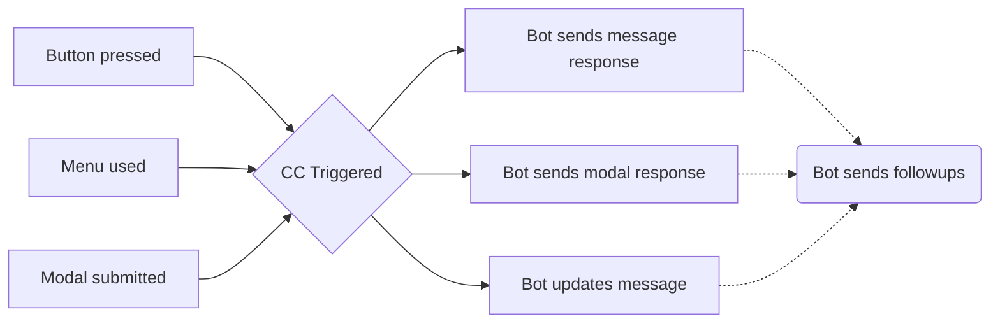
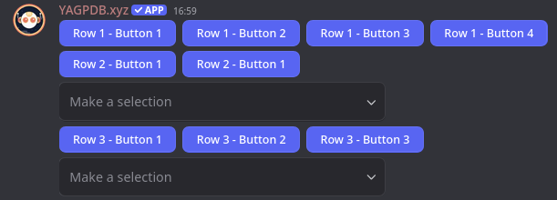

+++
title = "Custom Interactions"
weight = 950
description = "Even better than embeds!"
+++



This page is just an overview about the most important core concepts of custom interactions. We have included some code
samples for quick reference, but this is by no means a complete guide from the grounds up. For an in-depth guide,
please refer to our [learning resources](/learn/advanced/custom-interactions/introduction).



## The Basics

Interactions within Discord allow server members to use alternative, built-in features to trigger bots to take action
other than messages or reactions. These features include builtin buttons, dropdown selection menus, or submitting a
modal (basically a pop-up form). Within custom commands it is possible to not only create and customize these new
interactive features, but respond to them as well, opening up new possibilities for ephemeral message responses, modals,
and more.

### Interaction Lifetime

An interaction's lifetime starts with the initial *interaction* with an *interactive element*.

1. A server member clicks on a *button*, uses a *menu*, or submits a *modal* after filling it out.
2. This interaction is sent to YAGPDB, and becomes available to trigger any custom commands which match it.
3. Within the triggered custom command(s), YAGPDB should then *respond* once to the interaction, sending a message,
   updating the triggering message, or sending a modal. This may only be done within the CC which was triggered by the
   interaction.
4. (optional) Continue to send followup responses for up to 15 minutes until the interaction token expires.



## Custom IDs

Custom IDs are used to identify the respective element a user interacted with. You use them to trigger custom commands
with the `message component` or `modal submission` trigger. Custom IDs must be unique for every component attached to
the message.

## Components

### Buttons

See also the [Discord API documentation](https://discord.com/developers/docs/components/reference#button) on button
objects.

Buttons can be created as either an `sdict` or via [`cbutton`]. In custom commands they can have five different styles,
listed in the table below. For your convenience, YAGPDB also accepts the style as a string-alias, so you can use
`"primary"` instead of `1`, `"secondary"` instead of `2`, and so on.

[`cbutton`]: /docs/reference/templates/functions#cbutton

| Style | Alias     | Description                                                                 |
| ----- | --------- | --------------------------------------------------------------------------- |
| 1     | primary   | Primary button, the most important or recommended action.                   |
| 2     | secondary | Secondary button, alternative or supporting actions.                        |
| 3     | success   | Success button, green color, used for positive actions.                     |
| 4     | danger    | Danger button, red color, used for negative actions.                        |
| 5     | link      | Link button, opens a URL when clicked.                                      |

A button is structured according to the following table; `label`, `emoji` and `disabled` are optional fields.
`style` will default to `1` (primary) if not specified. Link style buttons cannot have a custom ID and must have a URL
specified.

| Field      | Description                                                                                      |
| ---------- | ------------------------------------------------------------------------------------------------ |
| custom_id  | Identifier for the button, used to trigger a custom command when clicked.                        |
| style      | The button's style, defaults to primary.                                                         |
| disabled?  | Whether the button is disabled. Defaults to `false`.                                             |
| emoji?     | A [partial emoji] to display on the button.                                                      |
| label?     | The button's label, appears on the button itself.                                                |
| url?       | Only available for URL-style buttons. Opens the URL when clicked.                                |

The below code will send a message with multiple buttons attached to it.

```yag
{{ $button1 := cbutton "label" "Duck One" "custom_id" "buttons-duck-alpha" "style" "success" }}
{{ $button2 := cbutton "emoji" (sdict "name" "🦆") "custom_id" "buttons-duck-beta" "style" "danger" }}
{{ $button3 := cbutton "label" "Duck Three" "emoji" (sdict "name" "🦆") "url" "https://yagpdb.xyz" "style" "link" }}
{{ $message := complexMessage "buttons" (cslice $button1 $button2 $button3) }}
{{ sendMessage nil $message }}
```

### Select Menus

Select menus allow users to select one or more options from a dropdown list. They can be created as either an `sdict` or
using the [`cmenu`] function.

[`cmenu`]: /docs/reference/templates/functions#cmenu

#### Select Menu Types

Select menus can have one of the types listed in the table below.  The `channel` type can be
further customized to only show certain channel types using the `channel_types` field, which accepts a slice of integers
representing allowed channel types.

| Type        | Description                                                                          |
| ----------- | ------------------------------------------------------------------------------------ |
| channel     | A list of channels in the server, automatically populated by Discord.                |
| mentionable | A list of users and roles that can be mentioned, automatically populated by Discord. |
| role        | A list of roles of the server, automatically populated by Discord.                   |
| text        | A simple dropdown menu with custom text options.                                     |
| user        | A list of users part of the server, automatically populated by Discord.              |

#### Select Menu Option

A select menu option for the `text` type has the structure as outlined in the table below. A text menu may not have more
than 25 options.

| Field        | Description                                                                       |
| ------------ | --------------------------------------------------------------------------------- |
| label        | The text displayed in the dropdown menu.                                          |
| value        | The value returned when the option is selected, used to trigger a custom command. |
| default?     | Whether the option is selected by default. Defaults to `false`.                   |
| description? | An optional description of the option, displayed when opening the menu.           |
| emoji?       | An optional [partial emoji] to display next to the option.                        |

#### Default Value Structure

The user, role, and channel type allow for a slice of `default_values` to be specified. Below is their structure.

| Field | Description                                                         |
| ----- | ------------------------------------------------------------------- |
| id    | The ID of the user, role, or channel to be selected by default.     |
| type  | The type of the default value, one of `user`, `role`, or `channel`. |

#### Select Menu Structure

A select menu is structured according to the table below. The `custom_id` field is required for all select menus. Text
type menus must have at least one option, while all other types cannot have any options.

| Field           | Description                                                                                     |
| --------------- | ----------------------------------------------------------------------------------------------- |
| type            | The type of the select menu, one of the types listed above.                                     |
| custom_id       | Identifier for the select menu, used to trigger a custom command when an option is selected.    |
| channel_types?  | A slice of integers representing allowed channel types, only for `channel` type menus.          |
| default_values? | A slice of values that should be selected by default, if applicable. Not for text type menus.   |
| disabled?       | Whether the select menu is disabled. Defaults to `false`.                                       |
| max_values?     | The maximum number of options that can be selected, default to the number of options available. |
| min_values?     | The minimum number of options that can be selected, defaults to `1`.                            |
| options?        | A slice of select menu options, as outlined above.                                              |
| placeholder?    | An optional placeholder text displayed when no option is selected.                              |

Putting it all together, a text select menu with three options, one of which is selected by default, could look
something like this.

```yag
{{ $menu := cmenu
  "type" "text"
  "placeholder" "Choose a terrible thing"
  "custom_id" "menus-duck"
  "options" (cslice
    (sdict "label" "Two Ducks" "value" "opt-1" "default" true)
    (sdict "label" "A Duck" "value" "duck-option" "emoji" (sdict "name" "🦆"))
    (sdict "label" "Half a Duck" "value" "third-option" "description" "Don't let the smaller amount fool you."))
}}

{{ sendMessage nil (complexMessage "menus" $menu) }}
```

Similarly, a channel select menu that allows users to select at most two channels, and only allows forum and
announcement channels could be created with the following code.

```yag
{{ $issuesChannel := "1210135699135926312" }}
{{ $updatesChannel := "1210135938722693151" }}

{{ $menu := cmenu
  "type" "channel"
  "placeholder" "Choose channels which are secretly duck hideouts"
  "custom_id" "menus-duck-channels"
  "default_values" (cslice
    (sdict "type" "channel" "id" $issuesChannel)
    (sdict "type" "channel" "id" $updatesChannel)
  )
  "max_values" 3
  "channel_types" (cslice 5 15) }}

{{ sendMessage nil (complexMessage "menus" $menu) }}
```

## Modals

Modals can be created as either an `sdict` or a `cmodal`. After being created they are subsequently sent with
`sendModal`. Sending a modal is a _response_ to an interaction, meaning it can only be sent once after a user clicks a
button or uses a select menu. You cannot send a modal as a response to a user submitting a modal.

### Modal Input Fields

Modals can have multiple text input fields, which allow users to input text in a structured way.

| Field        | Description                                                                                      |
| ------------ | ------------------------------------------------------------------------------------------------ |
| label        | The label of the text input, appears above the input field.                                      |
| max_length?  | The maximum length of the input.                                                                 |
| min_length?  | The minimum length of the input, defaults to `0` (no minimum).                                   |
| placeholder? | An optional placeholder text displayed in the input field when it is empty.                      |
| required?    | Whether the input field is required, defaults to `false`.                                        |
| style?       | The style of the text input, one of `1` (short, default), `2` (paragraph)                        |
| value?       | The default value of the input field, appears in the input field when it is empty.               |

#### Modal Structure

| Field     | Description                                                                        |
| --------- | ---------------------------------------------------------------------------------- |
| title     | The modal's title, appears at the top of the modal while a user is filling it out. |
| custom_id | The custom ID of this modal.                                                       |
| fields    | A slice of modal input fields as outlined above.                                   |

```yag
{{ $modal := sdict
  "title" "My Custom Modal"
  "custom_id" "modals-my_first_modal"
  "fields" (cslice
    (sdict "label" "Name" "placeholder" "Duck" "required" true)
    (sdict "label" "Do you like ducks?" "value" "Heck no")
    (sdict "label" "Duck hate essay" "min_length" 100 "style" 2)) }}
{{ sendModal $modal }}
```

## Parsing an Interaction

Custom Commands with the [Message Component](/docs/custom-commands/commands#component) or [Modal
Submission](/docs/custom-commands/commands#modal) trigger allow you to take action upon the press of a button, use of a
select menu, or completion of a modal form. Interaction triggers provide new context data for templating.

| **Field**          | **Description**                                                                                                                                                                                                                                                                 |
| ------------------ | ------------------------------------------------------------------------------------------------------------------------------------------------------------------------------------------------------------------------------------------------------------------------------- |
| .Interaction.Token | The interaction's token. Is unique to each interaction. Required for sending [followup interactions](/docs/reference/templates/functions#interaction-followups).                                                                                                                |
| .CustomID          | The triggering component/modal's Custom ID. Note: This custom ID excludes the `templates-` prefix which is added to all components and modals under the hood.                                                                                                                   |
| .StrippedID        | "Strips" or cuts off the triggering part of the custom ID and prints out everything else after that. Bear in mind, when using regex as trigger, for example `"day"` and input custom ID is `"have-a-nice-day-my-dear-YAG"` output will be `"-my-dear-YAG"` --- rest is cut off. |
| .Values            | List of all options selected with a select menu, OR all values input into a modal in order.                                                                                                                                                                                     |

[Interaction object and context data](/docs/reference/templates/syntax-and-data#interaction)

`.Interaction.Token` must be provided to any [followup](#following-up) functions you decide to use later. If you are
using these in subsequent script executions, it's a good idea to save this to database when the interaction occurs.

`.CustomID` can be used to identify which component or modal triggered the command. `.StrippedID` can be used to quickly
parse out arguments in your custom ID, and use them in your response.

`.Values` is used to capture values a user selected in a select menu or submitted to a modal. When creating a select
menu and defining the options, the `"value"` field for each option defines which values will show up in this slice if
chosen, in the order the user selected them. A modal's values are simply the values of each field in order.



Because the `.Values` slice when interacting with select menus is ordered by the order the user selected the
options, you generally cannot simply index into the slice; you'll have to search for the value you want to use.



## Responding to an Interaction

### Initial Response

While technically not required, responding to an interaction with one of Discord's allotted initial responses is crucial
if you don't want your users to see an error after interacting. An interaction may be responded to only once.

You can only respond to an interaction within the custom command triggered by said interaction, with the exception that
a CC executed with `execCC` by the triggered CC will be able to send initial responses to the triggering interaction as
well.

Possible initial responses:

- Output text in your script response field. This text will be sent as an interaction response.
  - You can even use the `ephemeralResponse` function to turn it _ephemeral_.
- Use the `sendResponse` function to send a response as soon as the function runs.
  - You can also use this to send `embeds` or `complexMessages`.
  - You'll need to send a `complexMessage` and pass it `"ephemeral" true` as an argument to send _ephemeral_ messages.
  - `sendResponse` comes in `NoEscape` and `RetID` variants too.
  - When sending an initial response, `sendResponse` does not need an interaction token, `nil` can be used.
- Use the `sendModal` function to show the user a modal. You cannot respond to a user submitting a modal by sending them
  another modal.
- Use the `updateMessage` function to edit the message the command triggered from. This works the same way as editing a
  message, however because it automatically targets the triggering message, the only argument required is the new
  message.

[Interaction Function documentation](/docs/reference/templates/functions#interactions)

### Following Up

Followups allow you to continue responding to an interaction after the initial response has been made. You can followup
for up to 15 minutes after the user interacts, and you can follow up as many times as you'd like. Followups require the
interaction token of the interaction they should be following up on.

Possible followups:

- Output text in your script response field. This text will be sent as an interaction followup.
  - You can even use the `ephemeralResponse` function to turn it _ephemeral_.
- Use the `sendResponse` function to send a followup as soon as the function runs. Note that this function morphs into
  sending followups if an initial response has already been made.
  - You can also use this to send `embeds` or `complexMessages`.
  - `sendResponse` comes in `NoEscape` and `RetID` variants too.
  - It's important to capture the message ID of any
    followups you'll want to edit or retrieve later, especially if you follow up ephemerally. If you follow up
    ephemerally without saving the message ID, you'll never be able to interface with that message again.
- Use the `editResponse` function to edit an initial response or a followup message.
  - When editing an initial response, the `messageID` argument should be `nil`.
  - When editing a followup message, the `messageID` argument is required.
  - You can still edit any initial responses or followups using the standard `editMessage` function as long as they
    aren't _ephemeral_.
- Use the `getResponse` function to get an initial response or a followup message.
  - When getting an initial response, the `messageID` argument should be `nil`.
  - When getting a followup message, the `messageID` argument is required.
  - You can still get any initial responses or followups using the standard `getMessage` function as long as they
    aren't _ephemeral_.

[Interaction Function documentation](/docs/reference/templates/functions#interactions)

## Action Rows

Action rows are a way to group multiple components together, such as buttons or select menus, into a single row. This
allows for better organization and layout of interactive elements in a message. Action rows are not a separate type of
interaction, but rather a structured approach to handling components.

Action rows are simply a slice of components, which can be buttons or select menus. Consider the following example:

```yag
{{ $row1 := cslice (cbutton "label" "Row 1 - Button 1") (cbutton "label" "Row 1 - Button 2") (cbutton "label" "Row 1 - Button 3") (cbutton "label" "Row 1 - Button 4") }}
{{ $row2 := cslice (cbutton "label" "Row 2 - Button 1") (cbutton "label" "Row 2 - Button 1") }}
{{ $row3 := cslice (cmenu "type" "mentionable") }}
{{ $row4 := cslice (cbutton "label" "Row 3 - Button 1") (cbutton "label" "Row 3 - Button 2") (cbutton "label" "Row 3 - Button 3") }}
{{ $row5 := cslice (cmenu "type" "channel") }}

{{ $rows := cslice $row1 $row2 $row3 $row4 $row5 }}

{{ $message := complexMessage "components" $rows }}
{{ sendMessage nil $message }}
```

This will nicely format our components, like shown in the screenshot below.


