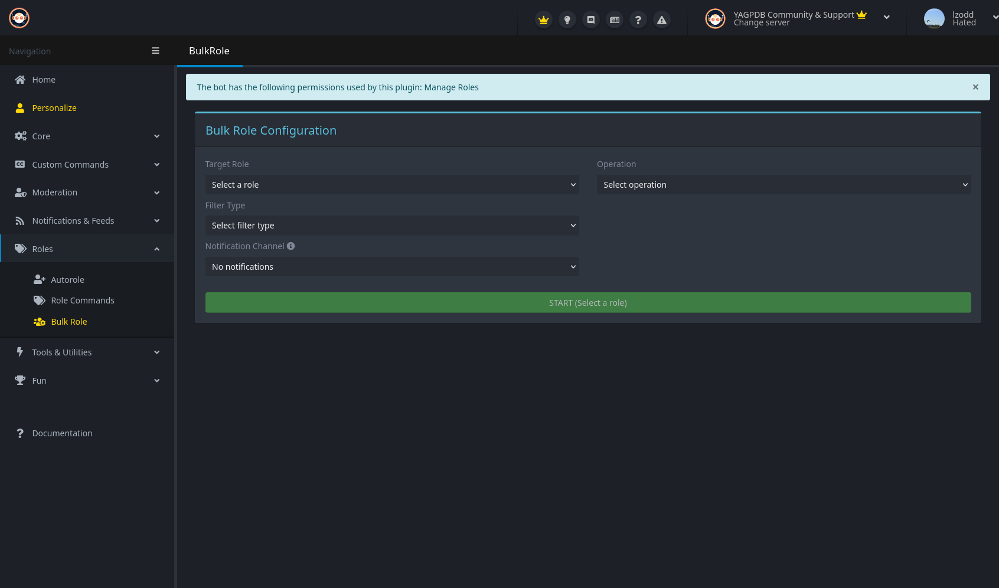

+++
title = "Bulk Role"
weight = 730
description = "Assign or remove roles to/from multiple members at once."
+++



Make sure that the bot has permission to manage roles **and** that the role the bot is assigning is below the highest
role the bot has.



Bulk role allows you to assign---or remove---a role en masse. YAGPDB provides several filters to narrow down assignment,
which will be further explained below. You can only run one bulk role proess at any given time, so you'll have to either
wait until the current one completes or simply just cancel it.



Due to the nature of this operation requiring a lot of API calls to Discord and the associated cost with that, we
provide this as a premium-only feature.



## Configuration

### Target Role

Select the role that you wish to assign or remove. Make sure that the bot's highest role is above this selected role.

### Operation

- **Assign role**: Assigns the selected role.
- **Remove role**: removes the selected role.

### Filter Type

- **All members**: Assign or remove the target role to/from all members indiscriminately.
- **Bots only**: Assign or remove the target role only to/from bots.
- **Humans only**: Assign or remove the target role only to/from humans.
- **Has specific roles**: Only care about members with at least one of these roles. Optionally you can tell the bot to
  require **all** of your selected roles.
- **Missing specific roles**: Like the above, but only on members without at least one of these roles. Optionally for
  **all** selected roles.
- **Joined after date**: Only care about members that joined after the selected date.
- **Joined before date**: Only care about members that joined before the selected date.

### Notification Channel

Optionally select a channel you wish to receive notifications about the operation status of bulk assignment. The bot
will let you know when it encountered an error during processing, otherwise after it wholly completed it.

After you've configured everything to your liking, click the green "start" button and let the magic happen. If you
changed your mind, you can always cancel it during the processing.
