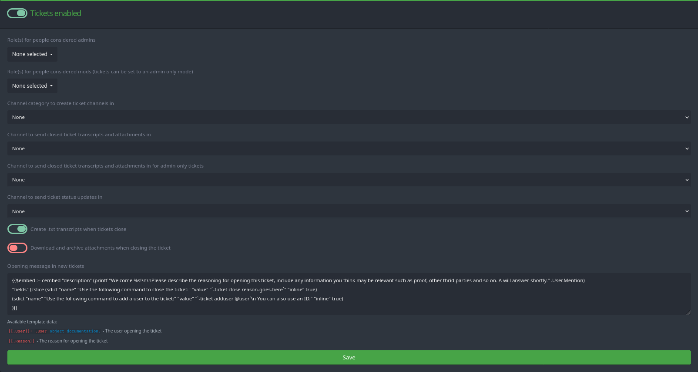

+++
title = "Tickets"
weight = 730
description = "No ticket no entry"
+++

Tickets let your members interact with your server staff in a private and more organized way.
The bot will create a dedicated channel that can only be seen by the staff and the member who created the ticket, with the option to add more users as-needed.



Make sure that the bot has permission to manage channels in the category you want the bot to create tickets in, as well as permission to send messages in said category, the transcript channels, and the ticket log channel.





## Commands

See the [Commands](/docs/core/all-commands/#tickets-) page for a listing of all commands.
By default, we impose no restrictions on who can run these commands, though it may be pertinent to restrict sensitive commands such as the `-tickets close` command to staff members using [Command overrides](/docs/core/command-settings).

## Configuration

At the top of the tickets settings page, you will find a toggle to enable or disable the ticket system in its entirety.
If you wish to disable certain parts, such as the `tickets adduser` command, please use a command override instead.

If you disable the ticket system, the bot will respond with an error message when you try to run ticket-related commands, unless they are also disabled using command overrides.

### Admin Roles

Individual tickets can be set to an admin-only mode, where only users with these specified roles will be able to view that ticket channel.

Toggling this mode is done by running `-tickets adminonly` in the ticket's channel.
Running the command again will deactivate the admin-only mode.
This may serve useful when handling issues that require a higher level of privacy, such as complaints about staff members.

Select as many roles as you like---they need not have "Administrator" or similar Discord permissions commonly associated with the term "admin".

### Mod Roles

These roles will be excluded from viewing tickets that are set to admin-only mode.
Select as many as you like---they need not have "Manage Messages", "Moderate Members" or other Discord permissions commonly associated with the term "moderator".

Having selected separate roles for moderators and administrators can be useful in larger servers where the two roles have different responsibilities, but nothing prevents you from selecting the same role for both.

### Ticket Category

The bot uses channels for tickets, and these channels are created in a category of your choosing.
This category should be set up with the necessary permissions for the bot to create channels in it.



Discord limits categories to contain at most 50 channels.
If you experience a high volume of tickets, consider closing some or using [threaded tickets](#threaded-tickets-premium).



### Threaded Tickets (Premium)



Threaded tickets are available for [premium servers](https://yagpdb.xyz/premium).



Instead of creating a new channel for each ticket, YAGPDB can use **private threads**. This is particularly useful for servers with a high volume of tickets, as it keeps the channel list clean and avoids hitting Discord's 50-channel-per-category limit.

To use threaded tickets:
1. Enable the **Use threaded tickets** toggle in the ticket settings.
2. Select a **Tickets thread channel**. This is the channel where the bot will create the private threads.

When enabled, the bot will create a private thread in the specified channel and add the user who opened the ticket and the configured staff roles to the thread.

### Ticket Transcripts Channel

This is the channel where text transcripts of tickets will be sent to, given that you activated the option to do so.
This channel does not have to be part of the ticket category you selected further up.

We also provide a separate option to download attachments sent in the ticket, which will be posted as a ZIP archive in this channel.

To keep admin-only tickets private, you can select a separate transcripts channel for tickets that were closed when they are in the admin-only mode during closure---if this is not necessary for your server, select the same channel as for the regular tickets.

### Ticket Status Updates

When a ticket is created or closed, the bot will send a message to this channel to inform your staff about this event.
Selecting "None" will cause the bot to not send these updates.

### Opening Message

This field supports [custom command templating](/docs/reference/templates/syntax-and-data) and will be executed in the newly created channel whenever a new ticket is created.
Feel free to customize this as you see fit.

The default message is the following custom command code:

```yag
{{$embed := cembed `description` (joinStr `` `Welcome ` .User.Mention `

Please describe the reasoning for opening this ticket, include any information you think may be relevant such as proof, other third parties and so on.`
"\n\nuse the following command to close the ticket\n"
"`-ticket close reason for closing here`\n\n"
"use the following command to add users to the ticket\n"
"`-ticket adduser @user`")}}
{{sendMessage nil $embed}}
```

The user-provided reason for opening this ticket is available under the `{{ .Reason }}` template data.
