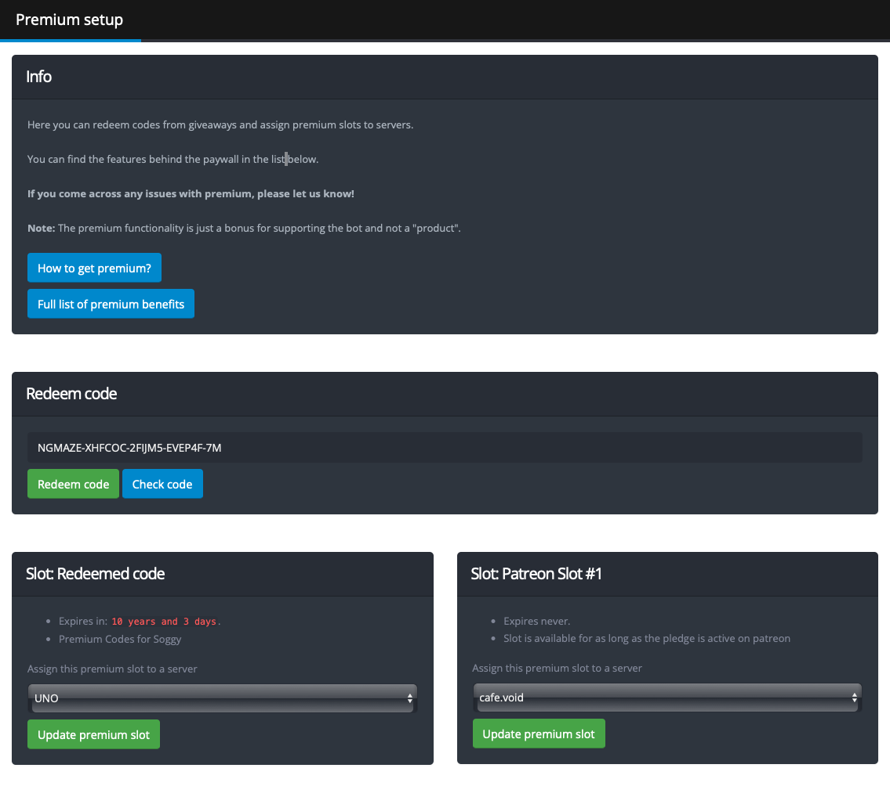
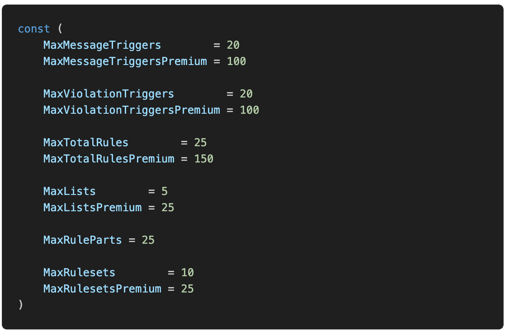

+++
title = "Premium"
weight = 3
+++

YAGPDB provides added functionality to servers which are assigned a premium slot by a user. On the official instance of
YAGPDB, these premium slots can be acquired as a perk of being a [Patreon](https://www.patreon.com/yagpdb) to Botlabs'
YAGPDB.

<!--more-->

## Benefits

A premium server unlocks the following benefits:

### Automoderator

- Increase maximum message triggers per rule from 20 to 100 (`MaxMessageTriggersPremium`).
- Increase maximum violation triggers per rule from 20 to 100 (`MaxViolationTriggersPremium`).
- Increase maximum total rules across all rulesets from 25 to 150 (`MaxTotalRulesPremium`).
- Increase maximum lists from 5 to 25 (`MaxListsPremium`).
- Increase maximum rulesets from 10 to 25 (`MaxRulesetsPremium`).

### Autorole

- Enables retroactively applying a role to all members of a server.

### Common Template Scripting

- Increase max operation count from 1 million to 2.5 million (`MaxOpsPremium`).
- Increase max operation count with `evalcc` command from 5,000 to 10,000 (`MaxOpsPremium`).
- Increase max `getChannelPins` uses in one script execution from 2 to 4 (`channel_pins`).
- Increase max `sort` uses in one script execution from 1 to 3 (`sort`).
- Increase max `execCC` and `scheduleUniqueCC` uses in one script execution from 1 to 10 (`runcc`).
- Increase max `getWarnings` uses in one script execution from 5 to 10 (`cc_moderation`).
- Increase max database interactions in one script execution from 10 to 50 (`db_interactions`).
- Increase max high-quantity database interactions (`dbCount`, `dbGetPattern`, etc.) in one script execution from 2 to
  10 (`db_multiple`).
- Increase max database entries from `(guild member count)*50` to `(guild member count)*500`.

### Custom Commands

- Enable triggering on edited messages instead of only new messages.
- Increase max commands which can trigger from a single interaction from 3 to 5 (`CCMessageExecLimitPremium`).
- Increase max commands from 100 to 250 (`MaxCommandsPremium`).
- Increase max combined response length per cc from 10,000 to 20,000 (`MaxCCResponsesLength`).

### Logging Messages

- Increase length of deleted message history by `logs` command from 1 hour to 12 hours.
- Increase length of deleted message history for logs saved by moderation actions from 1 hour to 12 hours.
- Increase length of deleted message history by `undelete` command from 1 hour to 12 hours.

### Reddit

- Increase maximum Reddit feeds per guild from 100 to 1000 (`GuildMaxFeedsPremium`).

### Rolemenu

- When a role group is in single mode, remove a user's reactions from other roles when self-assigning a new role in the
  group. **DISABLED ON OFFICIAL INSTANCE**

### Soundboard

- Increase maximum sounds saved to a guild from 50 to 250 (`MaxGuildSoundsPremium`).

### Twitter **DISABLED ON OFFICIAL INSTANCE**

- Enable Twitter feeds

### YouTube

- Increase maximum YouTube feeds per guild from 50 to 250 (`GuildMaxFeedsPremium`).



Some features enhanced or enabled by premium have been disabled on Botlabs' publicly hosted instance, often due to
ratelimits with 3rd party APIs YAGPDB relies on.

Any features marked as **DISABLED ON OFFICIAL INSTANCE** will **not** be available if you become a patreon to botlabs.



## Enabling Premium on a Server

### Getting a Premium Slot

To enable premium on your server, you'll first need to get a premium slot assigned to your account. This is tied to your
Discord user ID and cannot be transferred.

#### Patreon

Patreon is the primary method of acquiring premium slots.

1. Pledge the required minimum amount to unlock a premium slot. For the publicly hosted instance, pledge on
   [botlabs' Patreon](https://www.patreon.com/yagpdb).
2. Link your Patreon account to your Discord account ([details
   here](https://support.patreon.com/hc/en-us/articles/212052266-How-do-I-get-my-Discord-Rewards-#h_21f22930-84c5-4950-b6b1-3e83312f66dc)).
3. Wait for up to 5 minutes for YAGPDB to verify your Patreon status.
4. If slot(s) still do not appear, you may need to unlink and relink your Patreon and Discord account again.

#### From a Code

A bot owner may generate temporary or permanent premium codes for giveaways, perks, or to manually reward donors who
donate through other sources/when the Patreon API is down.

1. Visit [/premium](https://yagpdb.xyz/premium).
2. Paste your code into the "Redeem Code" field, and click "Redeem Code." You may also use the "Check Code" button to
   see a code's validity and expiration without claiming it yourself.

### Assigning a Slot

Once you have obtained a Premium slot, it should appear on the [/premium](https://yagpdb.xyz/premium) page and be
available to be assigned to a server. For each slot, choose a server to assign it to, then click "Update Premium Slot."

You can assign your premium slots to any server with YAGPDB in it and no existing slot assigned.

## Self Hosting YAGPDB

Do not proceed unless you are hosting your own version of the YAGPDB codebase.

### Premium Sources

When hosting YAGPDB yourself, you have access to a few methods to source premium slots to your users.

- Patreon
  1. Configure your price per premium slot in `premium/patreonpremiumsource/patreonpremiumsource.go > func
CalcSlotsForPledge`.
  2. Configure relevant env variables to connect YAGPDB to your Patreon API.
- Generating premium codes with [`GeneratePremiumCode` command](core/all-commands#generatepremiumcode).
- Setting the `premium.all_guilds_premium` env variable to true.

### Changing Limits

Functionally raising or lowering limits, both for premium and non-premium servers, is accomplished by altering the
source code. Most limits are numerical values that only need to be updated in one location. For most of the above listed
numerical limits, the relevant key or constant is named in parenthesis. Ex. (`MaxMessageTriggersPremium`). It is
recommended you familiarize yourself with the codebase before making changes. Find where these keys or constants are
defined and alter their values as you wish.

