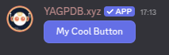
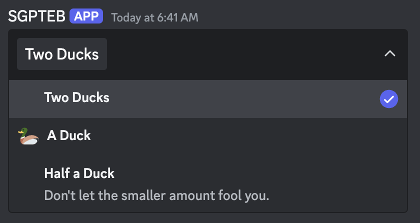
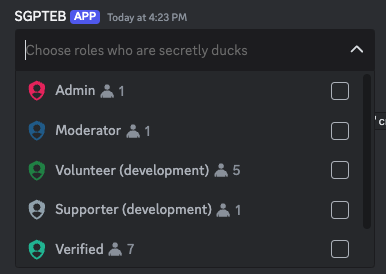

+++
title = "Creating Interactive Elements"
weight = 412
+++

Before you can start triggering custom commands with interactive elements---such as buttons---you'll obviously need
to have elements to interact with. In this section, we'll cover how to create these elements and then make them usable
to trigger custom commands.

## Message Components

### Buttons

Buttons are probably the simplest interactive element to create, so we'll start with them. To create a button, we use
the [`cbutton`](docs/reference/templates/functions#cbutton) function. In and of itself, that is rather useless, so we'll
also have to attach it to a message. We do that by calling the
[`complexMessage`](docs/reference/templates/functions#complexmessage) builder and adding the result of `cbutton` to it.
Finally, we send the message.

```yag
{{ $button := cbutton "label" "My Cool Button" "custom-id" "buttons-duck" }}
{{ $m := complexMessage "buttons" $button }}
{{ sendMessage nil $m }}
```

Result:




We've successfully crated a basic button! It doesn't do anything yet, but we'll cover that in a later section.
In the meantime, play around with the values `cbutton` takes. Try to attach an emoji to it, or change its style!

### Select Menus

Select menus act as dropdowns, allowing users to select one or more of several options. To further complicate things,
select menus come in different types, each offering different functionality. We'll first focus on the most intuitive
type, the **Text** select menu. This type allows you to define a custom list of options.

Available select menu types are as follows:

- **Text** - The options available to be selected are defined when creating the select menu. Options have labels, and
  can optionally have emojis and longer-form descriptions.
- **User** - The options are populated with users on the server by Discord.
- **Role** - The options are populated with roles on the server by Discord.
- **Mentionable** - The options are auto-populated with both users and roles on the server by Discord, allowing members
  to select both.
- **Channel** - The options are populated with channels on the server by Discord. You can limit which channel types
  appear as options when creating the select menu.

#### Text Select Menus

To create a text select menu, we use the [`cmenu`](docs/reference/templates/functions#cmenu) function. Then, just like
with a button, we attach it to a message and send it.

```yag
{{ $menu := cmenu
  "type" "text"
  "placeholder" "Choose a terrible thing"
  "custom_id" "menus-duck"
  "options" (cslice
    (sdict "label" "Two Ducks" "value" "opt-1" "default" true)
    (sdict "label" "A Duck" "value" "duck-option" "emoji" (sdict "name" "🦆"))
    (sdict "label" "Half a Duck" "value" "third-option" "description" "Don't let the smaller amount fool you."))
  "max_values" 3
}}

{{ sendMessage nil (complexMessage "menus" $menu) }}
```

Opening the select menu that was sent using the above code should yield the following result:



In this menu, our first option (Ducks) is defined as `default`, which is why it is already selected when we look at the
menu on our server. You can define multiple default options, however the amount of default options you define must fall
between your `min_values` and `max_values`.

We have also set the `max_values` to 3, and we haven't set a `min_values` argument. This means the server member could
select anywhere between 1 and 3 of these options.

#### Other Select Menu Types

The other select menu types are created in the same way as the text select menu, but with a few differences. As Discord
automatically populates the options, you need not---nor can you---define these options.

```yag
{{ $menu := cmenu
  "type" "role"
  "placeholder" "Choose roles who are secretly ducks"
  "custom_id" "menus-duck-roles"
  "max_values" 3
}}

{{ sendMessage nil (complexMessage "menus" $menu) }}
```




