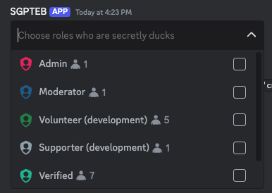
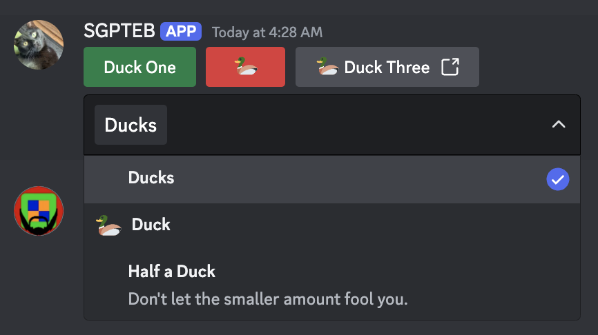

+++
title = "Creating Interactive Elements"
weight = 412
+++

Before you can start triggering custom commands with interactive elements---such as buttons---you'll obviously need
to have elements to interact with. In this section, we'll cover how to create these elements and explore their
differences.

## Message Components

### Buttons

Buttons are probably the simplest interactive element to create, so we'll start with them. To create a button, we use
the [`cbutton`](docs/reference/templates/functions#cbutton) function. In and of itself, that is rather useless, so we'll
also have to attach it to a message. We do that by calling the
[`complexMessage`](docs/reference/templates/functions#complexmessage) builder and adding the result of `cbutton` to it.
Finally, we send the message.

```yag
{{ $button := cbutton "label" "My Cool Button" "custom-id" "buttons-duck" }}
{{ $m := complexMessage "buttons" $button }}
{{ sendMessage nil $m }}
```

Result:


We've successfully crated a basic button! It doesn't do anything yet, but we'll cover that in a later section.
In the meantime, play around with the values `cbutton` takes. Try to attach an emoji to it, or change its style!

### Select Menus

Select menus act as dropdowns, allowing users to select one or more of several options. To further complicate things,
select menus come in different types, each offering different functionality. We'll first focus on the most intuitive
type, the **Text** select menu. This type allows you to define a custom list of options.

Available select menu types are as follows:

- **Text** - The options available to be selected are defined when creating the select menu. Options have labels, and
  can optionally have emojis and longer-form descriptions.
- **User** - The options are populated with users on the server by Discord.
- **Role** - The options are populated with roles on the server by Discord.
- **Mentionable** - The options are auto-populated with both users and roles on the server by Discord, allowing members
  to select both.
- **Channel** - The options are populated with channels on the server by Discord. You can limit which channel types
  appear as options when creating the select menu.

#### Text Select Menus

To create a text select menu, we use the [`cmenu`](docs/reference/templates/functions#cmenu) function. Then, just like
with a button, we attach it to a message and send it.

```yag
{{ $menu := cmenu
  "type" "text"
  "placeholder" "Choose a terrible thing"
  "custom_id" "menus-duck"
  "options" (cslice
    (sdict "label" "Two Ducks" "value" "opt-1" "default" true)
    (sdict "label" "A Duck" "value" "duck-option" "emoji" (sdict "name" "🦆"))
    (sdict "label" "Half a Duck" "value" "third-option" "description" "Don't let the smaller amount fool you."))
  "max_values" 3
}}

{{ sendMessage nil (complexMessage "menus" $menu) }}
```

Opening the select menu that was sent using the above code should yield the following result:


In this menu, our first option (Ducks) is defined as `default`, which is why it is already selected when we look at the
menu on our server. You can define multiple default options, however the amount of default options you define must fall
between your `min_values` and `max_values`.

We have also set the `max_values` to 3, and we haven't set a `min_values` argument. This means the server member could
select anywhere between 1 and 3 of these options.

#### Other Select Menu Types

The other select menu types are created in the same way as the text select menu, but with a few differences. As Discord
automatically populates the options, you need not---nor can you---define these options.

```yag
{{ $menu := cmenu
  "type" "role"
  "placeholder" "Choose roles who are secretly ducks"
  "custom_id" "menus-duck-roles"
  "max_values" 3
}}

{{ sendMessage nil (complexMessage "menus" $menu) }}
```



##### Channel Select Menus

Channel select menus are a bit different from the other types, as they allow you to specify which channel types you
want to include in the menu. You do this by using the `channel_types` field, which accepts a slice of [channel types].

[channel types]: https://discord.com/developers/docs/resources/channel#channel-object-channel-types

```yag
{{ $issuesChannel := "1210135699135926312" }}
{{ $updatesChannel := "1210135938722693151" }}

{{ $menu := cmenu
  "type" "channel"
  "placeholder" "Choose channels which are secretly duck hideouts"
  "custom_id" "menus-duck-channels"
  "default_values" ( cslice
  ( sdict "type" "channel" "id" $issuesChannel )
  ( sdict "type" "channel" "id" $updatesChannel ))
  "max_values" 3
  "channel_types" (cslice 5 15) }}

{{ sendMessage nil (complexMessage "menus" $menu) }}
```

This gives us a select menu that allows us to select only guild announcement and guild form channels.


## Modals

Modals are a pop-up form that YAGPDB can send in response to an interaction. It allows users to privately input text
which is sent directly to YAGPDB for use in your custom command. Although modals are not interactive elements in the
same way buttons and menus are, we will cover them here for completeness' sake.

Modals are created using the [`cmodal`](docs/reference/templates/functions#cmodal) function. The modal is then sent
with the [`sendModal`](docs/reference/templates/functions#sendmodal) function. Sending a modal is strictly a response,
meaning it can only be sent once a user clicks a button or uses a select menu. You cannot send a modal as a response to
a user submitting a modal.

### Modal Structure

| Field     | Description                                                                                                                                                        |
| --------- | ------------------------------------------------------------------------------------------------------------------------------------------------------------------ |
| Title     | The modal's title, appears at the top of the modal while a user is filling it out.                                                                                 |
| Custom ID | The Custom ID is referenced to trigger a custom command when the modal is submitted (which you'll need to do if you care about retrieving what the user inputted). |
| Fields    | A slice of [discordgo.TextInputComponent](https://discord.com/developers/docs/components/reference#text-input) objects.                                            |

Let's consider the following piece of code:

```yag
{{ $modal := cmodal
  "title" "My Custom Modal"
  "custom_id" "modals-my_first_modal"
  "fields" (cslice
    (sdict "label" "Name" "placeholder" "Duck" "required" true)
    (sdict "label" "Do you like ducks?" "value" "Heck no")
    (sdict "label" "Duck hate essay" "min_length" 100 "style" 2)) }}
{{ sendModal $modal }}
```

This code will send a modal with three fields. The first field is a required text input, with "Duck" as a placeholder,
the second field is a text input with a default value, and the third field is a long-form text input that requires at
least 100 characters. The custom ID is set to `modals-my_first_modal`, which helps us identifying the modal when we use
a modal submission trigger for a custom command.


## Multiple Components

You learned how to create messages with just one component attached to it, but the whole point of components is to have
*a lot* of them available. Let's start with adding some more buttons!

### More Buttons



Buttons with the "link" style cannot have a Custom ID, and instead require a URL field.

Link style buttons do not trigger interactions.



To add more buttons to a single row, simply toss them all into a slice, like so.

```yag
{{ $button1 := cbutton "label" "Duck One" "custom_id" "buttons-duck-alpha" "style" "success" }}
{{ $button2 := cbutton "emoji" (sdict "name" "🦆") "custom_id" "buttons-duck-beta" "style" "danger" }}
{{ $button3 := cbutton "label" "Duck Three" "emoji" (sdict "name" "🦆") "url" "https://yagpdb.xyz" "style" "link" }}
{{ $message := complexMessage "buttons" (cslice $button1 $button2 $button3) }}
{{ sendMessage nil $message }}
```


At this stage we have three buttons. Both of the first two buttons will trigger our duck trigger custom command, but the
third button will not trigger any custom command. Link buttons do not create _interactions_.

We can differentiate between the two buttons using `.StrippedID`, which, just like `.StrippedMsg`, returns our Custom ID
without the trigger and everything else before that. In our example, `.StrippedID` will return `-alpha` for the first
button and `-beta` for the second button.

Confirming this behavior will be left as an exercise to the reader (you).

Let's add a select menu as well, now.

### Buttons and a Select Menu

We start by copying the previous code over, and define our menu using `cmenu`. Then, it's just simply adding our newly
created menu to the `"menu"` key of the complex message builder, and sending said message.

```yag
{{ $button1 := cbutton "label" "Duck One" "custom_id" "buttons-duck-alpha" "style" "success" }}
{{ $button2 := cbutton "emoji" (sdict "name" "🦆") "custom_id" "buttons-duck-beta" "style" "danger" }}
{{ $button3 := cbutton "label" "Duck Three" "emoji" (sdict "name" "🦆") "url" "https://yagpdb.xyz" "style" "link" }}

{{ $menu := cmenu
  "type" "text"
  "placeholder" "Choose a terrible thing"
  "custom_id" "menus-duck-alpha"
  "options" (cslice
    (sdict "label" "Ducks" "value" "opt-1" "default" true)
    (sdict "label" "Duck" "value" "opt-2" "emoji" (sdict "name" "🦆"))
    (sdict "label" "Half a Duck" "value" "opt-3" "description" "Don't let the smaller amount fool you."))
  "max_values" 3 }}

{{ $message := complexMessage "buttons" (cslice $button1 $button2 $button3) "menus" $menu }}
{{ sendMessage nil $message }}
```



### Ordering Components

Let's say we want to play Tic-Tac-Toe. If we just add nine buttons into the same slice in our complex message builder,
they will just fill the first row with five buttons, and the second row with four buttons, which is definitely not what
we are looking for. The solution is to tell YAGPDB precisely how the rows look like and then pass each row to the
`"button"` or `"menu"` key.

```yag
{{ $blankEmoji := sdict "name" "⬜" }}

{{ $row1 := cslice (cbutton "emoji" $blankEmoji "custom_id" "tictactoe-button-1" "style" "secondary") (cbutton "emoji" $blankEmoji "custom_id" "tictactoe-button-2" "style" "secondary") (cbutton "emoji" $blankEmoji "custom_id" "tictactoe-button-3" "style" "secondary") }}
{{ $row2 := cslice (cbutton "emoji" $blankEmoji "custom_id" "tictactoe-button-4" "style" "secondary") (cbutton "emoji" $blankEmoji "custom_id" "tictactoe-button-5" "style" "secondary") (cbutton "emoji" $blankEmoji "custom_id" "tictactoe-button-6" "style" "secondary") }}
{{ $row3 := cslice (cbutton "emoji" $blankEmoji "custom_id" "tictactoe-button-7" "style" "secondary") (cbutton "emoji" $blankEmoji "custom_id" "tictactoe-button-8" "style" "secondary") (cbutton "emoji" $blankEmoji "custom_id" "tictactoe-button-9" "style" "secondary") }}

{{ $message := complexMessage "buttons" $row1 "buttons" $row2 "buttons" $row3 "menus" }}
{{ sendMessage nil $message }}
```


#### Action Rows

As you continue to attach more components, YAGPDB will automatically overflow into new rows. However, this may be
undesirable in some cases, such as when you want to have a specific layout for your buttons and/or menus. For that
purpose, `complexMessage` accepts another key, `"components"`, which is essentially just you providing all the action
rows you want.

To illustrate, we'll create a message with five action rows, each with a different number of buttons or menus in it.

```yag
{{ $row1 := cslice (cbutton "label" "Row 1 - Button 1") (cbutton "label" "Row 1 - Button 2") (cbutton "label" "Row 1 - Button 3") (cbutton "label" "Row 1 - Button 4") }}
{{ $row2 := cslice (cbutton "label" "Row 2 - Button 1") (cbutton "label" "Row 2 - Button 1") }}
{{ $row3 := cslice (cmenu "type" "mentionable") }}
{{ $row4 := cslice (cbutton "label" "Row 3 - Button 1") (cbutton "label" "Row 3 - Button 2") (cbutton "label" "Row 3 - Button 3") }}
{{ $row5 := cslice (cmenu "type" "channel") }}

{{ $rows := cslice $row1 $row2 $row3 $row4 $row5 }}

{{ $message := complexMessage "components" $rows }}
{{ sendMessage nil $message }}
```


## Final Notes

### Using emojis

Buttons and Select Menu Options both have an `"emoji"` field, but this field does not accept the regular unicode/name:id
formula like reactions do. Emojis in components follow the [partial emoji
object](https://discord.com/developers/docs/resources/emoji#emoji-object) structure, however only the ID *or* the Name
fields are required, depending on if you are using a custom emoji or not.

| Field | Description                                                                                           |
| ----- | ----------------------------------------------------------------------------------------------------- |
| ID    | ID of the emoji, only necessary when using Custom Emoji.                                              |
| Name  | Name of the emoji, use the unicode character here. Only necessary when using built-in unicode emojis. |

```yag
{{ $unicodeEmojiButton := cbutton "emoji" (sdict "name" "😀") }}
{{ $customEmojiButton := cbutton "emoji" (sdict "id" "733037741532643428") }}
{{ $animatedEmojiButton := cbutton "emoji" (sdict "id" "786307104247775302") }}

{{ $components := cslice $unicodeEmojiButton $customEmojiButton $animatedEmojiButton }}
{{ sendMessage nil (complexMessage "components" $components)}}
```

### Using dictionaries instead

As you probably already discovered when building embeds, you can use `sdict` in favor of `cembed` to create some sort of
skeleton of your embed for later adjustments, with YAGPDB's template engine automagically handling the conversion for
you. This is also true for all the elements we covered in this section, which makes it far easier to conditionally
change certain aspects of your interactive elements.
