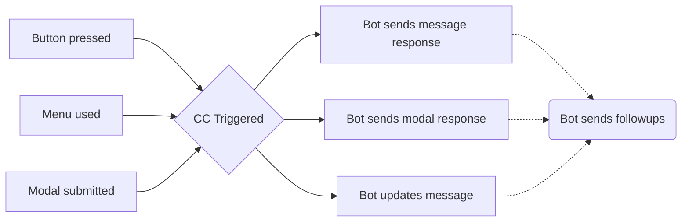

+++
title = "Introduction"
weight = 411
description = "Learn how to use buttons, modals, and select menus in custom commnads."
+++



Use of interactions within YAGPDB is an advanced topic; you will need a thorough understanding of YAGPDB's scripting language before learning interactions.



Interactions within Discord allow server members to use alternative, built-in features to trigger bots to take action other than messages or reactions.
These features include built-in buttons, dropdown selection menus, or submitting a modal (basically a pop-up form).
Within custom commands it is possible to not only create and customize these new interactive features, but respond to them as well, opening up new possibilities for ephemeral message responses, modals, and more for your server.

## Interaction Lifetime

An interaction's lifetime starts with the initial *interaction* with an *interactive element*.

1. A server member clicks on a *button*, uses a *menu*, or submits a *modal* after filling it out.
2. This interaction is sent to YAGPDB, and becomes available to trigger any custom commands which match it.
3. Within the triggered custom command(s), YAGPDB should then *respond* once to the interaction, sending a message, updating the triggering message, or sending a modal.
   This may only be done within the CC which was triggered by the interaction.
4. (optional) Continue to send followup responses for up to 15 minutes until the interaction token expires.

## Definitions

On the following pages, we will use the listed terms with their respective definitions, which are also used as such by the Discord API.

Interaction
: A user engaging with YAGPDB through one of Discord's built-in features: Clicking a button, Making a selection with a select menu, or Submitting a modal.

Response
: YAGPDB is required to respond promptly---that is, within three (3) seconds---after receiving an interaction by either sending a message or modal, or by updating the message on which the interaction was triggered.
If it does not do this, the user triggering the interaction will see a "This application did not respond" error.
The bot cannot respond to an interaction more than once.

Followup
: Since YAGPDB may only *respond* to an *interaction* once, it is subsequently required to send an interaction followup if it still needs to interface with the interaction.
These followups can be sent up to 15 minutes after the initial interaction, and you can send as many as you want.
YAGPDB may only send a followup in one of the following ways: Sending a followup message, editing an initial response or previous followup message, or getting an initial response or previous followup message.

Interactive Elements
: Elements users can interact with to send *interactions*, i.e. buttons, menus, and modals.

Message Components
: *Interactive Elements* which can be attached to YAGPDB's Discord messages, i.e. buttons and menus.

Button
: A button appearing in or under a Discord message sent by YAGPDB.
You can create and customize these buttons' appearance and behavior with color, emoji, label text, etc. When a button is clicked, an *interaction* is sent to the bot.

Menu
: A dropdown select menu appearing in or under a Discord message sent by YAGPDB.
You can create and customize these menus' appearance and behavior with placeholder text, predefined options with labels, descriptions, and/or emojis, designate the entire menu as a user or role select menu instead.
When a select menu is used, an *interaction* is sent to the bot.

Modal
: A pop-up form YAGPDB can send in response to an interaction.
It allows users to privately input text which is sent directly to YAGPDB for use in CC scripting.
You can create and customize these modals' appearance and behavior with a title and fields.
YAGPDB can both **receive a submitted modal** (which is an *interaction*), and **send a modal** for a member to fill out, (which is an interaction *response*).

Ephemeral
: An ephemeral message is sent to a server channel but only appears to a single user.
YAGPDB cannot send these ephemeral messages to users except in response to an *interaction*.
Both *response* messages and *followup* messages can be ephemeral.
