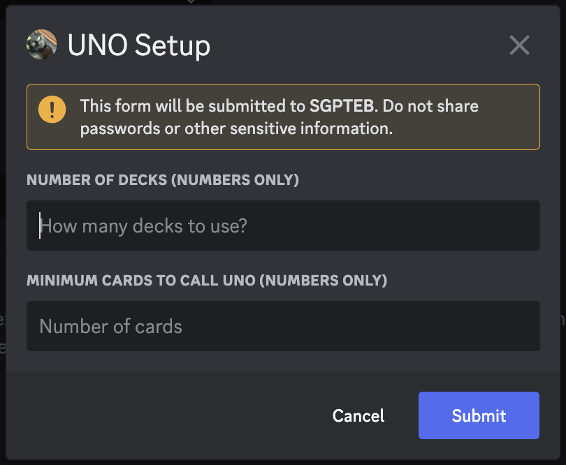

+++
title = "Parsing an Interaction"
weight = 412
+++

Custom Commands with the [Message Component](/docs/custom-commands/commands#component) or [Modal
Submission](/docs/custom-commands/commands#modal) trigger allow you to take action upon the press of a button, use of a
select menu, or completion of a modal form. Interaction triggers provide new context data for templating.

In this section, we'll cover the data available and how to make use of it.

## Important Context Data

A short list of the more important context data available is provided below. For a full list, please see the
[documentation on the interaction object](/docs/reference/templates/syntax-and-data#interaction).

| **Field**          | **Description**                                                                                                                                                                                                                                                                 |
| ------------------ | ------------------------------------------------------------------------------------------------------------------------------------------------------------------------------------------------------------------------------------------------------------------------------- |
| .Interaction.Token | The interaction's token. Is unique to each interaction. Required for sending [followup interactions](/docs/reference/templates/functions#interaction-followups).                                                                                                                |
| .CustomID          | The triggering component/modal's Custom ID. Note: This custom ID excludes the `templates-` prefix which is added to all components and modals under the hood.                                                                                                                   |
| .StrippedID        | "Strips" or cuts off the triggering part of the custom ID and prints out everything else after that. Bear in mind, when using regex as trigger, for example `"day"` and input custom ID is `"have-a-nice-day-my-dear-YAG"` output will be `"-my-dear-YAG"` --- rest is cut off. |
| .Values            | Slice of all options selected with a select menu, OR all values input into a modal in order.                                                                                                                                                                                    |

`.Interaction.Token` *must* be provided to any followup functions you decide to use later. If you are
using these in subsequent script executions, it's a good idea to save this to database when the interaction occurs.

`.CustomID` can be used to identify which component or modal triggered the command. `.StrippedID` can be used to quickly
parse out arguments in your custom ID, and use them in your response.

`.Values` is used to capture values a user selected in a select menu or submitted to a modal. When creating a select
menu and defining the options, the `"value"` field for each option defines which values will show up in this slice if
chosen. A modal's values are simply the values of each field in order.

## Parsing Buttons

As buttons do not provide any `.Values` data, we have to rely on the custom ID to pass around any data that a button may
carry. Let us consider a message with two buttons, one for joining a game of Uno, and the other one for leaving said
game. We can set the custom IDs of these buttons to `uno-join` and `uno-leave`, respectively, and trigger our custom
command on `uno-` as custom ID regex.

```yag
{{ if eq .StrippedID "join" }}
  {{ sendResponse nil "You joined the UNO game!" }}
{{ else if eq .StrippedID "leave" }}
  {{ sendResponse nil "You left the UNO game :(" }}
{{ end }}
```

## Parsing Select Menus

Select menus provide us with a `.Values` slice, which we can use to parse the values selected by the user. This slice is
ordered by the order in which the user selected the options, so if a user selects the first option, then the third
option, then the second option, the `.Values` slice will be `["first", "third", "second"]`. Of course, when you set your
menu to allow only one selection, this need not be a concern, as `.Values` will only ever contain one value.

Let us consider a select menu with several options for Uno cards, where the user can choose only one card. We will have
to verify that the user selected a valid option, that is, same color or same number. To simplify, we do not consider
wildcards here. Our code could look similar to the following listing.

```yag
{{ $selectedOptions := .Values }} {{/* ["blue-7"] */}}
{{ $cardRaw := index $selectedOptions 0 }} {{/* "blue-7" */}}
{{ $cardSplit := split $cardRaw "-" }} {{/* ["blue" "7"] */}}
{{ $playedCard := sdict
  "Color" ( index $cardSplit 0 )
  "Number" ( index $cardSplit 1 )}}

{{ $previousCard := ( dbGet .Channel.ID "uno-last-card" ).Value }}
{{ $validCard := or
  (eq $playedCard.Color $previousCard.Color)
  (eq $playedCard.Number $previousCard.Number) }}

{{ if $validCard }}
  {{ sendResponse nil (print .User " played a " $playedCard.Color $playedCard.Number) }}
  {{ dbSet .Channel.ID "uno-last-card" $playedCard }}
{{ else }}
  {{ sendResponse nil "You can't play that card!" }}
{{ end }}
```

Having only one option users can choose certainly simplifies working with `.Values` under select menus, but most of the
time it's probably not that easy. Here, we encourage you to fully consider what `.Values` gives you and what
specifically you're interested in. If, for instance, you only want to find out whether a certain option was selected, we
can use [`inFold`](/docs/reference/templates/functions/#infold). In some other cases, we simply may not care at all,
just that we got a slice of things.

## Parsing Modals

Thankfully, YAGPDB handles the grunt work of parsing a modal for you, and populates `.Values` according to the order of
the fields in your modal.

Consider the following modal being submitted:

```yag
{{ $m := cmodal
  "title" "UNO Setup"
  "custom_id" "uno-setup"
  "fields" (cslice
    (sdict "label" "Number of decks (numbers only)" "placeholder" "How many decks to use?")
    (sdict "label" "Minimum cards to call uno (numbers only)" "Number of cards")
  )
}}
{{ sendModal $m }}
```



We could store this setup for later use like so:

```yag
{{ $numberOfDecks := index .Values 0 }}
{{ $minCardsForUNO := index .Values 1 }}

{{ dbSet .Channel.ID "uno-decks" ( toInt $numberOfDecks ) }}
{{ dbSet .Channel.ID "uno-min_for_uno" ( toInt $minCardsForUNO ) }}
```
