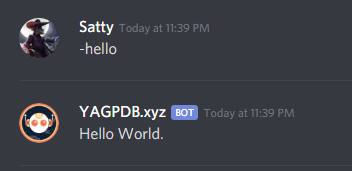

+++
title = "Outputs 1"
weight = 210
+++

In this chapter, we will go over two ways to output text from a custom command: using the *response*, and later on using
*template actions*.

## Response

If you paste text into the response field of a custom command, the bot will respond with that text when the command is
triggered.

For instance, paste the following text into a new custom command:

```go
Hello World.
```

This will make the bot respond "Hello World." in a new message when the command is triggered, as shown below.

<center>



</center>

## Template Actions

### Actions As Output

Earlier, we just made the bot respond with some static text. However, sometimes (or rather, most of the time) we want to
change that around depending on various factors. This is where *template actions* come in.

Template actions are a way to dynamically change the output depending on various things, such as the user who triggered
the command, the arguments passed to the command, or even the current time.

The bot evaluates the template action and replaces it with the result of the evaluation. For instance, the following
code will make the bot respond with the server name when the command is triggered:

```go
{{ .Server.Name }}
```

As you can see, it differs from the static response in that it uses double curly braces (`{{` and `}}`) to denote an
action. Without those, the bot would just respond with the text as-is.

If we want to bring this a step further, we can combine the plain response with some template actions to make it a bit
more nicer-looking:

```go
Hey there {{.User.Username}}!
Welcome to {{ .Server.Name }}!
```

Play around with this a little bit and see what you can come up with. Take a look at the
[data reference documentation](/docs/reference/templates/syntax-and-data) to see what other data you can access.

### Actions For Computation

Template actions can also be used to perform computations (tasks) and return the result. This allows you to create
extremely powerful custom commands that do much more than just output some random text. For instance, the following
code will make the bot respond with the sum of two numbers when the command is triggered:

```go
{{ add 5 3 }}
```

Obviously this is a very simple example. We provide a list of all available functions in the
[functions reference documentation](/docs/reference/templates/functions). Try to experiment around with some of these
functions to get a feel for how they're called and what they do.

You can also combine functions such that the output of one serves as the input of another, like so:

```go
{{ add 5 (mult 3 2) }}
```

Just like in math, the expression inside the parentheses is evaluated first, and then that result is used in the outer
expression.

### Actions for Control Flow

You can also use actions to change your program's code path, depending on some condition. We will go over this in more
detail in a later chapter.
