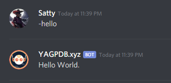

# Outputs 1

## Response

With the exception of content enclosed in two brackets `{{ action }}` which denotes a template-structure to be parsed as "code", any extraneous content which is not enclosed in two brackets will be sent without any modification. This output message is called the custom command **response.**


The response is sent in the same channel that the custom command is triggered.


**Example:**

```go
Hello World. 
```

The above will make the bot print out "Hello World." in form of a response message when the command gets **triggered**.



Practice Question: Write a command to output : This is **yag bot**

## Template-Structures or Actions

Things written inside double curly brackets `{{ action goes here }}` are called actions or template-structures. We have seen earlier how we can output specific textual response after invoking a custom command. However, sometimes we want the output to change depending on the person running the command, the channel it is run on etc. Actions help us in such situations. Actions--data evaluations or control structures-- can also produce complex behaviors which we will slowly explore over the subsequent sections. Actions can basically produce four kinds of effects:

1. **Produce an output :** Certain actions simply produce an output. These actions can be regarded as data evaluations. This output becomes a part of the response unless directed to another action or variable. The most common actions of this kind are the "property template-structures" which encompasses all active data in the templating system and returns information about the current Server/Channel/Member/Message etc. The property template-structures always start with a `.` and if they have sub properties ( like current server is the main structure and it has sub fields like Name , ID etc.), there is a `.` between the main struct and it's sub fields.\
   example: `{{.Server.Name}}` outputs the name of your server. `{{.CCID}}` is the numerical ID of the current custom command. Some other examples are `{{.User.Username}}` , `{{.Channel.Name}}` so on. More can be found in the docs ([\[1\]](https://docs.yagpdb.xyz/reference/templates#guild-server) , [\[2\]](https://docs.yagpdb.xyz/reference/templates#channel) , [\[3\]](https://docs.yagpdb.xyz/reference/templates#message) , [\[4\]](https://docs.yagpdb.xyz/reference/templates#member) , [\[5\]](https://docs.yagpdb.xyz/reference/templates#user)). \\
2. **Perform a task :** These actions do not return any meaningful data; they simply perform a computation/task. The term "function" is often used to for these actions.\\
3.  **Both perform an task + produce an output :** These actions perform a computation/calculation/task and also produce an output at the end. The term "function" is often used for these actions.

    \
    example: `{{add 1 2}}` adds two numbers and returns their sum.\\
4. **Modify the control flow :** Certain actions can modify the control flow of the program itself or used to define user-defined templates which can be used later in code.

## Example Codes

### Example 1

```
Hey there {{.User.Username}}!
Welcome to our Server : {{.Server.Name}}
```

#### Output :

.png>)

### Example 2

```
This is <#{{.Channel.ID}}> {{mentionEveryone}}
```

#### Explanation :

In the above code we explore how to produce mentions. Simply writing @user or @role or #channel will _**not**_ produce a user , channel or role mention.

#### Mentions and Custom Emojis

Before understanding mentions it is important to understand what IDs are. For this we recommend to have a look at the [official discord guide](https://support.discordapp.com/hc/en-us/articles/206346498-Where-can-I-find-my-User-Server-Message-ID-). Mentions follow a specific format which is elaborated [here](https://docs.yagpdb.xyz/reference/templates#mentions). In general channel mentions are `<#Channel_ID>` , User Mentions are `<@User_ID>` , Role Mentions are `<@&Role_ID>` and custom emojis are `<:emoji_name:emoji_id>` or `<a:emoji_name:emoji_id>` . This raw representation of mentions and emojis can be obtained by typing a back-slash `\` before the emoji/mention while using PC client. Also, by default special( role + `@everyone` + `@here`) mentions will be escaped (not produce a ping/highlight). You will have to use special template-structures to produce a special mention as seen in the above code with `mentionEveryone`. Some template-structures for role mentions are `mentionRoleName` and `mentionRoleID`.\\

.png>)


Note: A bot has the same restrictions as that of a regular user with nitro and cannot use emojis of servers they have no access to. For the bot to use external custom emojis, they must be present in that server where the emojis belong to and they must have permissions to use external emojis.



You will sometimes notice user mentions are produced by <@!UserID>. This is because users with nicknames have the extra `!` before their ID in their mentions.


#### Output :

.png>)

***


**Pro Tip :** Did you know you can combine multiple template-structures such that the output of one serves as input to another. We can achieve this by enclosing the interior template-structure within parenthesis `()`

**Example :** `{{mult 2 (add 3 2)}}`\
Produces 10 as output.

