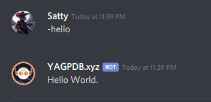

+++
title = "Simple Responses"
weight = 210
description = "Learn how to get YAGPDB to say something!"
+++

In this chapter, we will go over two ways to output text from a custom command: using the _response_, and later on using _template actions_.

## Response

If you paste text into the response field of a custom command, the bot will respond with the same text when the command is triggered.

For instance, create a new custom command with the following response:

```yag
Hello World.
```

This will make the bot respond "Hello World." in a new message when the command is triggered, as shown below.

<center>



</center>

## Template Actions

### Actions As Output

Earlier, we just made the bot respond with some static text.
However, often we want our custom command to behave differently depending on input.
This is where _template actions_ come in.

Template actions are a way to dynamically change the output depending on various things, such as the user who triggered the command, the arguments passed to the command, or even the current time.

The bot evaluates the template action and replaces it with the result of the evaluation.
For instance, the following code will make the bot respond with the server name when the command is triggered:

```yag
{{ .Guild.Name }}
```

As you can see, we use double curly braces (`{{` and `}}`) to denote a template action.
The braces are essential: without these, the bot would simply respond with the text verbatim.
A common pitfall we often see in the support channels is something like the following:

```yag
Hello .User.Username!
```

If we want to bring this a step further, we can combine the plain response with some template actions to make it a bit more nicer-looking:

```yag
Hey there {{ .User.Username }}!
Welcome to {{ .Guild.Name }}!
```

Play around with this a little bit and see what you can come up with.
Take a look at the [data reference documentation](/docs/reference/templates/syntax-and-data) to see what other data you can access.

### Actions for Functions

Custom command functions allow you to perform calculations, add or remove roles to/from a user, send messages to a channel, and lots more!
The syntax is a little different to what you might be used to; All arguments to a function follow the function name itself, like so:

```yag
{{ add 5 3 }}
```

Some functions also return the result of their operation, which can be passed as arguments to other functions.
For example:

```yag
{{ mult 5 (add 3 2) }}
```

Just like in math, the expression inside the parentheses is evaluated first, and then that result is used in the outer expression.

Obviously these are both quite contrived examples.
We provide a list of all available functions in the [functions reference documentation](/docs/reference/templates/functions).
Try to experiment around with some of these functions to get a feel for how they're used and what they do.

### Actions for Control Flow

You can also use actions to determine whether some of your code is executed depending on a condition, along with some more complex control flows.
We will go over these in more detail in a later chapter.
