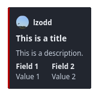

+++
title = "Embeds and Messages"
weight = 310
description = "Learn how to send messages to different channels, edit existing messages, and send messages with embeds."
+++

Until now, we have just used the [default response behavior](/learn/beginner/simple-responses) to make our custom
commands respond with some text. This makes sense for quick mockups or relatively simple commands. However, this may be
inconvenient or Not What You Want in some cases. In this chapter, we will explore how to send messages to different
channels, edit existing messages, and send messages with embeds, vastly expanding your toolbox for creating complex
custom command systems.

## Sending Messages

We provide several `sendMessage*` functions that all do the same thing: send a message to a channel. The difference
between them is how they handle special mentions like `@everyone` and `@here`, and whether to return the ID of the
message after sending it. We will cover these functions in detail in the following sections, and when to best use them.

Let's get started with the simplest of them all, `sendMessage`. Its syntax is the following:

```yag
{{ sendMessage channel_id message_to_be_sent }}
```

The `channel_id` is the ID of the channel to send the message to. If you want to send the message in the same channel as
the one in which the custom command was triggered, simply set `channel_id` to `nil`.

Intuitively, `message_to_be_sent` denotes the output that is to be sent as a message. For now, we will just use a string
with the content you want to send. We will cover sending embeds in a later section on this page.

### Special Mentions

By default, the bot will escape special mentions like `@everyone`, `@here`, and role mentions (note that user mentions
are not escaped by default). If you want to send a message with these mentions, you'll need to tell the bot to not
escape them. You can do this by using the `sendMessageNoEscape` function instead of `sendMessage`.

```yag
{{ sendMessageNoEscape channel_id message_to_be_sent }}
```

### Returning the Message ID

If you want to store the ID of the message you just sent, for example to later edit it, use the `sendMessageRetID`
function and assign the result to a variable.

```yag
{{ $messageID := sendMessageRetID channel_id message_to_be_sent }}
```

Naturally, we provide a variant of the `sendMessageRetID` function that does not escape mentions:

```yag
{{ $messageID := sendMessageNoEscapeRetID channel_id message_to_be_sent }}
```

It is quite the mouthful to write, but just roll with it.

## Building Embeds

Embeds are a powerful way to display information in a structured and visually appealing way. They can contain a title,
description, fields, images, and more. We provide a function to build embeds in a way that closely resembles the
structure as defined by the Discord API.

We will illustrate this with a simple example. For a full breakdown of all available fields, please refer to our
[custom embeds documentation](/docs/reference/custom-embeds).

```yag
{{ $embed := cembed
    "title" "This is a title"
    "description" "This is a description."
    "color" 0xff0000
    "fields" (cslice
        (sdict "name" "Field 1" "value" "Value 1" "inline" true)
        (sdict "name" "Field 2" "value" "Value 2" "inline" true)
    )
    "author" (sdict
      "name" .User.Username
      "icon_url" (.User.AvatarURL "256")
    )
}}
{{ sendMessage nil $embed }}
```

<div style="float: right; margin-left: 7px; margin-bottom: 10px;">



</div>

The above code will generate an embed as shown on the left. Let us dissect it a bit. First, we simply define a variable
`$embed` and assign it the result of the `cembed` function. This function takes a series of key-value pairs, where the
key is the embed field you want to set, and the value is the value you want to set for that field. The `cembed` function
will return a structured object that can be sent as a message, as demonstrated in the last line of the code.

The `"title"` and `"description"` fields are self-explanatory---we can use Discord Markdown in the latter. The `"color"`
field takes an integer color value, for which we can conveniently use hexadecimal formatting as mentioned in
[Variables and Data Types](/learn/beginner/variables-and-data-types#integers), but it can also take a
[decimal value](https://www.binaryhexconverter.com/hex-to-decimal-converter).

The `"fields"` field is a list (more precisely a _slice_) of dictionaries, where each dictionary represents a field in
the embed. Each field dictionary must contain a `"name"` and a `"value"` field, and can optionally contain an `"inline"`
field. This field is a boolean that determines whether the field should be displayed inline with the previous field.

The `"author"` field is a dictionary that contains the name and icon URL of the author of the embed. In this case, we
use the username of the user who triggered the custom command as the name, and the user's avatar URL as the icon URL.



There is a [community-made embed visualizer][v-embed] that can help you create custom command embeds more easily.
However, it is still a good idea to not wholly rely on the GUI and understand the structure of the embeds yourself.

For your convenience, we have [prefilled the above example][prefill] in the visualizer.

[v-embed]: https://yagpdbembeds.netlify.app/
[prefill]: https://yagpdbembeds.netlify.app/?data=JTdCJTIyZW1iZWQlMjIlM0ElN0IlMjJ0aXRsZSUyMiUzQSUyMlRoaXMlMjBpcyUyMGElMjB0aXRsZSUyMiUyQyUyMmRlc2NyaXB0aW9uJTIyJTNBJTIyVGhpcyUyMGlzJTIwYSUyMGRlc2NyaXB0aW9uLiUyMiUyQyUyMmNvbG9yJTIyJTNBMTY3MTE2ODAlMkMlMjJmaWVsZHMlMjIlM0ElNUIlN0IlMjJuYW1lJTIyJTNBJTIyRmllbGQlMjAxJTIyJTJDJTIydmFsdWUlMjIlM0ElMjJWYWx1ZSUyMDElMjIlMkMlMjJpbmxpbmUlMjIlM0F0cnVlJTdEJTJDJTdCJTIybmFtZSUyMiUzQSUyMkZpZWxkJTIwMiUyMiUyQyUyMnZhbHVlJTIyJTNBJTIyVmFsdWUlMjAyJTIyJTJDJTIyaW5saW5lJTIyJTNBdHJ1ZSU3RCU1RCUyQyUyMmF1dGhvciUyMiUzQSU3QiUyMm5hbWUlMjIlM0ElMjJsem9kZCUyMiUyQyUyMmljb25fdXJsJTIyJTNBJTIyaHR0cHMlM0ElMkYlMkZjZG4uZGlzY29yZGFwcC5jb20lMkZhdmF0YXJzJTJGNjY1MjQzNDQ5NDA1OTk3MDY2JTJGZDYzMTM3MWJiY2NhMDI3NDgxYTcxMjk1NGUyODQyYmMucG5nJTNGc2l6ZSUzRDI1NiUyMiU3RCU3RCU3RA==



## Editing Messages

Sending a message is nice and all, but for the sake of keeping things clean, you might want to edit a message instead of
creating a new one each time something changes. We provide the `editMessage` function for this purpose.

```yag
{{ editMessage channel_id message_id new_message_content }}
```

The `channel_id` is the ID of the channel containing the message. The `message_id` is the ID of the message you want to
edit. The `new_message_content` is the new content of the message, which will completely overwrite the existing content.
See [Editing Embeds](#editing-embeds) if you only want to change certain fields of an existing embed while leaving
others intact. You should note that YAGPDB can only edit messages from itself, just like you cannot edit someone else's
messages.

For a quick demonstration, consider the following code:

```yag
{{ $messageID := sendMessageRetID nil "Hello, World!" }}
{{ sleep 5 }}
{{ editMessage nil $messageID "Goodbye, World!" }}
```

This code sends a message saying "Hello, World!" and then, after 5 seconds, edits the message to say "Goodbye, World!",
all in the same channel where the custom command was triggered.

### Editing Embeds

Editing embeds is a little more involved than editing regular messages. Since the data provided to `editMessage`
completely overwrites the existing content, it is necessary to retrieve the existing embed object, modify the desired
fields, and provide the whole embed to `editMessage`.

An elaborate example all within the same custom command looks like the following:

```yag
{{ $embed := cembed
    "title" "This is a title"
    "description" "This is a description."
    "color" 0xff0000
    "fields" (cslice
        (sdict "name" "Field 1" "value" "Value 1" "inline" true)
        (sdict "name" "Field 2" "value" "Value 2" "inline" true)
    )
    "author" (sdict
      "name" .User.Username
      "icon_url" (.User.AvatarURL "256")
    )
}}
{{ $messageID := sendMessageRetID nil $embed }}
{{ sleep 5 }}

{{ $newEmbed := structToSdict $embed }}
{{ $newEmbed.Set "title" "This is a new title" }}
{{ $newEmbed.Set "description" "This is a new description." }}
{{ $newEmbed.Set "fields" (cslice) }}
{{ editMessage nil $messageID (cembed $newEmbed) }}
```

In the second part, after `{{ sleep 5 }}`, we first convert the original embed object to a dictionary using the
`structToSdict` function. We then modify the fields we want to change using the `Set` method. In this case, we change
the title and description of the embed, and remove all fields. Finally, we send the modified embed object back to the
`editMessage` function.

As mentioned previously, this example is contrived: in practice, we're more likely to use `.Message.Embeds` to get the
original embed object, convert and modify it as shown above, then send it back to the `editMessage` function.



`structToSdict` does not perform deep conversion. For a full conversion of an embed to a dictionary, you can use the
following code snippet:

```yag
{{ if not .Message.Embeds }}
  {{/* no point converting non-existent embed */}}
  {{ return }}
{{ end }}

{{ $embed := structToSdict (index .Message.Embeds 0) }}
{{ range $k, $v := $embed }}
  {{- if eq (kindOf $v true) "struct" }}
    {{- /* convert nested struct */}}
    {{- $embed.Set $k (structToSdict $v) }}
  {{- end -}}
{{ end }}

{{/* also add old fields */}}
{{ $embed.Set "Fields" (cslice.AppendSlice $embed.Fields) }}
{{ range $i, $field := $embed.Fields }}
  {{- $embed.Fields.Set $i (structToSdict $field) -}}
{{ end }}

{{/* ensure all parts of the embed are reconstructed */}}
{{ if $embed.Author }} {{ $embed.Author.Set "Icon_URL" $embed.Author.IconURL }} {{ end }}
{{ if $embed.Footer }} {{ $embed.Footer.Set "Icon_URL" $embed.Footer.IconURL }} {{ end }}
```



## Complex Message Builder

We learned how to send messages and embeds individually---we can also combine them in a single message. This is where we
have to use the `complexMessage` builder function. In this case, we will use the `"content"` and `"embed"` key to set
the respective parts of our message:

```yag
{{ $embed := cembed
    "title" "This is a title"
    "description" "This is a description."
    "color" 0xff0000
    "fields" (cslice
        (sdict "name" "Field 1" "value" "Value 1" "inline" true)
        (sdict "name" "Field 2" "value" "Value 2" "inline" true)
    )
    "author" (sdict
      "name" .User.Username
      "icon_url" (.User.AvatarURL "256")
    )
}}

{{ $message := complexMessage
    "content" "This is some content, appearing above the embed below."
    "embed" $embed
}}

{{ sendMessage nil $message }}
```

Similarly, we provide a `complexMessageEdit` function to edit messages with both content and embeds. The syntax is the
same as `complexMessage`, minus a few keys that cannot be edited. Please refer to the documentation below.

The `complexMessage` builder takes a lot more keys that give you fine-grained control over the message you want to send.
Refer to the [message functions documentation][message-docs] for a complete description.
You're already quite far into the course, so you should be able to understand this documentation without much trouble.

[message-docs]: /docs/reference/templates/functions#message
