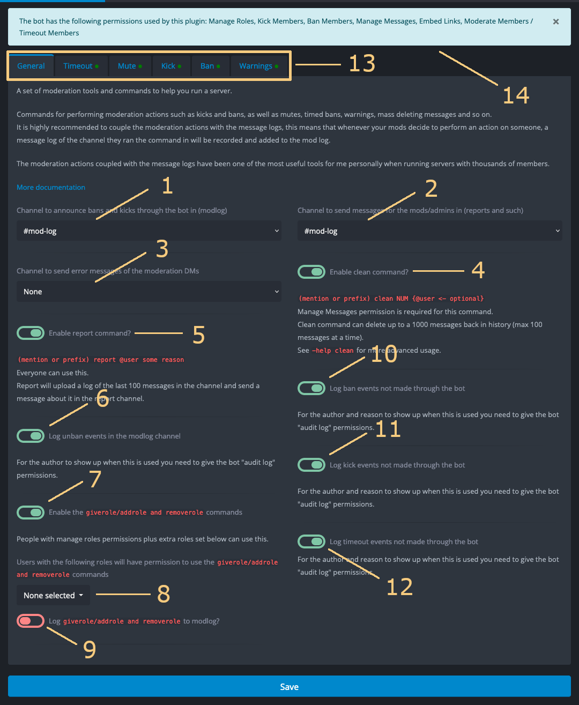
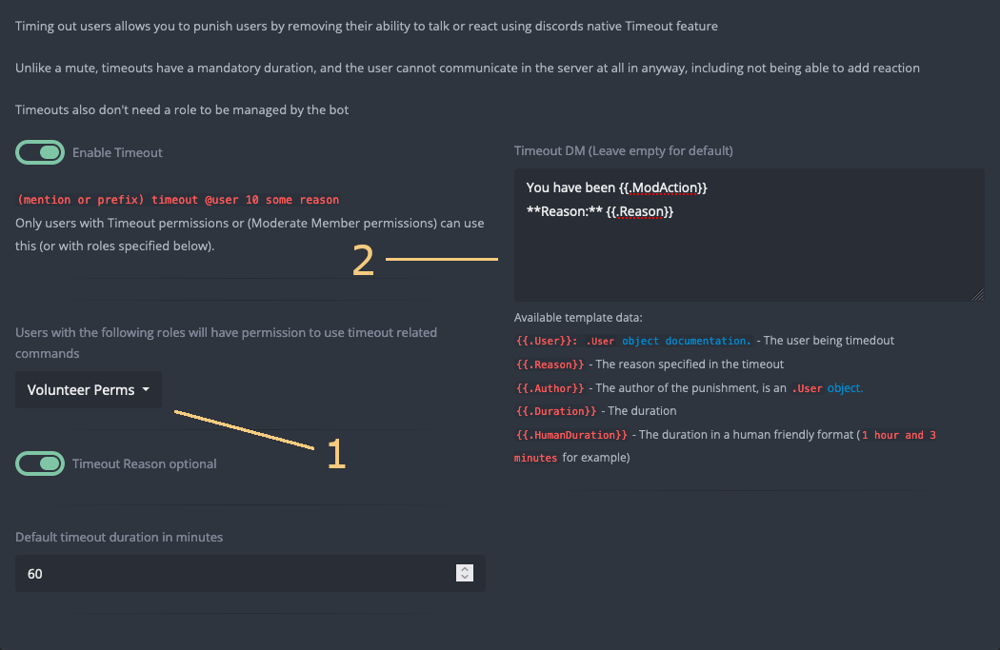

+++
archetype = "chapter"
title = "Moderation"
weight = 1
+++

Everything in moderation, including moderation.

**1** Mod Log Channel **2** Report Channel **3** Moderation DM Error Channel **4** Clean Command **5** Report
Command **6** Unban Logging **7** Giverole/Takeerole commands **8** Give/Takerole Permitted Roles **9**
Give/Takerole Logging **10** Foreign Ban Logging **11** Foreign Kick Logging **12** Foreign Timeout Logging **13**
Moderation Tabs **14** Bot Permissions Notice

## Moderation Page

The moderation page allows configuration of common settings.

### Mod Channels

1. **Mod Log** - The mod log is the channel YAGPDB will send log messages to when most moderation commands are used. It
includes username and user ID of both the moderator, and the moderated user. It additionally includes the reason for
relevant commands (defaults to `<no reason provided>` when not provided), and a [log](/moderation/logging) of the
channel where the command was run.
2. **Report** - The channel for YAGPDB to send report messages to when users use the report command. Similar to the mod
log, it includes username and user ID of the user reporting, and the user reported, as well as the reason and message
log of the channel.
3. **Moderation DM Error** - The channel where YAGPDB will send error messages from executing template script within
[moderation DMs](#moderation-dms).

### Command Toggles

Certain potentially destructive moderation commands are disabled by default. These commands are:

- The **clean command** (**4**) toggles the [clean command](/commands/all-commands#clean).
- The **report command** (**5**) toggles the [report command](/commands/all-commands#report).
- **Giverole/Takerole commands** (**7**) toggle the [giverole](/commands/all-commands#giverole) and
[takerole](/commands/all-commands#takerole) commands.

### Unban/Unmute Logging

When the `unban`/`unmute` commands are used, YAGPDB will log their usage to the [mod log](#mod-channels) similarly to
the other moderation commands, except without the logs.

When using the `ban` and `mute` commands with a duration, YAGPDB will essentially execute the inverse commands as itself
at the end of the duration. i.e, if you execute `ban @user 1d`, YAGPDB will ban the user, and 1 day later YAGPDB will
execute the `unban` command with reason "Timed ban expired." This action appears in the mod log as YAGPDB being the
moderator.

Toggling Unban Logging (**6**) allows you to enable or disable the logging of Unmute events.

Toggling Give/Takerole Logging (**9**) allows you to enable or disable the logging of Give/Takerole events.

### Foreign logging

By default, YAGPDB will only log actions it takes, i.e. if you kick a user with the bot's `kick` command, it will log
it, but not if you kick the user directly with user. Enabling foreign logging for different moderation actions (**10**),
(**11**), (**12**) allows the bot to use the server Audit Log to retrieve moderation actions taken by other bots or
other users.

YAGPDB must have View Audit Log permissions to use this feature.

## Permissions Notice

The moderation plugin, among other plugins, requires additional permissions to function properly. The notice at the top
of the screen (**14**) will inform you of the required permissions for the plugin and alert you if the bot is missing
permissions.

## Moderation Commands

Each of the main moderation commands have individual configuration pages, accessible through the tabs (**13**). There
are common configuration options worth mentioning.

**1** Permitted Roles **2** Moderation DM

### Permitted Roles

Selecting permitted roles will allow said roles to run the moderation command **EVEN IF** they do not have
required Discord permissions.

Give/Takerole Permitted Roles (**8**) operate in the same way.

### Moderation DMs

Moderation DMs are template scripts which are executed within the offending user's DM. Text output to the response will
be directly sent to the offending user.

Any errors which occur in the template execution will not be logged by default. The offending user will only receive a
DM from your server saying **Failed executing template.** Setting a [Moderation DM Error channel](#mod-channels) allows
for the more detailed errors to not be lost.

{}
