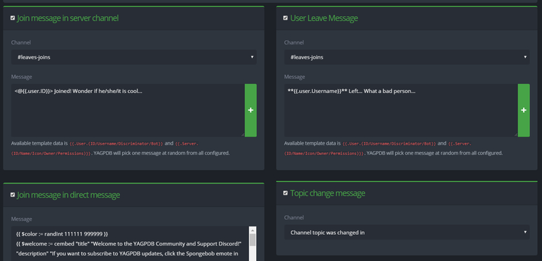

+++
title = 'General'
weight = 1
menuPre = "<i class= 'fas fa-bell'></i> "
+++

General notifications such as a welcoming direct message, a message in the server when users join or leave, as well as a
simple message announcing when a channel's topic has changed.

<!--more-->

### Join Message

**Channel:** Choose what channel you want the bot to announce the message in.

**Message:** Write the message that you want the bot to say when someone joins.

### Leave Message

**Channel:** Choose what channel you want the bot to announce the message in.

**Message:** Write the message that you want the bot to say when someone leaves.

### Join Message in Direct Message

Write a message that you want the bot to send to the user via DM whenever someone joins your server.

### Topic Change Message

Choose what channel you want the bot to announce the topic change from a specific channel or the channel that the topic
was changed in.

{}

Custom command templates are supported for usage in all the notification feeds provided.

{}
