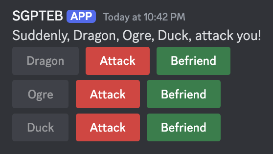

+++
title = 'Custom Interactions'
weight = 6
+++

Buttons, Modals, Select Menus, Ephemeral Messages, and more!

<!--more-->

{}

Use of interactions within YAGPDB is an advanced topic; you will need a thorough understanding of YAGPDB's scripting
language before learning interactions.

We have a [comprehensive learning course](https://learn.yagpdb.xyz) for you to get started.

{}

## The Basics

Interactions within Discord allow server members to use alternative, built-in features to trigger bots to take action
other than messages or reactions. These features include builtin buttons, dropdown selection menus, or submitting a
modal (basically a pop-up form). Within custom commands it is possible to not only create and customize these new
interactive features, but respond to them as well, opening up new possibilities for ephemeral message responses, modals,
and more within YAGPDB custom templating script.

### Interaction Lifetime

An interaction's lifetime starts with the initial *interaction* with an *interactive element*.

1. A server member clicks on a *button*, uses a *menu*, or submits a *modal* after filling it out.
2. This interaction is sent to YAGPDB, and becomes available to trigger any custom commands which match it.
3. Within the triggered custom command(s), YAGPDB should then *respond* once to the interaction, sending a message,
   updating the triggering message, or sending a modal. This may only be done within the CC which was triggered by the
   interaction.
4. *(optional)* Continue to send followup responses for up to 15 minutes until the interaction token expires.


graph LR;
    A[Button pressed] --> B{CC Triggered}
    C[Menu used] --> B
    D[Modal submitted] --> B
    B --> E[Bot sends message response]
    B --> G[Bot sends modal response]
    B --> H[Bot updates message]
    E --> F(Bot sends followups)
    G --> F
    H --> F


### Definitions

Interaction
: A user engaging with YAGPDB through one of Discord's builtin features: Clicking a button, Making a
selection with a select menu, or Submitting a modal.

Response
: YAGPDB is required to respond promptly after receiving an interaction by either sending a message or modal, or by
updating the message on which the interaction was triggered. If it does not do this, the user triggering the interaction
will see a "This application did not respond" error. The bot cannot respond to an interaction more than once.

Followup
: Since YAGPDB may only *respond* to an *interaction* once, it is subsequently required to send an interaction
followup if it still needs to interface with the interaction. These followups can be sent up to 15 minutes after the initial
interaction, and you can send as many as you want. YAGPDB may only send a followup in one of the following ways: Sending
a followup message, editing an initial response or previous followup message, or getting an initial response or previous
followup message.

Interactive Elements
: Elements users can interact with to send *interactions*, i.e. buttons, menus, and modals.

Message Components
: *Interactive Elements* which can be attached to YAGPDB's Discord messages, i.e. buttons and menus.

Button
: A button appearing in or under a Discord message sent by YAGPDB. You can create and customize these
buttons' appearance and behavior with color, emoji, label text, etc. When a button is clicked, an *interaction* is sent
to the bot.

Menu
: A dropdown select menu appearing in or under a Discord message sent by YAGPDB. You can create and customize these
menus' appearance and behavior with placeholder text, predefined options with labels, descriptions, and/or emojis,
designate the entire menu as a user or role select menu instead, etc. When a select menu is used, an *interaction* is sent
to the bot.

Modal
: A pop-up form YAGPDB can send in response to an interaction. It allows users to privately input text which
is sent directly to YAGPDB for use in CC scripting. You can create and customize these modals' appearance and
behavior with a title and fields. YAGPDB can both **receive a submitted modal** (which is an
*interaction*), and **send a modal** for a member to fill out, (which is an interaction *response*).

Ephemeral
: An ephemeral message is sent to a server channel but only appears to a single user. YAGPDB cannot send
these ephemeral messages to users except in response to an *interaction*. Both *response* messages and *followup*
messages can be ephemeral.

## Creating Interactive Elements

Before you can start triggering Custom Commands with interactive elements, you'll need to have elements to interact
with. *Message Components* can be created and sent with `complexMessage` and `sendMessage`. *Modals* need a triggering
*interaction* to be sent, meaning you'll only be able to show a modal after a user has used a message component.

### Creating Message Components

#### Basics

Let's examine how to make a basic button.

```go
{{ $button := cbutton "label" "Button" }}
{{ $message := complexMessage "buttons" $button }}
{{ sendMessage nil $message }}
```

Result:


We've successfully made a basic button. Currently this button doesn't do anything when we click it. That's because it
doesn't have an ID that YAGPDB can use to trigger any other custom commands. For our next iteration, we'll add a custom
ID which can trigger a custom command.

##### Custom IDs

{}

Multiple buttons and menus can not have the same custom ID in one message.

{}

```go
{{ $button := cbutton "label" "Button" "custom_id" "buttons-duck" }}
{{ $message := complexMessage "buttons" $button }}
{{ sendMessage nil $message }}
```

This button will now trigger the following custom command:


This custom command will trigger on any message component, either button or menu, whose custom ID contains the word "duck."

##### Multiple Components

Now, let's add some more buttons.

{}

Buttons with the "link" style cannot have a Custom ID, and instead require a URL field.

Link style buttons do not trigger *interactions*.

{}

```go
{{ $button1 := cbutton "label" "Duck One" "custom_id" "buttons-duck-alpha" "style" "success" }}
{{ $button2 := cbutton "emoji" (sdict "name" "🦆") "custom_id" "buttons-duck-beta" "style" "danger" }}
{{ $button3 := cbutton "label" "Duck Three" "emoji" (sdict "name" "🦆") "url" "https://yagpdb.xyz" "style" "link" }}
{{ $message := complexMessage "buttons" (cslice $button1 $button2 $button3) }}
{{ sendMessage nil $message }}
```


At this stage we have three buttons. Both of the first two buttons will trigger our duck trigger custom command, but the
third button will not trigger any custom command. Link buttons do not create *interactions*.

We can differentiate between the two buttons using `.StrippedID`, which, just like `.StrippedMsg`, returns our Custom ID
without the trigger and everything else before that. In our example, `.StrippedID` will return `-alpha` for the first
button and `-beta` for the second button.

Confirming this behavior will be left as an exercise to the reader (you).

Let's add in a select menu now.

```go
{{ $button1 := cbutton "label" "Duck One" "custom_id" "buttons-duck-alpha" "style" "success" }}
{{ $button2 := cbutton "emoji" (sdict "name" "🦆") "custom_id" "buttons-duck-beta" "style" "danger" }}
{{ $button3 := cbutton "label" "Duck Three" "emoji" (sdict "name" "🦆") "url" "https://yagpdb.xyz" "style" "link" }}

{{ $menu := cmenu
  "type" "text"
  "placeholder" "Choose a terrible thing"
  "custom_id" "menus-duck-alpha"
  "options" (cslice
    (sdict "label" "Ducks" "value" "opt-1" "default" true)
    (sdict "label" "Duck" "value" "opt-2" "emoji" (sdict "name" "🦆"))
    (sdict "label" "Half a Duck" "value" "opt-3" "description" "Don't let the smaller amount fool you."))
  "max_values" 3 }}

{{ $message := complexMessage "buttons" (cslice $button1 $button2 $button3) "menus" $menu }}
{{ sendMessage nil $message }}
```


We now have two buttons and a menu which are triggering our duck custom command. We used to branch with `.StrippedID`,
but now since we have two components whose stripped IDs are `-alpha`, we'll need to branch with `.IsMenu` too. If our
custom command was triggered by the use of this select menu, we could also see that `.MenuType` returns `"string"`,
since this menu is a string select type menu.

##### Ordering Message Components

A message can have 5 rows of components.
A row of components can have 5 buttons, **or** 1 menu.

Let's say we want to play tic tac toe. If we just add 9 buttons into the same slice in our complex message, they'll just
fill the first row with 5 buttons and the second row with 4, which isn't what we're looking for. Here's a solution:

```go
{{ $blankEmoji := sdict "name" "⬜" }}

{{ $row1 := cslice (cbutton "emoji" $blankEmoji "custom_id" "tictactoe-button-1" "style" "secondary") (cbutton "emoji" $blankEmoji "custom_id" "tictactoe-button-2" "style" "secondary") (cbutton "emoji" $blankEmoji "custom_id" "tictactoe-button-3" "style" "secondary") }}
{{ $row2 := cslice (cbutton "emoji" $blankEmoji "custom_id" "tictactoe-button-4" "style" "secondary") (cbutton "emoji" $blankEmoji "custom_id" "tictactoe-button-5" "style" "secondary") (cbutton "emoji" $blankEmoji "custom_id" "tictactoe-button-6" "style" "secondary") }}
{{ $row3 := cslice (cbutton "emoji" $blankEmoji "custom_id" "tictactoe-button-7" "style" "secondary") (cbutton "emoji" $blankEmoji "custom_id" "tictactoe-button-8" "style" "secondary") (cbutton "emoji" $blankEmoji "custom_id" "tictactoe-button-9" "style" "secondary") }}

{{ $menu := cmenu
  "type" "text"
  "placeholder" "Control Panel"
  "custom_id" "tictactoe-menu"
  "options" (cslice
    (sdict "label" "Forfeit" "value" "forfeit")
    (sdict "label" "Toggle Notifications" "value" "notifs"))}}

{{ $message := complexMessage "buttons" $row1 "buttons" $row2 "buttons" $row3 "menus" (cmenu "type" "mentionable") }}
{{ sendMessage nil $message }}
```


#### Advanced (Variable Row Counts)

When working with multiple components in advanced flows where final number and order of buttons and menus is variable,
the basic structure of building components with `complexMessage` will be inefficient for your needs.

Take the following scenario: You are building a turn-based combat game with a variable number of enemies. For each enemy
you need a button to attack them, and a button to befriend them. You also want each enemy's buttons on a separate row.

If you always had three enemies, this code would look something like this:

```go
{{ $message := complexMessage
  "content" "Dragon, Ogre, Duck, attack you!"
  "buttons" (cslice
    (cbutton "label" "Attack Dragon" "style" "red" "custom_id" "attack-dragon")
    (cbutton "label" "Befriend Dragon" "style" "green" "custom_id" "befriend-dragon"))
  "buttons" (cslice
    (cbutton "label" "Attack Ogre" "style" "red" "custom_id" "attack-ogre")
    (cbutton "label" "Befriend Ogre" "style" "green" "custom_id" "befriend-ogre"))
  "buttons" (cslice
    (cbutton "label" "Attack Duck" "style" "red" "custom_id" "attack-duck")
    (cbutton "label" "Befriend Duck" "style" "green" "custom_id" "befriend-duck")) }}
{{ sendMessage nil $message }}
```


However, we need the number of rows present on the message to be variable. With this method, it is impossible to do this
without building a completely different `complexMessage` for each number of enemies.

##### Quick Solution

A quick solution to this problem is to pass all of our buttons into one `"buttons"` value. Overflowing `"buttons"`,
`"menus"`, or even `"components"` with more components than the row can take (i.e 6+ buttons or 2+ menus) results in the
function automatically distributing the components to new rows.

```go
{{ $msg1 := complexMessage
  "content" "Message 1"
  "buttons" (cslice (cbutton "label" "Button") (cbutton "label" "Button") (cbutton "label" "Button") (cbutton "label" "Button") (cbutton "label" "Button") (cbutton "label" "Button") (cbutton "label" "Button"))
  "menus" (cslice (cmenu "type" "mentionable") (cmenu "type" "mentionable") (cmenu "type" "mentionable")) }}

{{ $msg2 := complexMessage
  "content" "Message 2"
  "components" (cslice (cbutton "label" "Button") (cmenu "type" "mentionable") (cmenu "type" "mentionable") (cbutton "label" "Button") (cbutton "label" "Button")) }}

{{ sendMessage nil $msg1 }}
{{ sendMessage nil $msg2 }}

```


This solution fills up each row with as many components as it can hold and then starts a new one. This is all we need
for most commands, but for our turn-based combat scenario, we only want two or three buttons in each row.

##### Full Solution

To account for a variable amount of rows while maintaining full customization, we will introduce a new field:
`"components"`. Where `"buttons"` and `"menus"` must be a slice of buttons or menus respectively, `"components"`
must be a slice of `rows` of buttons/menus.

A `row` must also be a slice. It either contains 1-5 buttons, *or* a single select menu.

Below is an example of a `components` structure.


graph TB
    subgraph Components
        subgraph Row 1
            b1((Button))
            b2((Button))
            b3((Button))
            b4((Button))
        end
        subgraph Row 2
            b5((Button))
            b6((Button))
        end
        subgraph Row 3
            m1[Select Menu]
        end
        subgraph Row 4
            b7((Button))
            b8((Button))
            b9((Button))
        end
        subgraph Row 5
            m2[Select Menu]
        end
    end


In scripting, this manifests from the following code:

```go
{{ $row1 := cslice (cbutton "label" "Button") (cbutton "label" "Button") (cbutton "label" "Button") (cbutton "label" "Button") }}
{{ $row2 := cslice (cbutton "label" "Button") (cbutton "label" "Button") }}
{{ $row3 := cslice (cmenu "type" "mentionable") }}
{{ $row4 := cslice (cbutton "label" "Button") (cbutton "label" "Button") (cbutton "label" "Button") }}
{{ $row5 := cslice (cmenu "type" "mentionable") }}

{{ $rows := cslice $row1 $row2 $row3 $row4 $row5 }}

{{ $message := complexMessage "components" $rows }}
{{ sendMessage nil $message }}
```

Which produces this message:


When applying this new skill to our turn-based combat game, the code looks something like this:

```go
{{ $rows := cslice }}
{{ $enemies := cslice "Dragon" "Ogre" "Duck" }}

{{ range $enemyName := $enemies }}
  {{ $nameButton := cbutton "label" $enemyName "style" "grey" "disabled" true }}
  {{ $attackButton := cbutton "label" "Attack" "style" "red" "custom_id" (print "attack-" (lower $enemyName)) }}
  {{ $befriendButton := cbutton "label" "Befriend" "style" "green" "custom_id" (print "befriend-" (lower $enemyName)) }}

  {{ $currentRow := cslice $nameButton $attackButton $befriendButton }}
  {{ $rows = $rows.Append $currentRow }}
{{ end }}

{{ $promptText := joinStr ", " "Suddenly" $enemies "attack you!" }}
{{ $message := complexMessage "content" $promptText "components" $rows }}
{{ sendMessage nil $message }}
```



### Creating Modals

## Parsing an Interaction

## Responding to an Interaction

## Following Up
