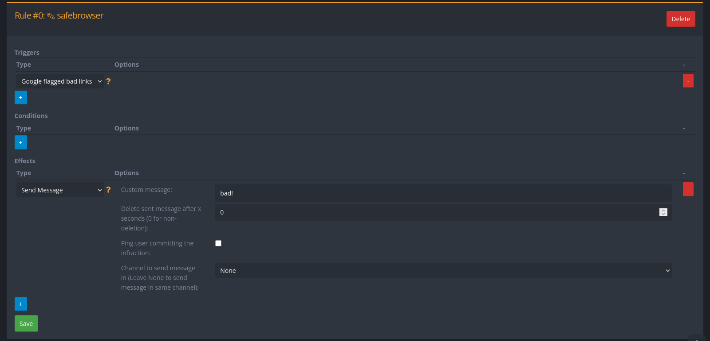

+++
title = "Safe Browsing"
description = "Google Safe Browsing setup for selfhosted YAGPDB"
weight = 330
+++

YAGPDB provides Google safebrowsing integration for Basic Automoderator and Advanced Automoderator.
In order to enable Safe Browsing checks you'll need to get a Google Safe Browsing API key and then let your bot know about it.

## Creating a Google Safe Browsing API Key

Similar to the YouTube integration, you need to create a project in the [Google Cloud Console](https://console.cloud.google.com/) and enable the "Safe Browsing API" for your project.
If you already have a project for YouTube, you can simply enable the Safe Browsing API in the same project.

After enabling the API, use the credentials wizard to create an API key.
Copy the generated API key as you'll need it later.

It is recommended to restrict the API key to the safe browsing API only, to prevent misuse in case the key gets leaked, as well as further restrictions at your discretion.

## Configuring YAGPDB

The configuration is the same for both baremetal and Docker installations.

Set the `YAGPDB_GOOGLE_SAFEBROWSING_API_KEY` environment variable to your newly created API key.
Then, restart the bot to apply the changes.

If everything works correctly, you should see a new `safebrowsing_db` file in the directory you started the bot from (or in the container).
Additionally, you can test the integration by setting up a Basic or Advanced Automoderator rule that uses Safe Browsing checks.

Pasting a link to a known malicious site, e.g. any from <https://testsafebrowsing.appspot.com/> under "Webpage Warnings" should trigger the rule and result in the bot sending `bad!` to the channel.
